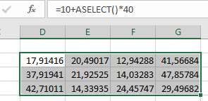
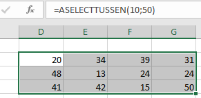
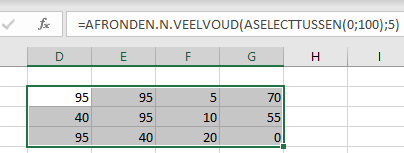
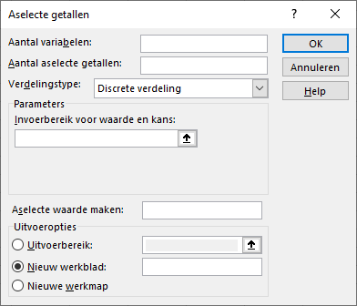
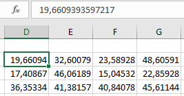

# Bijlage Aselecte getallen {#app-aselect}

Voor experimenten is het soms nodig om zelf data te genereren omdat je bijvoorbeeld een specifiek patroon in de data wilt bestuderen en daar geen goede data voor hebt.

Aselecte getallen, ook wel willekeurige getallen of toevalsgetallen genoemd, worden gemaakt met een zogenaamde *toevalsgenerator (random generator)*. Deze trekt willeurig (aselect) een getal uit een verzameling getallen. Zo haalt de ballenmachine bij Lotto een willekeurig getaL uit de verzameling getallen 1 t/m 45. Computerprogramma's gebruiken meestal een algoritme waarin via wiskundige formules een getal geproduceerd wordt. Excel maakt net als veel andere programma's gebruikt van het zogenaamde Mersenne Twister algoritme. Dit zijn in werkelijkheid geen echte willekeurige getallen, maar pseudo-willekeurige getallen omdat ze op een voorspelbare manier geproduceerd zijn. Voor de meeste doeleinden is dit geen probleem.

Bij het genereren van een getal wordt altijd aangeven binnen welke grenzen (ondergrens, bovengrens) het getal moet liggen. Dit interval wordt aangeduid met een combinatie van ronde haken () en blokhaken []. Een ronde haak betekent dat de grenswaarde niet tot de klasse behoort. Een blokhaak betekent dat de grenswaarde wel tot de klasse behoort. Zo hoort bij het interval [25,40) de waarde 25 er wel bij en de waarde 40 niet.

In Excel kun je aselecte getallen te genereren met functies en met de analysis toolpak.

## ASELECT Functies

Excel heeft drie functies voor het genereren van aselecte getallen. Een mogelijk nadeel van het gebruik van functies is dat deze iedere keer opnieuw worden uitgevoerd wanneer je een wijziging in een werkblad aanbrengt en ook wanneer je het bestand opent. Je krijgt dan steeds nieuwe getallen. Dat is niet in alle situaties handig. Wat je kunt doen is deze getallen na het genereren te kopieren en daarna te plakken als waarden.

**ASELECT()**, in het Engels **RAND()**

Syntax: *ASELECT()* , de functie heeft geen argumenten

Deze produceert een getal groter of gelijk aan 0 en kleiner dan 1. Dus een decimaal getal in het interval [0,1). Om meerdere willekeurige getallen te krijgen plaats je deze formule in een cel en kopieer vervolgens de formule naar andere cellen. En om willekeurige decimale getallen tussen andere grenswaarden te krijgen, in het interval [ondergrens,bovengrens) wijzig je de formule in

*=ondergrens + ASELECT()\*(bovengrens-ondergrens)*

In de volgende afbeelding zie je hoe willekeurige getallen in het interval [10,50) zijn gegenereerd.

```{r aselect, fig.cap="Gegenereerde getallen met functie ASELECT.", out.width="70%"}

```

Wanneer je gehele getallen wilt moet je voorgaande formule binnnen de functie *INTEGER()* plaatsen, die een getal naar beneden afrondt op het dichtstbijzijnde gehele getal.

**ASELECTTUSSEN()**, in het Engels **RANDBETWEEN()**

Syntax: *ASELECTTUSSEN(laagst;hoogst)*

+ *laagst*, het kleinste gehele getal dat geretourneerd kan worden.
+ *hoogst*, het grootste gehele getal dat geretourneerd kan worden

Deze functie produceert een willekeurig geheel getal uit het interval [laagst,hoogst]. In tegenstelling tot *ASELECT()* doen hier beide grenswaarden mee.

```{r aselecttussen, fig.cap="Gegenereerde getallen met functie ASELECTTUSSEN.", out.width="70%"}

```

Met wat trucs kun je ook andere getallen dan gehele getallen genereren. Zo zou je voor prijzen van artikelen die tussen €10,00 en €90,00 liggen gebruik kunnen maken van de formule in de volgende afbeelding

```{r aselecttussen-euro, fig.cap="Gegenereerde geldbedragen met functie ASELECTTUSSEN.", out.width="70%"}
knitr::include_graphics("images/app-aselect/aselecttussen-euro.png")
```

Om twee decimalen te krijgen worden de grenswaarden 10 en 90 eerst met 100 vermenigvuldigd, dan wordt er een getal gegenereerd uit het interval [1000,9000] waarna dit getal door 100 gedeeld wordt en je precies twee decimalen krijgt. De cellen kun je vooraf of achteraf opmaken als geldbedragen.

En door creatief gebruik te maken van afrondfuncties zijn er verrassende mogelijkheden. Het volgende voorbeeld genereert 5-vouden uit het interval [0,100].

```{r aselecttussen-5voud, fig.cap="Gegenereerde vijfvouden met functie ASELECTTUSSEN.", out.width="70%"}

```

Ook het genereren van datums (alsmede tijdstippen) is hiermee mogelijk, omdat intern in Excel een datum en tijd als een getal wordt opgeslagen. Zo staat het getal 1 voor "1-1-1900 00:00:00". In het volgende voorbeeld worden willekeurige datums uit het jaar 2019 gegenereerd. Ook hier moet je de cellen waarin het resultaat komt, opmaken in het gewenste datumformaat.

```{r aselecttussen-datums, fig.cap="Gegenereerde datums met functie ASELECTTUSSEN.", out.width="70%"}
knitr::include_graphics("images/app-aselect/aselecttussen-datums.png")
```

OPMERKING: In plaats van de functie *DATUM()* kun je hier ook de functie *DATUMWAARDE()* gebruiken. De formule wordt dan

`=ASELECTTUSSEN(DATUMWAARDE("1-1-2019");DATUMWAARDE("31-12-2019"))`.

**ASELECT.MATRIX()**, in het Engels **RANDARRAY()**

Syntax: *ASELECT.MATRIX(rijen;kolommen;min;max;geheel)*

+ *rijen*, het aantal rijen met getallen dat geretourneerd moet worden (optioneel)
+ *kolommen*, het aantal kolommen met getallen dat geretourneerd moet worden (optioneel)
+ *min*, de minimale waarde die geretourneerd kan worden (optioneel)
+ *max*, de maximale waarde die geretourneerd kan worden (optioneel)
+ *geheel*, WAAR voor gehele getallen, ONWAAR voor decimale getallen (optioneel)

De functie produceert een *matrix (array)* met willekeurige getallen. Zonder argumenten wordt er één getal tussen 0 en 1 geretourneerd. Wanneer de minimum- en maximumwaarde worden weggelaten, worden er getallen tussen 0 en 1 geretourneerd.

Als voorbeeld weer het genereren van gehele getallen tussen 10 en 50. De formule is

`=ASELECT.MATRIX(3;4;10;50;WAAR)`

In tegenstelling tot de vorige functies selecteer je hier maar één cel waar je de formule invoert. Het resultaat is een array, een nieuwe gegevensstructuur in Excel. De waarden van de array komen niet alleen in de geselecteerde cel, maar *lopen over* naar de naburige cellen. Excel maakt dynamisch de benodigde ruimte voor de array wanneer de formule ingevoerd wordt. Wanneer een van die benodigde cellen bezet is krijg je een foutmelding.

```{r aselectmatrix, fig.cap="Gegenereerde getallen met functie ASELECT.MATRIX.", out.width="70%"}
knitr::include_graphics("images/app-aselect/aselectmatrix.png")
```

Dit ziet er bij de eerste aanblik hetzelfde uit als bij ASELECTTUSSEN(), maar er zijn verschillen omdat het een array is. Allereerst zie je een lichtblauw kader om de array. En wanneer je een andere cel selecteert dan die waar de formule is ingevoerd, zie je in de formulebalk dat de formule grijs geworden is. Ook kun je in de andere cellen geen wijzigingen aanbrengen.

## Gegevensanalyse

In het hulpprogramma Gegevensanalyse zit ook een keuze om willekeurige getallen te genereren. Het gebruik hiervan is wat flexibeler dan het werken met de hiervoor genoemde functies. De werkwijze is als volgt. Kies

*tabblad Gegevens -> Gegevensanalyse (groep Analyse) -> Aselecte getallen*

Het dialoogscherm dat je krijgt kan wat van het volgende afwijken, maar ziet er grotendeels hetzelfde uit.

```{r aselect-toolpak-discreet, fig.cap="Invulscherm Gegevensanalyse voor aselecte getallen.", out.width="70%"}

```

*Aantal variabelen*: het aantal kolommen in het uitvoergebied dat je met waarden wilt vullen.

*Aantal aselecte getallen*: het aantal rijen in het uitvoergebied dat je met waarden wilt vullen.

Je kunt deze twee invulvakken ook leeg laten.In dat geval wordt het verderop gespecificeerde uitvoergebied met waarden gevuld.

*Verdelingstype*:

- Uniforme verdeling, voor willekeurige getallen tussen twee grenzen.
- Normale verdeling, voor een opgegeven gemiddelde en standaarddeviatie
- Bernouilli verdeling, voor een experiment met als enige uitkomst succes (waarvoor je de kans moet opgeven) of mislukking.
- Binomiale verdeling, voor de verdeling van het aantal successen (met kans p) in n experimenten.
- Poisson verdeling, geeft de kans op een bepaalde gebeurtenis met een waarde voor Lambda als gemiddelde.
- Discrete verdeling, kiest getallen uit een reeks waarden met voor elke waarde een kans.
- Patroonmatige verdeling, is een hulpmiddel om een patroon van gegeven getallen te produceren, geen willekeurige getallen dus.

Voor het genereren van willekeurige getallen tussen twee grenzen kies je voor Uniforme verdeling. Afhankelijk van de gekozen verdeling wijzigt het scherm zodat je de parameters voor de gekozen verdeling kunt invullen. Bij een Uniforme verdeling zijn dat de twee grenswaarden, aangegeven met Tussen ... en ...

*Aselecte waarde maken*: Hier kun je desgewenst een startpunt (de zogenaamde seed) voor de random generator opgeven, waardoor je een volgende keer dezelfde willekeurige getallen kunt produceren. In het algemeen kun je dit beter leeg laten.

*Uitvoeropties*: Gebruik de selectieknoppen om de locatie voor de willekeurige getallen aan te geven.

Als voorbeeld worden weer getallen gegenereerd tussen 10 en 50.

```{r aselect-toolpak-uniform, fig.cap="Invulscherm Gegevensanalyse voor uniform verdeelde aselecte getallen.", out.width="70%"}
knitr::include_graphics("images/app-aselect/aselect-toolpak-uniform.png")
```

Het resultaat ziet er ongeveer uit als volgt:

```{r aselect-toolpak-resultaat, fig.cap="Gegenereerde uniform verdeelde getallen via Gegevensanalyse.", out.width="70%"}

```

Er staat geen formule in een van de cellen. De getallen veranderen dan ook niet wanneer er een wijziging in het werkblad komt.

Er worden altijd decimale getallen geproduceerd. Wil je gehele getallen hebben, dan zul je deze daarna nog met een functie moeten omzetten naar gehele getallen.
