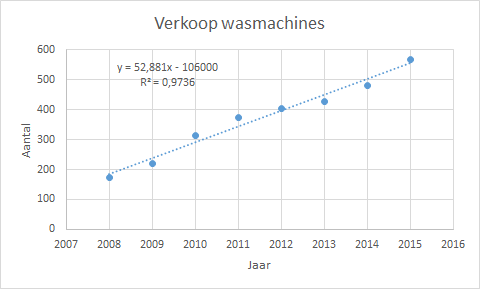
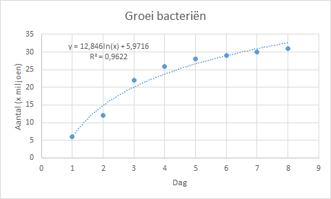
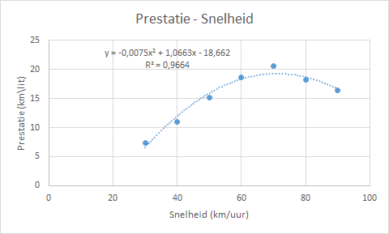
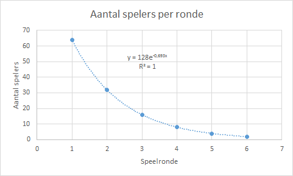

# Excel Trendlijnen {#app-excel-trendlijnen}

Excel kent een zestal trendlijnen. Het is niet altijd direct duidelijk welk soort trendlijn het beste bij een verzameling gegevens past. Soms zie je dat meteen en anders moet je een aantal verschillende soorten trendlijnen proberen.

De kwaliteit van een trendlijn kun je beoordelen door de waarde van R-kwadraat (R2) uit te laten rekenen. Dit is een getal van 0 tot 1 dat aangeeft hoe dicht de berekende waarden via de formule van de grenslijn liggen bij de werkelijke waarden. Hoe dichter bij 1 hoe beter de trendlijn. Bij het toevoegen van een trendlijn kan geselecteerd worden dat R-kwadraat en de vergelijking van de trendlijn in de grafiek moeten worden weergegeven.

Bij het maken van voorspellingen heb je de coëfficienten van de vergelijking van de trendlijn nodig. Excel voorziet in werkbladfuncties voor deze coëfficienten.

## Lineaire trendlijn

Een lineaire trendlijn is een zo goed mogelijk passende rechte lijn die gebruikt wordt voor eenvoudige lineaire gegevensverzamelingen. Deze trendlijn wordt meestal gebruikt om een regelmatige stijging of daling weer te geven.

De vergelijking van de trendlijn is: $y = a \cdot x + b$ met

+ $a$ = richtingscoëfficient
+ $b$ = snijpunt met de verticale as

:::{.workedexample}
Verkoop van het aantal wasmachines door een bepaald bedrijf voor acht achtereenvolgende jaren.

1. Open het hulpbestand [Trendlijnen.xlsx](data/trendlijnen.xlsx) en selecteer het werkblad *Lineair*.
1. Selecteer een willekeurige cel in het gegevensgebied.
1. Voeg een *Spreidingsdiagram* in.
1. Selecteer de grafiekreeks door op een gegevenspunt te klikken. Dan rechtermuisklik en kies *Trendlijn toevoegen*.
1. Selecteer bij Opties voor trendlijn: *Lineair*. En laat de vergelijking en R-kwadraat in de grafiek weergeven.
1. Wijzig titel in *Verkoop Wasmachines*.
1. Voeg astitels toe en wijzig titel Y-as in *Aantal* en titel X-as in *Jaar*.
1. Versleep in de grafiek de vergelijking naar een overzichtelijke plaats.

```{r vb-trend-lineair, fig.cap="Voorbeeld lineaire trendlijn", out.width="70%"}

```

:::

**Werkbladfuncties**

Vergelijking: $y = a \cdot x + b$

Richtingscoëfficient $a$

+ `RICHTING(y-bekend;x-bekend)`
+ `INDEX(LIJNSCH(y-bekend ; x-bekend) ; 1; 1)`

Snijpunt met Y-as $b$

+ `SNIJPUNT(y-bekend;x-bekend)`
+ `INDEX(LIJNSCH(y-bekend ; x-bekend) ; 1; 2))`

Correlatiecoëfficient $R$

+ `CORRELATIE(y-bekend ; x-bekend)`

R-kwadraat vind je door de gevonden waarde te kwadrateren.

## Logaritmische trendlijn

Een logaritmische trendlijn is een zo goed mogelijk passende gebogen lijn die goed past bij gegevens die in het begin snel stijgen (of dalen) en zich daarna stabiliseren. Er mogen geen nulwaarden in de gegevensverzameling zitten!

De vergelijking van de trendlijn is: $y = a \cdot LN(x) + b$ met a en b als constanten.

:::{.workedexample}
Groei van het aantal bacteriën in een kweek.

1. Open het hulpbestand [Trendlijnen.xlsx](data/trendlijnen.xlsx) en selecteer het werkblad *Logaritmisch*.
1. Selecteer een willekeurige cel in het gegevensgebied.
1. Voeg een *Spreidingsdiagram* in.
1. Selecteer de grafiekreeks door op een gegevenspunt te klikken. Dan rechtermuisklik en kies *Trendlijn toevoegen*.
1. Selecteer bij Opties voor trendlijn: *Logaritmisch*. En laat de vergelijking en R-kwadraat in de grafiek weergeven.
1. Wijzig titel in *Groei bacterieën*.
1. Voeg astitels toe en wijzig titel Y-as in *Aantal (x miljoen)* en titel X-as in *Dag*.
1. Versleep in de grafiek de vergelijking naar een overzichtelijke plaats.


```{r vb-trend-logaritme, fig.cap="Voorbeeld logaritmische trendlijn", out.width="70%"}

```

:::

**Werkbladfuncties**

Vergelijking: $y = a \cdot LN(x) + b$

+ $a$ = `INDEX(LIJNSCH(y-bekend ; LN(x-bekend)) ; 1 ; 1)`
+ $b$ = `INDEX(LIJNSCH(y-bekend ; LN(x-bekend)) ; 1 ; 2)`

## Polynoom trendlijn

Een polynoom trendlijn is een gebogen lijn die vaak goed past bij schommelende gegevens.

De vergelijking van de trendlijn heeft de vorm:
$y = a_n \cdot x^n ... + a_2 \cdot x^2 + a_1 \cdot x + a_0$ De getallen $a_0, a_1, a_2, ... a_n$ heten de coëfficiënten van de polynoom en het getal $n$ heet de graad van de polynoom.

De graad van de polynoom wordt bepaald door het aantal schommelingen (pieken en dalen) in de gegevens:

+ 1e graad, hetzelfde als de lineaire trendlijn.
+ 2e graad, meestal slechts één piek of dal in de lijn. Lijn heet ook wel parabool.
+ 3e graad, meestal één of twee pieken of dalen.
+ 4e graad, meestal maximaal drie pieken of dalen.

In de praktijk zul je moeten experimenteren met de graad om uit te zoeken welke de best passende is.

:::{.workedexample}
Prestatie (in km per liter brandstof) van een auto bij verschillende snelheden (in km/uur).

1. Open het hulpbestand [Trendlijnen.xlsx](data/trendlijnen.xlsx) en selecteer het werkblad *Polynoom*.
1. Selecteer een willekeurige cel in het gegevensgebied.
1. Voeg een *Spreidingsdiagram* in.
1. Selecteer de grafiekreeks door op een gegevenspunt te klikken. Dan rechtermuisklik en kies *Trendlijn toevoegen*.
1. Selecteer bij Opties voor trendlijn: *Polynoom volgorde 3*. En laat de vergelijking en R-kwadraat in de grafiek weergeven.
1. Wijzig titel in *Prestatie - Snelheid*.
1. Voeg astitels toe en wijzig titel Y-as in *Prestatie (km/lit)* en titel X-as in *Snelheid (km/uur)*.
1. Versleep in de grafiek de vergelijking naar een overzichtelijke plaats.

```{r vb-trend-polynoom, fig.cap="Voorbeeld polynoom trendlijn", out.width="70%"}

```

:::

**Werkbladfuncties**

Vergelijking: $y = a \cdot x^2 + b \cdot x + c$

+ $a$ = `INDEX(LIJNSCH(y-bekend ; x-bekend^{1\2}) ; 1 ; 1)`
+ $b$ = `INDEX(LIJNSCH(y-bekend ; x-bekend^{1\2}) ; 1 ; 2)`
+ $c$ = `INDEX(LIJNSCH(y-bekend ; x-bekend^{1\2}) ; 1 ; 3)`

## Machtstrendlijn

Een machtstrendlijn is een gebogen lijn die zeer geschikt is voor verzamelingen van gegevens die in een bepaald tempo toenemen, bijvoorbeeld de acceleratie van een Formule 1 auto. Er mogen geen nulwaarden of negatieve waarden in de gegevensverzameling zitten!

De vergelijking van de trendlijn is: $y = a \cdot x^b$ waarbij $a$ en $b$ constanten zijn.

:::{.workedexample}
Afgelegde afstand van een optrekkende raceauto in intervallen van steeds 1 seconde.

1. Open het hulpbestand [Trendlijnen.xlsx](data/trendlijnen.xlsx) en selecteer het werkblad *Macht*.
1. Selecteer een willekeurige cel in het gegevensgebied.
1. Voeg een *Spreidingsdiagram* in.
1. Selecteer de grafiekreeks door op een gegevenspunt te klikken. Dan rechtermuisklik en kies *Trendlijn toevoegen*.
1. Selecteer bij Opties voor trendlijn: *Macht*. En laat de vergelijking en R-kwadraat in de grafiek weergeven.
1. Wijzig titel in *Afgelegde afstand*.
1. Voeg astitels toe en wijzig titel Y-as in *Afstand (meter)* en titel X-as in *Tijd (sec)*.
1. Versleep in de grafiek de vergelijking naar een overzichtelijke plaats.

```{r vb-trend-macht, fig.cap="Voorbeeld macht trendlijn", out.width="70%"}
knitr::include_graphics("images/timeseries/vb-trend-macht.png")
```

:::

**Werkbladfuncties**

vergelijking: $y = a \cdot x^b$

+ $a$ = `EXP(INDEX(LIJNSCH(LN(y-bekend) ; LN(x-bekend)) ; 2))`
+ $b$ = `INDEX(LIJNSCH(LN(y-bekend) ; LN(x-bekend)) ; 1)`

## Exponentiële trendlijn

Een exponentiële trendlijn is een gebogen trendlijn die vooral geschikt is voor gegevensverzamelingen waarvan de waarden steeds sneller stijgen of dalen. Er mogen geen nulwaarden of negatieve waarden in de gegevensverzameling zitten!

De vergelijking van de trendlijn is: $y = a \cdot e^{bx}$ waarbij $a$ en $b$ constanten zijn.

:::{.workedexample}
Aantal spelers in een tennistoernooi dat na elke ronde overblijft. Het toernooi is met 128 spelers begonnen.

1. Open het hulpbestand [Trendlijnen.xlsx](data/trendlijnen.xlsx) en selecteer het werkblad *Exponentieel*.
1. Selecteer een willekeurige cel in het gegevensgebied.
1. Voeg een *Spreidingsdiagram* in.
1. Selecteer de grafiekreeks door op een gegevenspunt te klikken. Dan rechtermuisklik en kies *Trendlijn toevoegen*.
1. Selecteer bij Opties voor trendlijn: *Exponentieel*. En laat de vergelijking en R-kwadraat in de grafiek weergeven.
1. Wijzig titel in *Aantal spelers per ronde*.
1. Voeg astitels toe en wijzig titel Y-as in *Aantal spelers* en titel X-as in *Speelronde*.
1. Versleep in de grafiek de vergelijking naar een overzichtelijke plaats.

```{r vb-trend-exponentieel, fig.cap="Voorbeeld exponentiële trendlijn", out.width="70%"}

```

De trendlijn is hier perfect omdat er exacte waarden zijn gebruikt.
:::

**Werkbladfuncties**

vergelijking: $y = a \cdot e^{bx}$

+ $a$ = `EXP(INDEX(LIJNSCH(LN(y-bekend) ; x-bekend) ; 1 ; 2))`
+ $b$ = `INDEX(LIJNSCH(LN(y-bekend) ; LN(x-bekend)) ; 1)`

## Zwevend gemiddelde lijn

Een zwevend gemiddelde (voortschrijdend gemiddelde) (trend)lijn strijkt schommelingen in de gegevens glad, waardoor het patroon duidelijker zichtbaar wordt.

Het zwevend gemiddelde is het gemiddelde van een vast aantal opeenvolgende waarden in een tijdreeks. De tijdsduur voor het vaste aantal elementen heet de periode. De lijn door deze gemiddeldes is de trendlijn. Sterke schommelingen worden hierdoor afgezwakt. Het kost soms wat experimenteren om een geschikte periode te vinden.

Deze lijn heeft geen formule en ook de R-kwadraatswaarde kan niet berekend worden. Voor de beoordeling van de kwaliteit zijn andere methodes beschikbaar.

:::{.workedexample}
Koers van een aandeel gedurende 20 dagen.
Het zwevend gemiddelde wordt berekend voor een periode van 3 dagen. Zo kan de eerste waarde voor het zwevend gemiddelde pas op dag 3 berekend worden en de waarde is het gemiddelde van dag 1, 2 en 3. De volgende waarde bij dag 4 is het gemiddelde van de waarden op dag 2, 3 en 4. Enzovoorts.

1. Open het hulpbestand [Trendlijnen.xlsx](data/trendlijnen.xlsx) en selecteer het werkblad *ZwevendGemiddelde*.
1. Selecteer een willekeurige cel in het gegevensgebied.
1. Voeg een *Spreidingsdiagram* in.
1. Selecteer de grafiekreeks door op een gegevenspunt te klikken. Dan rechtermuisklik en kies *Trendlijn toevoegen*.
1. Selecteer bij Opties voor trendlijn: *Zwevend gemiddelde met Periode 3*.
1. Wijzig titel in *Koers*.
1. Voeg astitels toe en wijzig titel Y-as in *Koers* en titel X-as in *Dag*.
1. Versleep in de grafiek de vergelijking naar een overzichtelijke plaats.


```{r vb-zwevend-gemiddelde, fig.cap="Voorbeeld zwevend gemiddelde lijn", out.width="70%"}
knitr::include_graphics("images/timeseries/vb-zwevend-gemiddelde.png")
```

Duidelijk is te zien dat de trendlijn de scherpe kantjes van de koersbeweging afhaalt.
:::
