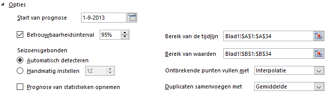

# Bijlage Prognosewerkblad {#app-prognosewerkblad-opties}

Het dialoogvenster **Prognosewerkblad** kent de volgende opties.


```{r sales-fcast-options, fig.cap="Opties prognosewerkblad."}

```

De verschillende mogelijkheden worden hierna toegelicht.

**Start van prognose**

De begindatum voor de prognose wordt automatisch door Excel geselecteerd. Je kunt deze wijzigen. Wanneer je een datum kiest vóór het einde van de historische gegevens, worden alleen gegevens vóór de begindatum gebruikt in de voorspelling (dit wordt soms ook wel *backcasting* genoemd).

::: {.tip}
1. Als je de prognose start vóór het laatste historische punt, krijg je een goed beeld van de nauwkeurigheid van de voorspelling, omdat je de voorspelde reeks kunt vergelijken met de werkelijke gegevens. Als je de prognose echter te vroeg start, is de gegenereerde prognose mogelijk niet hetzelfde als de prognose die je krijgt wanneer je alle historische gegevens gebruikt. De voorspelling wordt nauwkeuriger als je alle historische gegevens gebruikt.

1. Als de gegevens seizoensgebonden zijn, kun je het beste een prognose starten vóór het laatste historische punt.
:::

**Betrouwbaarheidsinterval**

Hier kun je het weergeven van een betrouwbaarheidsinterval in of uit schakelen. Hiermee kun je de nauwkeurigheid van de voorspelling vaststellen. Een kleiner interval betekent een betrouwbaardere voorspelling voor het specifieke punt. Standaard is het een 95% betrouwbaarheidsinterval dat gewijzigd kan worden.

**Seizoensgebonden**

Wanneer het patroon van de gegevens een seizoensgebondenheid bevat dan kun je hier het aantal waarnemingen voor het patroon instellen. Standaard is automatisch detecteren ingesteld. Wanneer het Excel niet lukt om automatisch een seizoenspatroon te ontdekken, krijg je een waarschuwing met het advies om over te stappen op Handmatig.

::: {.important}
Gebruik geen waarde voor minder dan twee cycli met historische gegevens wanneer je seizoensgebondenheid handmatig instelt. Met minder dan twee cycli kunnen de seizoensgebonden items niet worden geïdentificeerd in Excel. Als de seizoensgebondenheid niet belangrijk genoeg is om te worden gedetecteerd met de algoritme, wordt de voorspelling weer omgezet in een lineaire trend.
:::

**Bereik van de tijdlijn**

Hiermee kun je het bereik voor de kolom met tijdgegevens instellen. Dit bereik moet hetzelfde zijn als het Bereik van waarden.

**Bereik van waarden**

Hiermee kun je het bereik voor de kolom met waarden instellen. Dit bereik moet hetzelfde zijn als het Bereik van de tijdlijn. 

**Ontbrekende punten invullen met**

Wanneer in de gegevensverzameling ontbrekende waarden voorkomen, dan vult Excel deze zelf in op basis van interpolatie. Dit houdt in dat een ontbrekend punt wordt ingevuld als het gewogen gemiddelde van de aangrenzende punten mits er minder dan 30% van de punten ontbreekt. Als je in plaats hiervan de ontbrekende waarden als nullen wilt behandelen, dan selecteer je Nullen in de lijst.

**Duplicaten samenvoegen met**

Wanneer de gegevens meerdere waarden met de dezelfde tijdstempel bevatten, dan neemt Excel hiervoor het gemiddelde van deze waarden. Als je een andere berekeningsmethode wilt gebruiken, dan kun je in de lijst kiezen uit: Gemiddelde, Aantal, AantalArg, Max, Mediaan, Min en Som.

**Prognose van statistieken opnemen**

Via dit selectievakje kun je aanvullende statistische informatie over de prognose in het voorspellingblad laten opnemen. Met behulp van de functie `VOORSPELLEN.ETS.STAT` wordt een tabel met statistieken gegenereerd. Zie het voorbeeld hierna.

```{r echo=FALSE}
opties <- tribble(
	~Statistieken, ~Waarde, ~Toelichting,
	"Alpha", "0,00", "Dempingscoëfficient van het ETS algoritme. Een hogere waarde kent meer gewicht toe aan recente waarden.",
	"Beta" , "0,00", "Dempingscoëfficient van het ETS algoritme. Een hogere waarde kent meer gewicht toe aan de recente trend.",
	"Gamma", "0,25", "Dempingscoëfficient van het ETS algoritme. Een hogere waarde kent meer gewicht toe aan de recente seizoensperiode.",
	"MASE" , "0,46", "Mean Absolute Scaled Error",
	"SMAPE", "0,03", "Symmetric Mean Absolute Percentage Error",
	"MAE"  , "128.317,53", "Mean Absolute Percentage Error",
	"RMSE" , "187.920,90", "Root Mean Square Error"
)
opties %>% kbl() %>% kable_styling()
```

<!-- Bron: https://support.office.com/nl-nl/article/Een-prognose-maken-in-Excel-2016-voor-Windows-22c500da-6da7-45e5-bfdc-60a7062329fd?ui=nl-NL&rs=nl-NL&ad=NL&fromAR=1  -->
