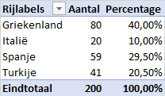
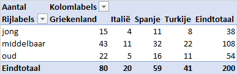
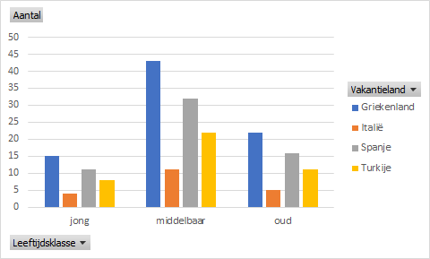
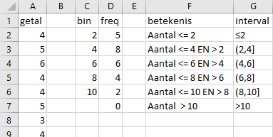
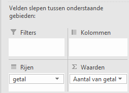
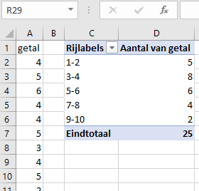
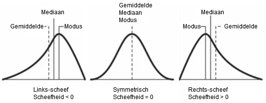

# Beschrijvende statistiek {#beschrijvend}

:::{.chapterintro}
Bij wat de beschrijvende statistiek genoemd wordt, gaat het om het beschrijven van een gegevensverzameling door de gegevens te ordenen, samen te vatten en weer te geven op een informatieve manier. Dit kan in *numerieke* en *grafische* vorm. Hierdoor ben je sneller in staat om de gegevensverzameling te begrijpen. Welke vorm je gebruikt hangt vooral af van de gewenste informatie over de gegevens. Bij het gebruik van de verschillende technieken moet je een onderscheid maken tussen categoriale variabelen en numerieke variabelen.
:::

## Ordening Categoriale variabelen

Voor categoriale variabelen kun je geen zinvolle statistieken als gemiddelde, minimum of maximum bepalen. Wel kun je samenvattingen maken door de frequenties van de waarden te tellen. In Excel gaat dit het handigste met *draaitabellen*. Behalve als absolute aantallen voor elke categorie (frequenties) kun je ook percentages voor elke categorie weergeven (relatieve frequenties. Verschillen tussen categorieën zijn hierdoor snel zichtbaar.

**Frequentietabel**

::: {.workedexample}
Aan 200 personen van drie verschillende leeftijdsklasses (jong, middelbaar, oud) is gevraagd wat hun favoriete vakantieland (Griekenland, Spanje, Turkije, Italië) is. De gegevens staan in het bestand [vakanties.xlsx](data/vakanties.xlsx). Download het bestand en open het.

Plaats de cursor ergens in de dataset en zet deze om naar een Excel tabel via *tab Invoegen > Tabel*. Kies daarna *tab Invoegen > Draaitabel* en laat deze in een nieuw werkblad plaatsen. Om de frequenties van de vakantielanden te bepalen sleep je het veld `Vakantieland` naar de `Rijen` en het veld `id` naar de `Waarden`. Standaard maakt Excel daat *Som van id* van. Dit is niet goed. Klik op het keuzepijltje in het vak *Som van id* en kies *Waardeveldinstellingen*. Onder *Waardeveld samenvatten op* selecteer je *Aantal*. Wijzig verder de *Aangepaste naam* in `Aantal` en daarna *OK*.

Om ook de relatieve frequenties weer te geven sleep je het veld `id` nogmaals naar de `Waarden`, onder Aantal. Excel maakt er weer *Som van id* van. Wijzig dit analoog aan het voorgaande weer in samenvatten op Aantal. Daarna selecteer je in hetzelfde dialoogvenster de tab *Waarden weergeven als* en wijzig je de standaardkeuze *Geen berekening* in *% van eindtotaal*. Pas tot slot de naam van de kolom aan in *Percentage* en klik dan *OK*.

```{r vakantieland-frequenties, fig.cap="Frequenties favoriete vakantielanden", out.width="40%", fig.align='left'}

```

Sluit de werkmap nog niet want je hebt deze nog nodig voor de volgende oefening.
:::

**Kruistabel**

Voor het vergelijken van twee (of meer) categoriale variabelen onderling maak je een **kruistabel**. Hierin staan de categorieën van de ene variabele (de rijvariabele) in de rijen en de categorieën van de andere variabele (de kolomvariabele) in de kolommen. In de cel waar een rijwaarde en een kolomwaarde elkaar kruisen staat het aantal dat tot beide categorieën behoort. Behalve als aantal (frequentie) kunnen de tellingen ook worden weergegeven als een percentage van het totale totaal, van het rijtotaal of van het kolomtotaal. Door deze weergave kun je patronen bestuderen die tussen de variabelen kunnen bestaan. Kruistabellen maak je ook het beste maken met *draaitabellen*.

::: {.workedexample}
Om een kruistabel te maken van de variabelen `Leeftijdsklasse` en `Vakantieland` maak je een nieuwe draaitabel. Sleep het veld `Leeftijdsklasse` naar de `Rijen`, het veld `Vakantieland` naar de `Kolommen` en het veld `id` naar de `Waarden`. Wijzig de *Waardeveldinstellingen* weer in *Aantal* in plaats van Som.

```{r vakantieland-kruistabel, fig.cap="Kruistabel van Leeftijdsklasse met Vakantieland", fig.align='left'}

```

Om hierbij een visualisatie met een kolomdiagram te maken selecteer je een veld in de draaitabel en kies dan *Invoegen > Gegroepeerde kolom (groep Grafieken)*.

```{r vakantieland-kolomdiagram, fig.cap="Kolomdiagram van Vakantieland per Leeftijdsklasse", fig.align='left'}

```

Uiteraard kun je dit standaarddiagram nog op de bekende manieren verder verfraaien.
:::

## Ordening Numerieke variabelen

Wanneer het aantal waarnemingen van een numerieke variabele niet al te groot is kun je een beter gevoel voor de data krijgen door deze te ordenen (sorteren) van klein naar groot. Je ziet dan snel het bereik van de waarden. Bij een groter aantal data kun je beter van een *frequentietabel* gebruik maken.

### Frequentieverdelingen {#frequentieverdelingen}

Bij een *frequentieverdeling* van een numerieke variabele wordt het bereik van de waarden opgedeeld in een aantal geordende *klassen* en geteld hoeveel waarden in elke klasse voorkomen. De grenzen van een klasse, de ondergrens en bovengrens, worden met een combinatie van ronde haken () en blokhaken [] aangeduid. Een ronde haak betekent dat de grenswaarde niet tot de klasse behoort. Een blokhaak betekent dat de grenswaarde wel tot de klasse behoort. Zo hoort bij een klasse aangeduid met [25,40) de waarde 25 wel tot de klasse, maar de waarde 40 niet.

De *klassebreedte* is het verschil tussen de bovengrens en de ondergrens van een klasse. Zo heeft de klasse [25,40) een klassebreedte 15. Om een bruikbare frequentieverdeling te maken moet je een beslissing nemen over het aantal klassen en dus over de klassebreedte. Bij teveel of te weinig klassen kun je weinig informatie uit de frequentieverdeling halen. In de praktijk zie je vaak 5 tot 15 klassen.

Voor het maken van klassen (*bins* geheten in Excel) gelden de volgende regels:

+ De klassen mogen geen overlappingen vertonen. Een waarneming moet slechts in één klasse ondergebracht kunnen worden. Een indeling met hierin de klassen [25,50] en [50,75] kan dus niet. Want dit zou inhouden dat de waarde `50` tot 2 klassen kan behoren.
+ Voor elke waarneming moet er een klasse beschikbaar zijn. Dus alle waarnemingen moeten in een klasse ondergebracht kunnen worden. Vaak worden daarom de eerste en laatste klasse extra groot gemaakt.
+ Als het kan maak dan de klassen even breed. Excel kan hier beter mee overweg dan wanneer de klassen niet even breed zijn. Voor de eerste en de laatste klasse lukt dat niet alijd omdat alle waarnemingen opgevangen moeten worden. Daarnaast kunnen er ook andere redenen zijn om de klassen niet even breed te maken. Ook worden soms klassen waarin weinig waarnemingen zitten samengevoegd waardoor een bredere klasse ontstaat.
+ De klassen moeten wel voldoende differentieren (verschillen vertonen) anders levert de frequentieverdeling te weinig informatie op. Zo heeft het weinig zin om voor de inkomensverdeling in Nederland een klasse van €10.000 tot €60.000 te maken, omdat hierin bijna alle inkomens (> 90%) vallen.

In Excel kun je op meerdere manieren een freqentieverdeling maken:

+ Met de formule `INTERVAL(gegevensmatrix;interval_verw)`
+ Met een draaitabel
+ Met de histogram optie in gegevensanalyse (Analysis Toolpak)
+ Via Invoegen > grafieken > Histogram (alleen histogram, geen afzonderlijke frequenties)

De eerste twee methodes worden hierna met een voorbeeld toegelicht. De andere twee mogelijkheden komen bij het maken van een histogram aan de orde. Welke manier je in de praktijk gebruikt hangt meestal af van de gewenste uitvoer en de mogelijkheden tot het maken van aanpassingen.

Allereerst de formule INTERVAL.

::: {.workedexample}
Download het bestand [frequenties.xlsx](data/frequenties.xlsx) en open werkblad *interval*. In de kolom *getal* staan 25 willekeurige gehele getallen, gegenereerd uit het interval [1,10].

Om een frequentieverdeling te maken moet je eerst de intervallen (bins) vaststellen waarin de waarden moeten vallen. Hiervoor maak je een kolom met de bovengrenzen van de intervallen. Deze staan in de kolom "bin" en typ je gewoon in.

De frequenties staan in de kolom *freq* en zijn berekend met de formule `=INTERVAL(A2:A26;C2:C6)`. Het eerste argument is de matrix met de waarden waarvanje frequentie wilt bepalen. Het tweede argument is de matrix met de bovengrenzen van de klassen (de intervallen).

Deze formule is een zogenaamde **matrixformule**. In Excel 365 kun je deze matrixformule gewoon in de begincel *D2* invoeren en vervolgens op Enter drukken. Het resultaat is een kolommetje getallen, een matrix. En Excel weet welke cellen nodig zijn voor de uitvoer en plaatst het resultaat van deze *dynamische matrix* in deze cellen. Deze cellen moeten wel leeg zijn anders krijg je een foutmelding.

```{r freq-interval, fig.cap="Frequenties bepaald met functie INTERVAL.", out.width="60%", fig.align='left'}

```
:::

Ook met een draaitabel kun je een frequentieverdeling maken.

::: {.workedexample}
Selecteer het gegevensgebied *A1:A26* en kies dan *tab Invoegen > Draaitabel*. Plaats het veld `getal` in zowel het rijengebied als het waardengebied. Wijzig daarna de waardeveldinstellingen zodat het aantal bepaald wordt en niet de som.

```{r freq-draaitabel-velden, fig.cap="Velden voor de draaitabel.", out.width="60%", fig.align='left'}

```

Nu moet je nog groeperen voor de intervals. Selecteer een willekeurig veld in de draaitabel, *rechter muisklik* en kies dan *Groeperen*. Stel in het dialoogscherm in dat wordt begonnen bij 1, geeindigd bij 10 en dat de stapgrootte 2 is. Na het groeperen verschijnt de frequentieverdeling.

```{r freq-draaitabel-resultaat, fig.cap="Frequentieverdeling via een draaitabel.", out.width="60%", fig.align='left'}

```
:::

De resultaten van beide methodes zijn hetzelfde. De werkwijze en presentatie van het resultaat verschillen.

**Relatieve frequentieverdeling**

De relatieve frequenties worden uitgedrukt als fracties of als een percentages. Deze verdeling kun je het beste via draaitabellen maken.

**Cumulatieve frequentieverdeling**

De cumulatieve frequentie is de som van alle frequenties tot en met de frequentie van de desbetreffende waarde. Met name wanneer je gebruik maakt van percentages heb je een manier om te laten zien welk percentage waarden kleiner is dan een bepaalde waarde.

## Numerieke statistieken

Voor numerieke variabelen kun je ook samenvattende grootheden, statistieken geheten, voor de dataset maken, zoals wat het centrum van de gegevens is en hoe de gegevens verspreid zijn.

### Centrum dataset

De waarden van veel numerieke variabelen zitten verspreid rond een centrale waarde. De meest gebruikte maten om het centrum van een dataset aan te geven zijn gemiddelde en mediaan. Welke maat het meest geschikt is om het centrum te bepalen hangt van de situatie af.

+ gemiddelde: is het meest geschikt voor symmetrische verdelingen zonder uitschieters.
+ mediaan: is het meest geschikt voor scheve verdelingen of data met uitschieters

#### Gemiddelde {.unnumbered}

Voor een populatie wordt het *gemiddelde* aangegeven met het symbool $\mu$ en berekend door de som van alle waarnemingen te delen door het totaal aantal waarnemingen. Doordat alle waarnemingen meetellen bij het bepalen van het gemiddelde hebben uitschieters grote invloed. Wanneer er extreme waarden voorkomen kun je beter een andere maat voor het centrum gebruiken.

Excel formule: `GEMIDDELDE(data)`

#### Mediaan {.unnumbered}

De mediaan is de middelste waarneming van een van klein naar groot gesorteerde reeks. Deze splitst dus de verzameling in twee helften: de laagste 50% en de hoogste 50%. Bij een oneven aantal is de mediaan de middelste waarneming. Bij een even aantal zijn er twee waarden die het midden vormen en neem je het gemiddelde van deze twee waarden. Uitschieters hebben geen invloed op de mediaan, waardoor de mediaan een goed alternatief is voor het gemiddelde wanneer er extreme waarden aanwezig zijn.

Excel formule: `MEDIAAN(data)`

#### Modus {.unnumbered}

De modus is de waarde die het meest voorkomt in de reeks. Wanneer er meerdere waarden zijn met de hoogste frequentie, dan is er geen modus. Uitschieters hebben geen invloed op de modus.

Excel formule: `MODUS(data)`

#### Kwartielen {.unnumbered} 
	
Je kunt een gesorteerde reeks ook in vier gelijke stukken verdelen, elk van 25% van de waarnemingen. Deze heten dan *kwartielen*. Het eerste kwartiel $Q_1$ splitst de verzameling in de laagste 25% en de hoogste 75%, Het tweede kwartiel $Q_2$ is gelijk aan de mediaan. En het derde kwartiel $Q_3$ splitst de verzameling in de laagste 75% en de hoogste 25%. Verder is $Q_0$ gelijk aan de minimumwaarde en is $Q_4$ gelijk aan de maximumwaarde.

Excel formules: `KWARTIEL.EXC(data;kwartiel)` en `KWARTIEL.INC(data;kwartie)` waarbij de uiterste waarden respectievelijk niet en wel worden meegenomen.

:::{ .important}

**5-getallensamenvatting**

Hiermee wordt bedoeld een opsomming van de waarden $Q_0$, $Q_1$, $Q_2$, $Q_3$ en $Q_4$. Hiermee heb je een beknopte samenvatting die je inzicht geeft in het centrum, de spreiding van de gegevens en het bereik.
:::

### Spreiding dataset

Het bepalen van het centrum geeft slechts gedeeltelijke informatie over een dataset. Het is ook belangrijk om te beschrijven hoe de waarnemingen rond het centrum verspreid zijn.

#### Variantie en Standaarddeviatie {.unnumbered}

De meest gebruikte maten om de spreiding van de gegevens weer te geven zijn *variantie* en *standaarddeviatie*. De standaarddeviatie (standaardafwijking)is gedefinieerd als de wortel uit de variantie. Voor een populatie wordt de standaarddeviatie weergegeven met het symbool $\sigma$ en de variantie met $\sigma^2$.

Voor het berekenen van de variantie worden de verschillen van alle waarnemingen ($x_i$) met het gemiddelde ($\mu$) gekwadrateerd en de som hiervan gedeeld door het totaal aantal waarnemingen ($N$). Zowel de variantie als de standaarddeviatie kunnen dus nooit negatief zijn.

$$\sigma^2 = \frac{1}{N}\sum_{i=1}^{N}{(x_i- \mu)}^2$$

Om de logica van deze maatstaf voor de spreiding van de gegevens te begrijpen moet je bedenken dat $x_i - \mu$ de afwijking is van $x_i$ ten opzichte van het gemiddelde. Je berekent dus in feite het gemiddelde van de kwadratische afwijkingen.

:::{ .important}
Bij een steekproef met $n$ waarnemeningen uit de populatie wordt de variantie aangeduid met $s^2$ en berekend via $s^2 = \frac{1}{n-1}\sum_{i=1}^{n}{(x_i- \bar{x})}^2$, waarbij $\bar{x}$ het steekproefgemiddelde is.
:::

Excel formules:

+ Variantie: `VAR.P(data)` voor populatie en `VAR.S(data)` voor steekproef
+ Standaarddeviatie: `STDEV.P(data)` voor populatie en `STDEV.S(data)` voor steekproef
+ Som kwadratische afwijkingen: `DEV.KWAD(data)`

#### Spreidingsbreedte {.unnumbered}

De spreidingsbreedte is het verschil tussen de grootste en de kleinste waarneming. Deze maat is eenvoudig uit te rekenen, maar wel erg gevoelig voor extreme waarden.

Excel formule: `MAX(data) - MIN(data)`

#### Gemiddelde absolute afwijking {.unnumbered}

Dit is het gemiddelde van de absolute waarden van het verschil van een waarneming met het gemiddelde.

Excel formule: `GEM.DEVIATIE(data)`

#### Interkwartielafstand {.unnumbered}

Dit is het verschil tussen het derde kwartiel en het eerste kwartiel, dus $Q_3 - Q_1$. Het is een manier om de spreiding van de middelste 50% van de gegevens weer te geven.

Excel formule: `KWARTIEL(data;3) - KWARTIEL(data;1)`

#### Variatiecoëfficient {.unnumbered}

De variatiecoëfficient (VC) is de standaarddeviatie gedeeld door het gemiddelde.

$VC = \frac{\sigma}{\mu}$ (voor een populatie),  $VC = \frac{s}{\bar{x}}$ (voor een steekproef)

De variatiecoëfficient wordt vaak als een percentage uitgedrukt. Je kunt er mee aangeven of de standdardeviatie groot of klein is ten opzichte van het gemiddelde. Een kleine variatiecoefficient geeft aan dat de waarden slechts weinig fluctueren rond het gemiddelde. De variatiecoëfficiënt wordt vaak gebruikt om de variatie tussen twee verschillende datasets te vergelijken.

### Z scores

Wanneer twee datsets verschillende gemiddelden en verschillende standaardwaarden hebben kun je niet zomaar een waarde uit de ene dataset vergelijken met een waarde uit een andere dataset. Om ze wel te kunnen vergelijken moet je de waarden in de datasets eerst standaardiseren door de waarden om te zetten in zogenaamde *z-waarden* of *z-scores*.

De z-score van een waarde is het verschil tussen die waarde en het gemiddelde, gedeeld door de standaarddeviatie: $z = \frac{x - \mu}{\sigma}$

Het gemiddelde zelf heeft een z-score van 0. Waarden groter dan het gemiddelde hebben een positieve z-score en waarden kleiner dan het gemiddelde een negatieve z-score. De z-score geeft in feite aan hoeveel keer de standaaarddeviatie een waarde van het gemiddelde af ligt.

Via de z-scores kun je ook gemakkelijker eventuele uitschieters opsporen. Een vuistregel is dat een waarde met een z-score kleiner dan -3 of groter dan 3 als een uitschieter beschouwd kan worden.

Excel formule: `NORMALISEREN(x ; gemiddelde ; standaarddeviatie)`

Voor het gebruik hiervan moet je wel eerst het gemiddelde en de standaarddeviatie berekenen of een formule hiervoor opnemen.

### Scheefheid en Kurtosis

Twee andere belangrijke grootheden zijn Scheefheid en Kurtosis.

#### Scheefheid {.unnumbered}

in vergelijking met een normale verdeling die symmetrisch is, kan een verdeling scheef verdeeld zijn aan de linker- of rechterkant.

```{r scheefheid, fig.cap="Linker en rechter scheefheid met kenmerken.", out.width="70%"}

```

Bij links-scheef ligt de staart links en bij rechts-scheef ligt de staart aan de rechterkant. Voor de berekening van de scheefheid bestaat een formule waarmee je de mate en soort scheefheid weer kunt geven. Een links-scheve verdeling heeft een negatieve waarde, een rechts-scheve verdeling heeft een positieve waarde. Ligt het gemiddelde precies in het midden dan is de waarde van de scheefheid 0. In de praktijk zal de scheefheid van een normaal verdeelde variabele rond de nul liggen, zo tussen -0,5 en +0,5.

Excel formules: `SCHEEFHEID(data)` en `SCHEEFHEID.P(data)` voor een populatie

#### Kurtosis {.unnumbered}

Bij kurtosis ga je na of de verdeling van de waarden van een variabele een scherpe piek heeft of dat de verdeling nogal plat is. Bij een normale verdeling is de kurtosis 0. Een negatieve waarde (meestal kleiner dan -3) geeft een plattere verdeling aan en een positieve waarde (meestal groter dan +3) een meer gepiekte verdeling.

```{r kurtosis, fig.cap="Kurtosis, gepiekt en plat.", out.width="70%"}
knitr::include_graphics("images/beschrijvend/kurtosis.png")
```

Het onderzoeken van de kurtosis van variabelen kan van belang zijn bij het onderzoeken van mogelijke relaties tussen variabelen. Bij een variabele met een hoge kurtosis liggen de waarden dicht bij elkaar (vandaar de piek) en is de kans op een relatie met andere varibelen klein.

Excel formule: `KURTOSIS(data)`

## Opgaven {#opg-beschrijvend}

::: {.sectionexercise}
1. In een straat wonen 9 personen met een inkomen tussen 15.000 en 30.000 euro en nog 1 persoon met een inkomen van ongeveer een miljoen. Welke maatstaf zou je gebruiken om het centrum van deze inkomens weer te geven?

1. In een bedrijf met 12 werknemers zijn de verzuimdagen per werknemer in een bepaald jaar: 0, 0, 0, 2, 2, 4, 5, 6, 7, 8, 20, 30. Ga na dat gemiddelde = 7, mediaan = 4,5 en modus =0.

:::
