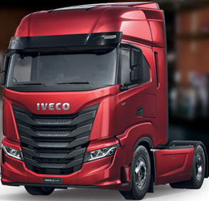

## Beisterkamp {#case-beisterkamp}

```{r vrachtwagen, echo=FALSE, fig.show='hold', out.width="30%", fig.cap="Een van de vrachtwagens van Beisterkamp"}

```

Beisterkamp Transport BV is een middelgrote transportonderneming gevestigd in Oldenzaal. Het bedrijf heeft een kleine vloot van 10 vrachtwagens en heeft evenveel chauffeurs in dienst. De concurrentie in de transportwereld is groot en de marges per kilometer zijn klein. Belangrijke kostenposten voor het bedrijf zijn het dieselverbruik en de uren van de chauffeurs. De directie wil weten of er op deze twee posten geld bespaard kan worden. Jij bent net begonnen als junior-controller bij Beisterkamp en de directie heeft jou gevraagd om met adviezen te komen.

:::{.data}
In het databestand [beisterkamp.csv](data/beisterkamp.csv) vind je de data over de afgelegde kilometers, het dieselverbruik in liters en het aantal geboekte uren in 2020. Begin met een nieuwe lege werkmap, importeer hierin de gegevens en voer hierin alle analyses uit. Bewaar het bestand onder de naam "beisterkamp.xlsx".
:::

Zie hieronder de data van week 1.

```{r}
registratie <- read_csv2(file = "data/beisterkamp.csv")
kable(head(registratie, 10))
```

Belangrijk om te weten:

+ Het aantal gereden kilometers wordt aan het eind van elke week uitgelezen uit de boardcomputers van de vrachtwagens. Dit systeem is echter niet helemaal foutloos. Soms zit er een niet te verklaren afwijking met de werkelijkheid in.
+ De gegevens over het dieselverbruik komen van het eigen kleine tankstation in Oldenzaal. Chauffeurs zijn verplicht om daar aan het einde van de dag, de vrachtwagen weer vol te tanken. Ook in dit systeem zitten helaas nog wat storingen. Een enkele keer klopt de geregistreerde getankte hoeveelheid niet.
+ Alle chauffeurs moeten in principe elke dag, maar in ieder geval elke week, hun uren boeken in het uren-registratie systeem van Beisterkamp. De chauffeurs worden betaald aan de hand van de geboekte uren. Niet alle chauffeurs zijn even handig en nauwkeurig bij het boeken van de uren in het verouderde systeem.
+ De chauffeurs hebben geen vaste vrachtwagen voor het hele jaar, maar wisselen per week van vrachtwagen.
+ De chauffeurs hebben geen vaste routes en/of klanten. Het werk wordt willekeurig verdeeld.
+ Elke vrachtwagen heeft een navigatiesysteem. Dit systeem berekent de optimale route per dag door Nederland voor de chauffeurs. De chauffeurs zijn verplicht deze voorgestelde route te volgen.
+ Chauffeurs mogen rijtijd, laad/lostijd, tanken en pauzes als uren registreren.

**Onderzoeksvraag**

De hoofdvraag van het onderzoek is: *Welke adviezen kun je de directie van Beisterkamp geven om te besparen op het dieselverbruik en het aantal uren?*

**Deelvragen**

1.	Is er een verschil in gemiddeld dieselverbruik tussen de chauffeurs? Wie rijdt het zuinigst en wie heeft het hoogste verbruik?
2.	Is er een verschil in gemiddeld dieselverbruik tussen de vrachtwagens? Welke rijdt het zuinigst en welke heeft het hoogste verbruik?
3.	Is er een verschil in het gemiddeld aantal geboekte uren tussen de chauffeurs? Wie boekt gemiddeld het meest en wie het minst in totaal en per kilometer?
4.	Welke fouten in de registratie van kilometers, dieselverbruik en uren kun je ontdekken? Maak bijvoorbeeld gebruik van een spreidingsdiagram om deze storingen zichtbaar te krijgen.
5.	Moeten deze fouten niet eerst worden opgelost voor je deelvraag 1, 2 en 3 kunt beantwoorden? Bedenk zelf een manier om van de fouten af te komen en beantwoordt deelvraag 1, 2 en 3 opnieuw.
