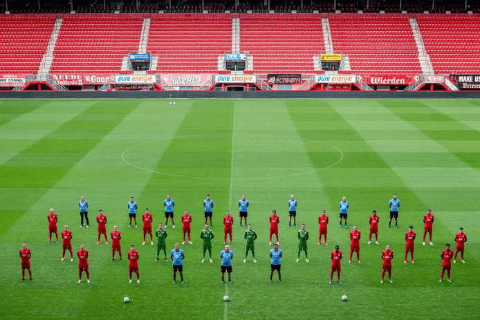

# Case - Marktwaarde Voetbalclub {#case-fctwente}

```{r elftalfoto, fig.cap="Elftalfoto FC Twente, augustus 2020, © Emiel Muijderman"}

```

In deze case doe je onderzoek naar de marktwaarde van de selectie van een voetbalclub.De benodigde data moet eerst samengesteld worden via een webquery. Omdat deze redelijk complex is, wordt in het eerste deel van deze case stapsgewijs beschreven hoe dat in zijn werk gaat. Voor de analyse daarna zul je zelf moeten bedenken hoe deze uitgevoerd moet worden.

:::{.data}
Het Duitse bedrijf Transfermarkt publiceert veel data over clubs en spelers, waaronder ook hun inschatting van de marktwaarde van de spelers. Naast een algemene url heeft het bedrijf ook landspecifieke urls's:

+ Algemeen: https://www.transfermarkt.com/
+ Duitsland: https://www.transfermarkt.de/
+ Nederland: https://www.transfermarkt.nl/
+ ...
:::

Om analyses met Excel uit te kunnen voeren moet je de gegevens eerst in een werkblad in een geschikt formaat beschikbaar hebben. Een leuke uitdaging met behulp van Power Query. In de stappen hierna zie je hoe dat voor FC Twente uitgevoerd wordt, maar je kunt het natuurlijk ook voor jouw eigen favoriete club uitvoeren. De enige aanpassing is dan de url van de club.

**URL achterhalen**

Wanneer je de Nederlandse url van Transfermarkt gebruikt is het land *Nederland* al voor je geselecteerd. Daarna kies je als competitie de *Eredivisie* en vervolgens de *club*, in mijn voorbeeld dus FC Twente. In de URL staat ook het actuele seizoen. Wanneer je de query ook voor de nieuwe seizoenen wilt gebruiken kun je beter dit deel uit de URL verwijderen en noteer de URL. Voor FC Twente wordt dat https://www.transfermarkt.nl/fc-twente-enschede/startseite/verein/317 .

**Query maken**

Nu je de URL gevonden hebt kun je de browser sluiten, Excel opstarten, een lege werkmap openen.

Kies *tab Gegevens > Van het web*. Voer de genoteerde URL in en klik OK. Na even wachten verschijnt het venster Navigator met in de linkerkant de mogelijke tabellen. Je moet nu uitzoeken in welke tabel de gezochte informatie zit. Wanneer je een tabel selecteert krijg je in het rechterdeel een voorbeeld van de gegevens te zien. Je hoeft niet lang te zoeken want de eerste tabel *Table 0* is al de goede tabel.

```{r fctwente-01, fig.cap="Selectie van de juiste tabel in Navigator."}
knitr::include_graphics("images/case-fctwente/fctwente-01.png", dpi = NA)
```

:::{ .caution}
Door gewijzigde omstandigheden kunnen spelers en hun marktwaarde ondertussen gewijzigd zijn.
:::

Klik op de knop *Gegevens transformeren*. Power Query Editor wordt nu opgestart met daarin de gegevens.

```{r fctwente-02, out.width="100%", fig.cap="Startscherm Power Query Editor."}
knitr::include_graphics("images/case-fctwente/fctwente-02.png", dpi = NA)
```

Verwijder de eerste twee kolommen. Hernoem de kolom met de namen van de spelers in "Speler". Wijzig de naam van de query in "qryfctwente".

```{r fctwente-03, out.width="100%", fig.cap=""}
knitr::include_graphics("images/case-fctwente/fctwente-03.png", dpi = NA)
```

De inhoud van de kolommen *Geb./leeftijd* en *Marktwaarde* is niet zodanig dat je er in Excel goed mee kunt werken. Een geboortedatum willen we in de vorm "16-11-1996". En voor de marktwaarde moet alleen een getal komen. Voor dit herstructureren van gegevens leent Power Query zich uitstekend.

*Geboortedatum*

Wanneer je de gegevens in de kolom *Geb./leeftijd* bekijkt dan zie dat dag, maand, jaartal en leeftijd steeds van elkaar gescheiden worden door een spatie. Dat betekent dat je de inhoud van deze kolom kunt splitsen en over vier nieuwe kolommen kunt verdelen.

Selecteer kolom *Geb./leeftijd*. Kies *tab Transformeren > Kolom splitsen (groep Kolom Tekst) > Op scheidingsteken*. Selecteer de *spatie* als scheidingsteken en ook dat er op elke spatie gesplitst moet worden.

```{r fctwente-04, fig.cap=""}
knitr::include_graphics("images/case-fctwente/fctwente-04.png", dpi = NA)
```

Klik op *OK*. De oude kolom is nu verdwenen en er zijn vier nieuwe kolommen voor terug gekomen. Wijzig de naam van de eerste drie kolommen in resp. *Dag*, *Maand* en *Jaar*.

Achter de maandnaam staat een punt. Deze moet verwijderd worden anders kunnen de datumfuncties van Excel er niet mee overweg. Selecteer de kolom *Maand*. Kies *tab Transformeren > Waarden vervangen (groep Alle kolommen)*. Specificeer voor de te zoeken waarde een *punt* en laat het vakje voor de te vervangen waarde leeg. Klik **OK**.

Nu moet er uit dag, maand en jaar een nieuwe kolom met de geboortedata gemaakt worden. Kies *tab Kolom toevoegen > Aangepaste kolom*. Noem de nieuwe kolom "Geboortedatum" en voer de volgende formule achter `=` in: `Text.From([Dag]) & "-" & [Maand] & "-" & Text.From([Jaar])`

```{r fctwente-05, out.width="100%", fig.cap=""}
knitr::include_graphics("images/case-fctwente/fctwente-05.png", dpi = NA)
```

Klik op *OK*. Het gegevenstype van deze kolom moet nog op Datum gezet worden. Met de kolom Geboortedatum nog geselecteerd kies je *tab Startpagina > Gegevenstype (groep Transformeren) > Datum*.

**Leeftijd**

De leeftijden zijn negatief, veroorzaakt doordat in de brondata de leeftijden tussen haakjes staan. Dat kan gewijzigd worden door een nieuwe kolom *Leeftijd* te maken met daarin de absolute waarde van het veld.

Kies *tab Kolom toevoegen > Aangepaste kolom*. Noem de nieuwe kolom   *Leeftijd* en voer de volgende formule in: `Number.Abs([#"Geb. / leeftijd.4"])`.

Opmerking zodra je begint met het intypen van het woord `Number` verschijnen automatisch de mogelijke functies. In plaats van de formule in te typen kun je ook de functie selecteren. Ook het veld kun je invoegen door klikken.

Verwijder nu de overbodige kolommen *Dag*, *Maand*, *Jaar* en *Geb. / leeftijd.4*.

```{r fctwente-06, out.width="100%", fig.cap=""}
knitr::include_graphics("images/case-fctwente/fctwente-06.png", dpi = NA)
```

**Marktwaarde**

De gegevens in de kolom *Marktwaarde* eindigen allemaal met `. €`. Dit moet eerst verwijderd worden.

Selecteer de kolom *Marktwaarde*. Kies *tab Transformeren > Waarden vervangen (groep Alle kolommen)*. Specificeer voor de te zoeken waarde `. €` en laat het vakje voor de te vervangen waarde leeg. Klik *OK*.

De inhoud van de kolom Marktwaarde bestaat nu uit een getal en een tekstaanduiding voor de eenheid, welke van elkaar gescheiden zijn door een spatie. Ga op dezelfde manier als bij geboortedatum te werk om deze kolom te splitsen op de spatie. De oude kolom wordt hierdoor vervangen door twee nieuwe kolommen: *Marktwaarde.1* met het getal en *Marktwaarde.2* met de eenheid.

De tekst van deze eenheid ga je nu vervangen door het overeenkomstige getal. Selecteer kolom *Marktwaarde.2*. Vervang nu de waarde `dzd` door `1000` en daarna de waarde `mln` door `1000000`. Wijzig daarna het gegevenstype van deze kolom in *Geheel getal*.

Nu kan er een nieuwe kolom *Marktwaarde* door de inhoud van de twee kolommen met elkaar te vermenigvuldigen. Kies *tab Kolom toevoegen > Aangepaste kolom*. Noem de nieuwe kolom *Marktwaarde* en voer de volgende formule in: `[Marktwaarde.1]*[Marktwaarde.2]` en klik daarna op OK. Verwijder vervolgens de overbodig geworden kolommen *Marktwaarde.1* en *Marktwaarde.2*. Wijzig tot slot het gegevenstype van deze kolom in *Valuta*.

```{r fctwente-07, out.width="100%", fig.cap=""}
knitr::include_graphics("images/case-fctwente/fctwente-07.png", dpi = NA)
```

**Laden in Excel**

De query is nu klaar en de gegevens kunnen in een Excel werkblad geladen worden. Kies *tab Startpagina > Sluiten en laden*.

Maak in het Excel werkblad de inhoud van Marktwaarde op als Valuta zonder decimalen.

Voeg tot slot een totaalrij toe via *tab Tabelontwerp > aanvinken Totaalrij (groep Opties voor tabelstijlen)*.

```{r fctwente-08, fig.cap="De tabel in het Excel werkblad."}
knitr::include_graphics("images/case-fctwente/fctwente-08.png", dpi = NA)
```

Wanneer de marktwaarde van een speler wijzigt, er spelers vertrekken of bijkomen, hoef je alleen maar de query te vernieuwen via *tab Gegevens > Alles vernieuwen (groep Query's en verbindingen)*.

**Opdracht**

Voer een verkennnend onderzoek onderzoek uit naar de dataset.

*Suggesties voor het onderzoek*:

+ Bij een aantal spelers is geen nationaliteit vermeld is, terwijl op de website deze wel te zien is. Probeer hiervoor een verklaring te vinden.
+ Van sommige voetbalclubs wordt wel eens gezegd dat de selectie een vreemdelingenlegioen is. Is dat hier ook het geval?
+ Bepaal voor Leeftijd en Marktwaarde de modus, mediaan, gemiddelde en standaarddeviatie.
+ Is het een jonge selectie?
+ Maak een frequentieverdeling van Leeftijd met een bijbehorende kolomdiagram.
+ Zit de grootste salarisdruk bij de oudere spelers?
+ Verdienen buitenlandse spelers gemiddeld meer dan Nederlandse spelers?
+ Welke leeftijdsgroep verdient gemiddeld het meest?
+ Is er een relatie tussen Leeftijd en Marktwaarde?

:::{ .tip}
In verband met gewijzigde omstandigheden moet je in elke rapportage altijd de datum vermelden waarop de data verzameld is.
:::
