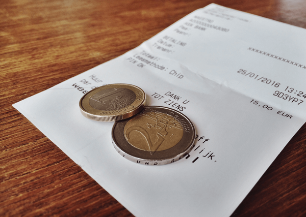

## Case - Fooien {#case-fooien}

```{r fooi, out.width="40%", fig.cap="Een fooi van een tevreden klant."}

```

Een ober noteerde informatie over elke fooi die hij gedurende een periode van een paar maanden in een restaurant kreeg. Hij verzamelde de volgende variabelen:

1. *rekening*: totale kosten maaltijd (euro)
2. *fooi*: grootte fooi (euros)
3. *sexe*: geslacht persoon die rekening betaalde (m, v)
4. *dag*: dag van de week (do, vr, za, zo)
5. *tijdstip*: tijdstip van de dag (middag, avond)
6. *groep*: aantal personen gezelschap

:::{.data}
De data staan in het bestand [fooien.xlsx](data/fooien.xlsx). Bewaar de analyse in een Excelbestand met de naam "fooien-analyse.xlsx".
:::

**Onderzoeksvraag**

De hoofdvraag van het onderzoek is: *Wat zijn de factoren die de grootte van de fooi beïnvloeden?*

**Opdracht**

Voer een exploratieve data analyse uit om de onderzoeksvraag te beantwoorden.

**Suggesties voor het onderzoek**:

+ Bepaal de meetschaal van de 6 variabelen.
+ Maak frequentietabellen.
+ Maak een samenvattingsinfo via gegevensanalyse
+ Maak een histogram voor de belangrijkste variabele `fooi`. De conclusies die je uit een histogram trekt hangen vaak af van de keuze voor de klassebreedte. Experimenteer daarom met verschillende bingroottes van een halve, een hele en twee euro. Kijk welke het meeste inzicht geeft.
+ Ga na of een fooi vaak afgerond wordt op de dichtstbijzijnde 50ct of hele euro.
+ Ga na of een fooi samen met de rekening tot een geheel bedrag wordt afgerond.
+ Ga na of er een relatie is tussen de fooi en de hoogte van de rekening.
+ Zijn er opvallende fooien gegeven?
+ Wat is het gemiddelde percentage voor een fooi?
+ Wat is het prijsniveau van het restaurant?
+ Is er verschil tussen mannen en vrouwen bij het bepalen van de fooi?
+ Is er verschil tussen middag en avond bij het bepalen van de fooi?
+ Is er verschil tussen de dagen?

<!-- Inspiratiebron: boek "Interactive and Dynamic Graphics for Data Analysis", Cook & Swayne, pag. 4 -->
