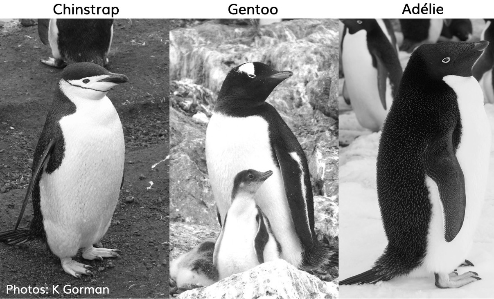
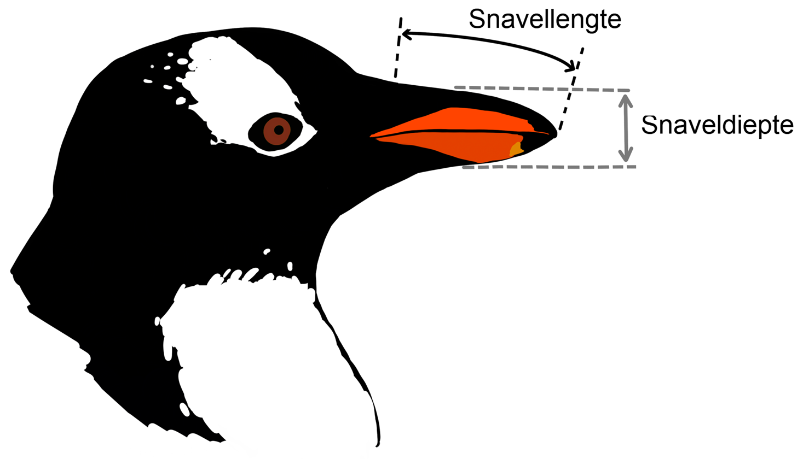

# (PART) Cases {-}

# Case - Pinguins {#case-pinguins}

Op het [Palmer Station, Antarctica](https://pal.lternet.edu/) is door dr. Kristen Gorman gedurende de jaren 2007-2009 een onderzoek bij pinguïns uitgevoerd. Van de drie pinguinsoorten die zijn waargenomen op drie eilanden in de Palmerarchipel zijn gegevens verzameld gedurende de onderzoeksperiode.

```{r pinguins, out.width="50%", fig.cap="Links: de drie soorten pinguïns, Rechts: afmetingen snavel."}


```

:::{.data}
Van de originele dataset is een vereenvoudigde versie gemaakt. Het bestand [pinguins.csv](data/pinguins.csv) is een in het Nederlands vertaalde versie hiervan met de volgende variabelen:

+ `soort` - Pinguïnsoort (Adélie, Chinstrap, Gentoo)
+ `eiland` - Eiland in de Palmerarchipel Antarctica (Biscoe, Dream, Torgersen)
+ `snavellengte` - Snavellengte (mm)
+ `snaveldiepte` - Snaveldiepte (mm)
+ `vleugellengte`- Vleugellengte (mm)
+ `gewicht` - Lichaamsgewicht (gram)
+ `geslacht` - Geslacht (vrouwtje, mannetje)
+ `jaar` - Het jaar waarin de pinguin onderzocht is (2007, 2008, 2009)
:::

**Opdracht**

Voer een exploratieve data analyse uit voor deze dataset. Ga hiertoe als volgt te werk.

1. Haal de gegevens uit het bestand `pinguins.csv` via Power Query in Excel binnen en sla het daarna als een Excelbestand op.
2. Bestudeer de Exceltabel. Wanneer je wat zaken opvallen, noteer deze dan.
3. Formuleer een eerste serie met vragen die je beantwoord wilt zien.
4. Ga creatief aan het werk om deze vragen te beantwoorden. Dat hoeft in deze fase nog niet te resulteren in "nette" resultaten.
5. Wanneer het onderzoek hiertoe aanleiding geeft, herformuleer dan de eerste serie vragen en vul deze aan met eventuele nieuwe vragen.
6. Ga hiermee door totdat je de indruk hebt dat je de dataset redelijk kent en de belangrijkste zaken weer kunt geven.
7. Maak een samenvattend eindverslag van het onderzoek waarin de belangrijkste conclusies naar voren komen. Hierin aanwezige grafieken en tabellen moeten wel netjes opgemaakt en voor de lezers te begrijpen zijn.
