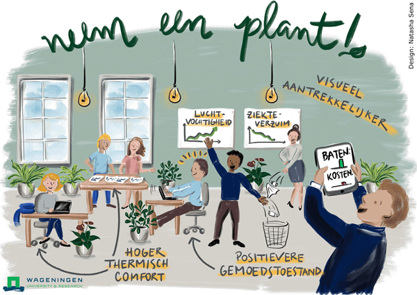

## Case - Ziekteverzuim {#case-ziekteverzuim}

```{r ziekteverzuim, fig.cap="Zo pakt Universiteit Wageningen het ziekteverzuim aan."}

```

Een bedrijf heeft een onderzoek naar het ziekteverzuim en tevredenheid uitgevoerd onder al haar 75 werknemers. Voor het tevredenheidsonderzoek zijn een twaalftal stellingen voorgelegd aan de medewerkers. Per stelling kon de medewerker een score op een 5-punts schaal geven. Die scores zijn opgeteld en weergegeven in de kolom Tevreden. De cijfers met betrekking tot het ziekteverzuim komen van de afdeling administratie.

:::{.data}
De data staan in het bestand [ziekteverzuim.xlsx](data/ziekteverzuim.xlsx). Bewaar de analyse in een Excelbestand met de naam "ziekteverzuim-analyse.xlsx".
In het werkblad "Data" staan de verzamelde gegevens en in het werkblad "Codeboek" vind je een toelichting op de variabelen
Het bestand geeft informatie over geslacht, leeftijd, afdeling waar de werknemer actief is, burgerlijke staat, het aantal dienstjaren bij de onderneming, een functieschaal en een salarisindicatie.
De laatste 4 kolommen geven informatie over ziekmelding en ziektedagen in 2012 en 2013.
:::

**Onderzoeksvraag**

De hoofdvraag van het onderzoek is: *Breng het ziekteverzuim in beeld en onderzoek of er een relatie is met de tevredenheid van de werknemer*

**Opdracht**

Voer een exploratieve data analyse uit om de onderzoeksvraag te beantwoorden.

**Suggesties voor het onderzoek**:

+ Maak een beschrijving van de gegevens via samenvattingen en grafieken. Denk hierbij ook na over wat je aan moet met de vraagtekens in de tabel.
+ Onderzoek de leeftijdsopbouw.
+ Onderzoek of er samenhang is tussen de verschillende werknemerskenmerken en het ziekteverzuim. Bijvoorbeeld
  - tussen mannen en vrouwen
  - tussen de afdelingen
  - verband met het salaris
  - verband met de tevredenheid
+ Onderzoek of er samenhang is tussen andere variabelen.
+ Vergelijk de salarissen van mannen en vrouwen bij deze onderneming, wat is je conclusie?
+ Is het ziekteverzuim in 2013 significant hoger of lager dan in 2012,  hoe stel je dat vast?
