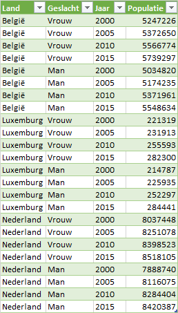

# Data {#data}

:::{.chapterintro}
Wanneer je data uit externe bronnen importeert, heb je geen controle over de indeling en het type gegevens en de manier waarop de data is georganiseerd. Voordat je met de analyse kunt beginnen moet je daarom vaak veel tijd steken om de data te herstructureren. Het eerste deel van dit hoofdstuk gaat hierover.

In het tweede deel van dit hoofdstuk ligt de nadruk op de verschillende soorten data, de bijbehorende variabelen en de bewerkingen die je mag toepassen.
:::

## Wat zijn gestructureerde gegevens

Vaak zijn de gegevens zijn niet goed gestructureerd, waardoor je niet met draaitabellen kunt werken of de gewenste grafieken niet kunt maken. Wanneer de gegevens goed gestructureerd zijn kun je ze gemakkelijker modelleren, visualiseren en transformeren waardoor de analyse eenvoudiger wordt.

Gestructureerde gegevens moeten voldoen aan de volgende voorwaarden:

1. Elke gemeten variabele staat in een kolom.
1. Elke waarneming van de variabele staat in een rij.

```{r tidy-data, fig.cap="Grafische weergave van gestructureerde gegevens", out.width="70%"}
knitr::include_graphics("images/data/tidy-data.png")
```

**Voorbeeld**

In tabel \@ref(tab:exp1) staan de gegevens van een meting bij een klein denkbeeldig experiment in een formaat dat je veel tegenkomt.

```{r exp1, echo=FALSE}
exp1 <- tribble(
	~Naam, ~Behandeling.A, ~Behandeling.B,
	"Melissa", 6, 7,
	"Roger", NA, 18,
	"Vicky", 4, 1
)

exp1 %>% 
	kbl(caption = 'Personen als rij.') %>% 
	kable_styling(full_width = FALSE, bootstrap_options = "condensed", font_size = 14)
```

Wanneer je de rijen en kolommen verwisselt heb je dezelfde gegevens, maar de tabel ziet er dan iets anders uit, zie tabel \@ref(tab:exp2).

```{r exp2, echo=FALSE}
exp2 <- tribble(
	~Behandeling, ~Melissa, ~Roger, ~Vicky,
	"Behandeling.A", 6, NA, 4,
	"Behandeling.B", 7, 18, 1
)

exp2 %>% 
	kable(caption = 'Behandelingen als rij.') %>% 
	kable_styling(full_width = FALSE, bootstrap_options = "condensed", font_size = 14)
```

Gestructureerd ziet de gegevensverzameling er uit zoals in tabel \@ref(tab:exp3).

```{r exp3, echo=FALSE}
exp3 <- exp1 %>%
  pivot_longer(Behandeling.A:Behandeling.B, names_to = "Behandeling", values_to = "Meting")

exp3 %>% 
	kbl(caption = 'Gegevens in gestructureerde vorm.') %>% 
	kable_styling(full_width = FALSE, bootstrap_options = "condensed", font_size = 14)
```

Dit maakt de waarden, variabelen en waarnemingen duidelijker.

:::{.guidedpractice}
1. Hoeveel waarnemingen en hoeveel variabelen telt de dataset in tabel \@ref(tab:exp3)? Controleer je antwoord via de voetnoot.[^tidydata-01]
2. Voldoet de gegevensverzameling nu aan de voorwaarden?[^tidydata-02]
:::

[^tidydata-01]: Elke kolom is een variabele, dus 3 variabelen: Naam, Behandeling, Meting. En elke rij is een waarneming, dus 6 waarnemingen.

[^tidydata-02]: Ja, elke variabele heeft een eigen kolom en de waarnemingen staan in de rijen.

Echte gegevensverzamelingen zijn vaak op bijna elke denkbare manier in strijd met de voorwaarden voor gestructureerde gegevens. De meest voorkomende problemen bij niet goed gestructureerde gegevensverzamelingen zijn:

+ Kolomkoppen bevatten waarden van een variabele i.p.v. een variabelenaam.
+ Combinatie van variabelen in een kolom.
+ Variabelen in zowel rijen als kolommen.

In de taken hierna zullen in kleine voorbeelden deze problemen gedemonstreerd worden en opgelost worden met behulp van Power Query.

### Kolomkoppen met waarden

Een veel voorkomende vorm van een gegevensverzameling is een tabelvorm waarbij de kolomkoppen waarden zijn en geen variabelenamen. De volgende tabel is hier een voorbeeld van. Hierin staat het aantal mannelijke en vrouwelijke studenten dat een bepaalde score (A t/m E) behaald heeft.

```{r scores1-data, echo=FALSE}
scores1 <- read_excel("data/scores1.xlsx")
scores1 %>% 
	kbl(caption = "Tabel waarin de kolomkoppen man en vrouw in feite waarden van variabele geslacht zijn.") %>% 
	kable_styling(bootstrap_options = "condensed", font_size = 14)
```

Deze gegevensverzameling heeft in feite drie variabelen:

+ `score` - met de waarden A t/m E.
+ `geslacht` - met de waarden man en vrouw
+ `aantal` - met het aantal keren dat de score behaald is, de frequentie

Het probleem is dus dat de waarden van de variabele `geslacht` in twee kolomkoppen staat.

De eerste variabele `score` is al een kolom, dat moet dus zo blijven. Voor de variabelen `geslacht` en `aantal` moeten nieuwe kolommen gemaakt worden. Voor elke combinatie van `score` en `geslacht` moet een rij gemaakt worden.

**Oefening**

1. Download eerst het hulpbestand [scores1.xlsx](data/scores1.xlsx) en open het daarna.

1. Selecteer een willekeurige cel met gegevens en kies *tab Gegevens > Van tabel / bereik (Gegevens ophalen en transformeren*. Het dialoogvenster *Tabel maken* verschijnt, waarin de tabelgegevens gespecificeerd kunnen worden. Het gegevensgebied is standaard al goed ingevuld.

1. Zorg er voor dat de optie voor kopteksten geselecteerd is en klik *OK*. Op het werkblad worden de gegevens allereerst in een Excel tabel omgezet. Daarna wordt in een nieuw venster de Power Query-editor opgestart die de gegevens uit de tabel inleest.

1. Selecteer in de Power Query editor de eerste kolom `score`.

1. Kies *tab Transformeren > Draaitabel opheffen voor kolommen (groep Alle kolommen) > Draaitabel voor andere kolommen opheffen*. Er worden twee nieuwe kolommen gemaakt. Een kolom `Kenmerk` (met de waarden voor variabele `geslacht`) en een kolom `Waarde` met de aantallen. En voor elke combinatie van `score` en `geslacht` is een rij gemaakt.

1. Selecteer kolom `Kenmerk`, *Rechter muisklik > Naam wijzigen* en wijzig de naam in `geslacht`.

1. Wijzig op dezelfde manier de naam van kolom `Waarde` in `aantal`.

1. Kies *tab Startpagina > Sluiten en laden > Sluiten en laden*.

Het resultaat is een tabel met gestructureerde gegevens. Elke kolom is één variabele en elke rij is één waarneming.

```{r scores1-result}
scores1 %>% 
	pivot_longer(-score, names_to = "geslacht", values_to = "aantal") %>%
	kbl(caption = "Scores1 nu gestructureerd") %>%
	kable_styling(bootstrap_options = "condensed", font_size = 14)
```

### Kolomkoppen zijn gecombineerde variabelen

Soms zijn kolommen een combinatie van meerdere onderliggende variabelen. Dit is het geval bij de gegevensverzameling in de volgende tabel. Deze is gelijkwaardig aan die in de vorige taak. Alleen zijn er nu twee verschillende klassen (klas1 en klas2) en staat het aantal voor elk geslacht in elke klas in een eigen kolom. Ook in deze gegevensverzameling zijn de kolomkoppen waarden van variabelen. Maar er zijn twee variabelen, `geslacht` en `klas`, in een kolom gecombineerd.

```{r scores2-data, echo=FALSE}
scores2 <- read_excel("data/scores2.xlsx")
scores2 %>% 
	kbl(caption = "Tabel met vier kolomkoppen die een combinatie van de variabelen geslacht en klas zijn.") %>% 
	kable_styling(bootstrap_options = "condensed", font_size = 14)
```

**Oefening**

1. Download eerst het hulpbestand [scores2.xlsx](data/scores2.xlsx) en open het daarna.

1. Selecteer een willekeurige cel met gegevens en kies *tab Gegevens > Van tabel / bereik (Gegevens ophalen en transformeren*. Het dialoogvenster *Tabel maken* verschijnt, waarin de tabelgegevens gespecificeerd kunnen worden. Het gegevensgebied is standaard al goed ingevuld.

1. Zorg er voor dat de optie voor kopteksten geselecteerd is en klik *OK*. Op het werkblad worden de gegevens allereerst in een Excel tabel omgezet. Daarna wordt in een nieuw venster de Power Query-editor opgestart die de gegevens uit de tabel inleest.

1. Selecteer in de Power Query editor de eerste kolom `score`.

1. Kies *tab Transformeren > Draaitabel opheffen voor kolommen (groep Alle kolommen) > Draaitabel voor andere kolommen opheffen*. Er worden twee nieuwe kolommen gemaakt. Een kolom `Kenmerk` (met de waarden voor `geslacht_klas`) en een kolom `Waarde` met de aantallen. En voor elke combinatie van `score` en `geslacht_klas` is een rij gemaakt.

1. Selecteer kolom `Kenmerk` en kies *tab Transformeren > Kolom splitsen (groep Kolom Tekst) > Op scheidingsteken*.
In het dialoogvenster is reeds het juiste scheidingsteken waarop gesplitst moet worden, `_`, geselecteerd.

1. Klik *OK*.
De kolom `Kenmerk` is gesplitst in kolom `Kenmerk.1` (met de waarden voor variabele `geslacht`) en `Kenmerk.2` (met de waarden voor variabele `klas`).

1. Wijzig de namen van de kolommen `Kenmerk.1`, `Kenmerk.1` en `Waarde` in respectievelijk `geslacht`, `klas` en `aantal`.

1. Kies *tab Startpagina > Sluiten en laden > Sluiten en laden*.

Het resultaat is een tabel met gestructureerde gegevens. Elke kolom is één variabele en elke rij is één waarneming.

```{r scores2-result}
scores2 %>% 
	pivot_longer(-score, names_to = "geslacht_klas", values_to = "aantal") %>% 
	separate(geslacht_klas, c("geslacht", "klas")) %>% 
	kbl(caption = "Scores2 nu gestructureerd") %>%
	kable_styling(bootstrap_options = "condensed", font_size = 14)
```

### Variabelen in rijen en kolommen

Een meer gecompliceerde vorm van rommelige gegevens krijg je wanneer er variabelen in zowel rijen als kolommen staan. In het voorbeeld hierna staan de beoordelingen voor een tussentoets en een eindtoets voor vijf studenten, waarbij elk van hen in precies twee van de vijf mogelijke klassen is geplaatst.

```{r scores3-data, echo=FALSE}
scores3 <- read_excel("data/scores3.xlsx")
scores3 %>% 
	kbl(caption = "Een tabel met variabelen in zowel rijen als kolommen.") %>% 
	kable_styling(bootstrap_options = "condensed", font_size = 14)
```

De eerste kolom met de variabele `naam` is in orde en moet zo blijven. De koppen van de laatste vijf kolommen zijn allemaal waarden van de variabele `klas`. De waarden in de tweede kolom, tussentoets en eindtoets, moeten eigen variabelen worden met als waarde de beoordeling van de student op dit onderdeel.

**Oefening**

1. Download eerst het hulpbestand [scores3.xlsx](data/scores3.xlsx) en open het daarna.

1. Selecteer een willekeurige cel met gegevens en kies *tab Gegevens > Van tabel / bereik (Gegevens ophalen en transformeren*. Het dialoogvenster *Tabel maken* verschijnt, waarin de tabelgegevens gespecificeerd kunnen worden. Het gegevensgebied is standaard al goed ingevuld.

1. Zorg er voor dat de optie voor kopteksten geselecteerd is en klik *OK*. Op het werkblad worden de gegevens allereerst in een Excel tabel omgezet. Daarna wordt in een nieuw venster de Power Query-editor opgestart die de gegevens uit de tabel inleest.

1. Selecteer in de Power Query editor de laatste vijf kolommen `klas1` t/m `klas5`.

1. Kies *tab Transformeren > Draaitabel opheffen voor kolommen (groep Alle kolommen) > Draaitabel opheffen voor kolommen*. Er worden twee nieuwe kolommen gemaakt. Een kolom `Kenmerk` (met de waarden voor variabele `klas`) en een kolom `Waarde` met de beoordeling. En voor elke combinatie van `naam`, `toets` en `klas` is een rij gemaakt.

1. Wijzig de naam van kolom `Kenmerk` in `klas`.

1. Selecteer kolom `toets` en kies *tab Transformeren > Draaikolom*. Het dialoogvenster Draaikolom verschijnt

1. Kies als Waardenkolom `Waarde`. En geef onder geavanceerde opties aan dat er niet samengevoegd moet worden.
```{r scores3-pivotcolumn, fig.cap="Instellingen voor de draaikolom.", out.width="70%", }
knitr::include_graphics("images/data/scores3_pivotcolumn.png")
```

1. Klik *OK*.

1. Kies *tab Startpagina > Sluiten en laden > Sluiten en laden*.

Het resultaat is een tabel met gestructureerde gegevens. Elke kolom is één variabele en elke rij is één waarneming.

```{r scores3-result}
scores3 %>% 
	pivot_longer(klas1:klas5, names_to = "klas", values_to = "score", values_drop_na = TRUE) %>% 
	pivot_wider(names_from = toets, values_from = score) %>%
	kbl(caption = "Scores3 nu gestructureerd") %>%
	kable_styling(bootstrap_options = "condensed", font_size = 14)
```

### Analyse populatie Benelux

In tabel \@ref(tab:benelux-data) staat de populatie mannen en vrouwen in de landen van de Benelux voor de jaren 2000, 2005, 2010 en 2015.

```{r benelux-data, echo=FALSE}
Benelux_Populatie <- read_excel("data/benelux-populatie.xlsx")
Benelux_Populatie %>% 
	kbl(caption = "Populatie Benelux voor de jaren 2000, 2005, 2010 en 2015.") %>% 
	kable_styling(bootstrap_options = "condensed", font_size = 14)
```

Deze gegevens wil je analyseren en bijvoorbeeld de ontwikkeling van de populatie per geslacht per jaar bestuderen en dat eventueel nog per land. Een draaitabel en draaigrafiek lenen zich daar het beste voor.

Echter de gegevens staan niet in een goed gestructureerde Exceltabel. In feite heeft deze tabel vier variabelen: `Land`, `Geslacht`, `Jaar` en `Populatie`. De eerste twee variabelen staan in een eigen kolom, dat moet zo blijven. De laatste vier kolomkoppen zijn de waarden van de variabele `Jaar` en de inhoud van deze kolommen is de waarde van de variabele `Populatie`. De tabel moet dus eerst gestructureerd worden voordat met de analyse begonnen kan worden.

**Oefening**

1. Download eerst het hulpbestand [benelux-populatie.xlsx](data/benelux-populatie.xlsx) en open het daarna.

2. Selecteer een willekeurige cel met gegevens en kies *tab Gegevens > Van tabel / bereik (Gegevens ophalen en transformeren*. Het dialoogvenster *Tabel maken* verschijnt, waarin de tabelgegevens gespecificeerd kunnen worden. Het gegevensgebied is standaard al goed ingevuld.

3. Zorg er voor dat de optie voor kopteksten geselecteerd is en klik *OK*. Op het werkblad worden de gegevens allereerst in een Excel tabel omgezet. Daarna wordt in een nieuw venster de Power Query-editor opgestart die de gegevens uit de tabel inleest.

4. Selecteer in de Power Query editor de eerste twee kolommen, met `Land` en `Geslacht`.

5. Kies *tab Transformeren > Draaitabel opheffen voor kolommen (groep Alle kolommen) > Draaitabel voor andere kolommen opheffen*. Er worden twee nieuwe kolommen gemaakt. Een kolom `Kenmerk` (met de waarden voor variabele `Jaar`) en een kolom `Waarde` met de populatiegetallen. En voor elke combinatie van `Land`, `Geslacht` en `Jaar` is een rij gemaakt.

::: {.tip}
Je had er ook voor kunnen kiezen om de laatste vier kolommen met de jaartallen te selecteren en dan te kiezen voor het opheffen van de draaitabel voor deze kolommen. Dit heeft als nadeel dat de query niet meer goed werkt wanneer er later in de brongegevens een nieuwe kolom met de populatie voor het jaar 2020 wordt toegevoegd.
:::

6. Wijzig de namen van de kolommen Kenmerk en `Waarde`` in respectievelijk Jaar en `Populatie`.

7. Kies *tab Startpagina >Sluiten en laden (groep Sluiten)*.

De gegevens worden nu in een nieuwe tabel in een nieuw werkblad gezet. De gegevens staan nu in een gestructureerde Excel tabel en zijn nu geschikt voor het maken van draaitabellen en draaigrafieken.

```{r benelux-tidy, out.width="40%", fig.cap="Tabel met gestructureerde populatiedata van de Benelux."}

```

8. Maak de volgende draaitabel en draaigrafiek.

```{r benelux-pivot-chart, fig.cap="Draaitabel en draaigrafiek van de populatie per geslacht per jaar.", out.width="70%"}
knitr::include_graphics("images/data/benelux_pivot_chart.png")
```

## Variabelen {#variabelen}

Bij het importeren en/of het herstructureren van de gegevens heb je de variabelen al gedefinieerd en zijn ze van een naam voorzien. Je moet verder ook nog weten wat voor een soort waarden de variabele kan hebben om later te kunnen bepalen welke statistische methodes geschikt zijn voor de variabele. In grote lijnen zijn alle variabelen ofwel **numerieke** variabelen waarvan de gegevens uit een getelde of gemeten hoeveelheid bestaat, of **categoriale** variabelen waarvan de gegevens categorieën vertegenwoordigen. 
Zo is een variabele *weekomzet* een numerieke variabele omdat de waarden hiervan hoeveelheden zijn. En een variabele *geslacht* met de categorieën Man en Vrouw is een categoriale variabele.

Soms moet je een numerieke variabele verder specificeren als **discreet** of **continu**. Discrete numerieke variabelen hebben waarden die voortkomen uit tellingen, ze vertegenwoordigen een aantal van iets, zoals het aantal leerlingen in een klas. Continue numerieke variabelen hebben waarden die voortkomen uit metingen, zoals de lengte van een persoon, welke in principe elke waarde binnen een interval kan aannemen (afhankelijk van de nauwkeurigheid van het meetinstrument).

**Meetschaal**

Variabelen worden in vier meetniveaus (schalen) ingedeeld:

+ **Categorie variabelen** Met deze variabelen kun je geen berekeningen uitvoeren, zoals het berekenen van een gemiddelde. Ze worden onderverdeeld in nominaal en ordinaal.
  - **Nominaal**: variabelen met namen als waarde (naam is in het Latijn *nomen*), zonder rangorde of logische volgorde. Voorbeelden: nationaliteit, oogkleur, studierichting, beroep, godsdienst, geslacht, industrietak.
  - **Ordinaal**: de waarden zijn kwalitatief van aard en hebben een logische volgorde. Je kunt ze sorteren maar er geen rekenkundige bewerkingen mee uitvoeren. Voorbeelden: beoordeling (1=zeer slecht, 2=slecht, 3=matig, 4=goed, 5=zeer goed), medaille (goud, zilver, brons), T-shirt maten (S, M, L, XL).

+ **Numerieke variabelen** Deze worden onderverdeeld in interval en ratio.
  - **Interval**: de gegevens hebben geen natuurlijk nulpunt, de keuze van een nulpunt is arbitrair. Het verschil tussen de waarden heeft wel betekenis. Zo is het verschil tussen 10°C en 15°C even groot als tussen 20°C en 25°C, maar je kunt niet zeggen dat 20°C twee keer zo warm is als 10°C. Sommige rekenkundige bewerkingen kun je wel uitvoeren zoals optellen, aftrekken en gemiddelde bepalen.
  - **Ratio**: de gegevens hebben een natuurlijk nulpunt. Hier kun je wel uitspraken doen over verhoudingen. Zo is een salaris van €4000 twee keer zo groot als een salaris van €2000. Voorbeelden: inkomen, vermogen, gewicht. Voor statistische doeleinden hoef je meestal geen verschil te maken tussen ratio- en intervalgegevens.

```{r meetniveaus, echo=FALSE, fig.cap="Meetniveaus van variabelen", echo=FALSE}
grViz("
  digraph stat1 {
    graph[rankdir = LR, bgcolor=transparent]
    node[shape = oval, fontname = Arial]
    V [label = 'Variabele']
    node[shape = box, width = 1.2, fontsize = 12]
    CA [label = 'Categorie']
    NU [label = 'Numeriek']
    node[shape = box, width = 0.8, fontsize = 10]
    NO [label = 'Nominaal']
    OR [label = 'Ordinaal']
    IN [label = 'Interval']
    RA [label = 'Ratio']

    {rank=same CA NU}
    V -> {CA,NU}
    CA -> {NO,OR}
    NU -> {IN,RA}
  }
")
```

## Opgaven {#opg-data}

::: {.sectionexercise}
1. In een Excel werkblad kom je de volgende tabel met gegevens tegen.

```{r demotabel}
demotabel <- data.frame(
  voornaam = c("Chris", "Mari", "Otto", "Peter", "Vicky"), 
  geslacht = c("m", "v", "m", "m", "v"),
  haarkleur = c("bruin", "blond", "blond", "zwart", "rood"), 
  lengte = c("groot", "groot", "normaal", "normaal", "klein"),
  gewicht = c(185, 176, 181, 178, 164), 
  iq = c(95, 104, 98, 108, 112))

demotabel %>% 
  kbl(caption = "Voorbeeldtabel met kenmerken van een aantal personen") %>% 
  kable_styling(bootstrap_options = "condensed", font_size = 14)
```

   a. Hoeveel waarnemingen en hoeveel variabelen telt de dataset in tabel \@ref(tab:demotabel)?
   b. Geef voor elke variabele aan tot welk meetniveau deze variabele behoort.

2. Bij een onderzoek wordt aan personen gevraagd om bij te houden hoeveel tekstberichten ze per dag versturen en hoeveel tijd ze hieraan besteden. Welke variabelen heb je hier en zijn deze discreet of continu?

3. Download het hulpbestand [koffieprijzen.xlsx](data/koffieprijzen.xlsx). Deze bevat een aantal koffieprijzen van Starbucks, zie tabel \@ref(tab:koffieprijzen-data). Maak hiervan een gestructureerde dataset.
    
```{r koffieprijzen-data, echo=FALSE}
tidy001.data <- read_excel("data/koffieprijzen.xlsx")
tidy001.data %>% 
	kbl(format.args = list(decimal.mark = ","), caption = "Starbucks koffieprijzen voor drie verschillende groottes.") %>% 
	kable_styling(bootstrap_options = "condensed", full_width = FALSE, font_size = 14)
```

4. Om de kosten van levensonderhoud in Europa te vergelijken zijn via de website van [Numbeo](https://www.numbeo.com/cost-of-living/) voor een aantal plaatsen de gemiddelde marktprijzen verzameld voor brood (wit, 500 gram), kaas(lokaal, 1 kg), melk (gewoon, 1 liter) en rijst (wit, 1 kg). De data staan in het hulpbestand [levensonderhoud.xlsx](data/levensonderhoud.xlsx). Voor de eerste 8 plaatsen zijn de gegevens te zien in tabel \@ref(tab:levensonderhoud-data).

```{r levensonderhoud-data, echo=FALSE}
levensonderhoud.data <- read_excel("data/levensonderhoud.xlsx")
levensonderhoud.data %>% head(8) %>% 
	kbl(format.args = list(decimal.mark = ","), caption = "Gemiddelde prijzen voor vier produkten.") %>% 
	kable_styling(bootstrap_options = "condensed", full_width = FALSE, font_size = 14)
```

   a. Maak hiervan een gestructureerde dataset.
   b. In welk land is rijst gemiddeld het goedkoopst en in welk land het duurst?

5. Op een bepaalde basischool krijgt elke leerling krijgt in elk kwartaal (Herfst, Winter en Lente) van elk jaar een toets voor rekenen en taal. Het bestand [rekenentaal.xlsx](data/rekenentaal.xlsx) bevat een beperkte gegevensverzameling hiervan en is te zien in tabel \@ref(tab:rekenentaal-data).
    
```{r rekenentaal-data, echo=FALSE}
rekenentaal.data <- read_excel("data/rekenentaal.xlsx")
rekenentaal.data %>% 
	kbl(caption = "Schoolresultaten voor rekenen en taal.") %>% 
	kable_styling(bootstrap_options = "condensed", full_width = FALSE, font_size = 14)
```

   De analyse-eenheid is ID-Jaar-Kwartaal. Dus elke waarneming is die van een leerling gedurende een kwartaal in een bepaald jaar.
   
   a. Maak hiervan een gestructureerde gegevensverzameling.
   b. Maak een draaigrafiek (staafdiagram) van de gemiddelde scores voor rekenen en taal per jaar
:::


