# Exploratieve Data Analyse (EDA) {#eda}

:::{.chapterintro}
Exploratieve Data Analyse (EDA) is vaak de eerste stap naar het visualiseren en transformeren van de gegevens. Je leert de gegevens kennen, vaak resulterend in een eerste aanzet tot modelvorming.
:::

## Introductie

Van EDA wordt wel eens gezegd dat het een zich herhalende cyclus is van

1. het genereren van vragen over de data.
2. het zoeken naar antwoorden door de gegevens te visualiseren, transformeren en modelleren.
3. uit het geleerde de vragen te verfijnen of nieuwe vragen te genereren.

Het doorlopen van deze cyclus is geen formeel proces met strakke regels. Zie het meer als een creatief proces om elk opkomend idee te onderzoeken. Sommige ideeën zullen op een dood spoor eindigen, andere zullen tot een vervolg leiden.

Bij EDA gaat het om

+ Het verkrijgen van zoveel mogelijk inzicht in de dataset.
+ Het herkennen van de belangrijkste variabelen.
+ Het herkennen van eventuele uitschieters, onregelmatigheden en fouten.
+ Het herkennen van patronen in de data, zoals trends, seizoensinvloeden, groeperingen (clusters) en afwijkingen hierop.
+ Het onderzoeken naar een mogelijk verband tussen variabelen.
+ Het testen van aannames die zijn gedaan over het voorspellende en/of verklarende vermogen van de data.
+ Het spaarzaam ontwikkelen van modellen en het testen van onderliggende aannames hierbij.

Een eerste stap is meestal de beschrijvende statistiek, waarbij je de belangrijkste statistische kenmerken van de variabelen vastlegt. Daarna stap je al snel over op visualisaties en grafieken. Deze zijn meestal gemakkelijker te interpreteren en vereisen geen geavanceerde statistische kennis. Door de gegevens te visualiseren worden verwachte of juist onverwachte eigenschappen intuïtief zichtbaar.

Tijdens de verkenningen ga je snel diverse grafieken maken om jouw ideeën te onderzoeken. In deze beginfase zijn deze grafieken (nog) niet voor publicatie bedoeld, waardoor je aan de opmaak nauwelijks aandacht hoeft te besteden. Het gaat er in eerste instantie om dat je de data leert begrijpen. Wanneer een grafiek in een latere rapportage wordt opgenomen is de opmaak natuurlijk wel van belang, dan moeten anderen jouw grafiek kunnen interpreteren.

## Anscombe dataset

Dat je voor het inzicht krijgen in een gegevensverzameling niet alleen maar af kunt gaan op een aantal statistische parameters, maar ook altijd een grafiek moet bekijken, wordt fraai gedemonstreerd met de dataset van Anscombe. Deze klassieke dataset bestaat uit vier eenvoudige gekunstelde verzamelingen van 11 paren x- en y-waarden. Hierbij zijn de gemiddelden en de variantie van respectievelijk de vier x en y variabelen gelijk en zijn ook de onderlinge correlaties voor de vier paren x en y variabelen gelijk zijn. In figuur \@ref(fig:anscombe) is te zien dat de spreidingsdiagrammen voor de vier verschillende paren x en y variabelen compleet verschillend zijn.

```{r anscombe, fig.cap="Spreidingsdiagrammen voor de vier datasets van Anscombe."}
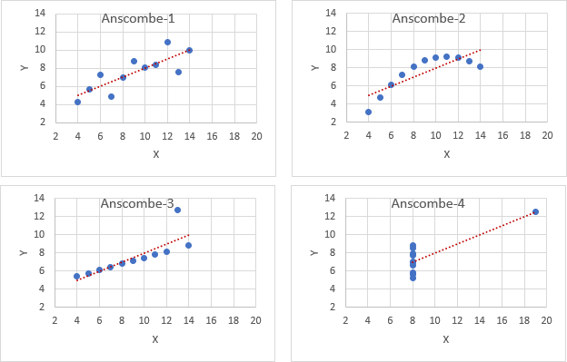
```

Conclusies uit de spreidingsdiagrammen:

-   Anscombe-1 is duidelijk lineair met enige spreiding.
-   Anscombe-2 is duidelijk kwadratisch, heeft iets van een bergparabool.
-   Anscombe-3 heeft een duidelijke uitschieter.
-   Anscombe-4 heeft één enkel punt ver verwijderd van de rest van de data die dicht bij elkaar ligt.

Wanneer je zelf hiermee wilt experimenteren dan kun je de dataset [anscombe.xlsx](data/anscombe.xlsx) met de bijbehorende grafieken downloaden.

## Werkwijze

De beste manier om de dataset te leren begrijpen is door vragen op te stellen. Door het formuleren van een vraag wordt jouw aandacht gevestigd op een specifiek gedeelte van de dataset. Dit helpt je om te beslissen welke grafieken of samenvattingen je moet maken en of daarvoor bewerkingen van de dataset nodig zijn.

In het begin van het onderzoek is het lastig om kwalitatief goede vragen op te stellen, je kent immers de dataset nog niet. Stel daarom veel vragen op. Je hebt dan de meeste kans dat je wat interessants vindt, wat tot nieuwere of scherper geformuleerde vragen leidt.

Een aantal handige vragen die je bijna altijd kunt gebruiken zijn:

1. Welke variabelen heeft de dataset? Zijn ze numeriek (discreet / continu) of categoriaal? wat is de schaling? Welke waarden kunnen deze variabelen aannemen?
1. Welke variatie komt er voor in de variabelen? Dus hoe gedragen zich de waarden van een variabele.
1. Welke covariatie komt er voor tussen variabelen? Dus hoe gedragen zich de waarden tussen variabelen.
1. Is er een verband te ontdekken tussen variabelen?

## Keuze hulpmiddelen

Op welke manier je data kunt samenvatten en welke grafiek het meest geschikt is voor visualisatie hangt vooral van de soort variabele(n) en de vraag af. Het volgende schema kan je hierbij een handje helpen.

```{r diagramselectie, fig.cap="Schema voor selectie samenvatting en visualisatie. In plaats van een kolomdiagram (verticaal) kun je ook een staafdiagram (horizontaal) nemen."}
grViz("
    digraph desc {
      # graph opdracht
      graph [rankdir = LR, bgcolor=transparent]

      # node opdrachten
      node[fontname = Sans, shape = cds, style = filled, fillcolor = Khaki, width = 1.5]
      T [label = 'Type variabele']
      node[fontname = Sans, shape = ellipse, style = filled, fillcolor = Beige, width = 2.0]
      C1 [label = '1 categorie\n variabele']
      C2 [label = '2 categorie\nvariabelen']
      N1 [label = '1 numerieke\nvariabele']
      N2 [label = '2 numerieke\nvariabelen']
      CN [label = '1 cat & 1 num\nvariabele']
      node[fontname = Sans, shape = box, style = filled, fillcolor = Azure, width = 2.7]
      C1R [label = 'Frequentietabel\nCirkeldiagram\nKolomdiagram']
      C2R [label = 'Kruistabel\nKolomdiagram (gegroepeerd)']
      N1R [label = 'Statistieken\nHistogram\nBoxplot']
      N2R [label = 'Spreidingsdiagram\nLijndiagram']
      CNR [label = 'Boxplot (gegroepeerd)']
      # edge opdrachten
      T -> {C1, N1,C2,CN,N2}
      C1 -> C1R
      C2 -> C2R
      N1 -> N1R
      N2 -> N2R
      CN -> CNR
    }
")
```

Deze worden hierna met voorbeelden uitgewerkt.

### Eén categorie variabele

**Oplossingen**

- *Frequentietabellen* - Je kunt absolute of relatieve frequenties gebruiken. Deze laatste wordt iets meer gebruikt omdat je hiermee kunt vergelijken hoe vaak waarden voorkomen in verhouding tot het totale aantal.
- *Cirkeldiagrammen* - Deze vertegenwoordigen relatieve frequenties doordat ze aangeven welk deel van de gehele cirkel bij een categorie hoort. Een cirkeldiagram wordt moeilijk leesbaar wanneer je veel categorieën hebt.
- *Kolomdiagrammen* - Hiermee kun je zowel absolute als relatieve frequenties weergeven. Bij een groot aantal categorieën kun je beter het horizontale staafdigram gebruiken.

::: {.workedexample}
Bij een onderzoek naar rookgedrag is ook de leeftijd van de rokers verzameld. Deze leeftijden staan in het bestand [rokers.xlsx](data/rokers.xlsx). Een onderzoeksvraag is of het percentage rokers sterk verschilt per leeftijdscategorie. De leeftijdscategorieën waarin de onderzoeker in eerste instantie geïnteresseerd is zijn: t/m 15 jaar, 16-25 jaar, 25-45 jaar, 46-65 jaar, ouder dan 65 jaar.

Er moet dus een nieuwe variabele `leeftijdsgroep` komen met 5 categoriën en je moet dan de aantallen van `leeftijd` in elke categorie tellen. Omdat de klassebreedte niet overal hetzelfde is kun je geen frequentieverdeling met een draaitabel maken. Bij het werken met de functie `INTERVAL()` kun je zelf de grenzen van de intervallen bepalen, waardoor voor deze methode gekozen wordt.

Download het bestand, zet de kolom met leeftijden om naar een Excel tabel en geef deze een zinvolle tabelnaam, bijvoorbeeld `Leeftijden`, waardoor je deze naam in de formules kunt gebruiken. Maak een kolom `bins` met de intervalgrenzen (15, 25, 45, 65). Maak tevens een kolom `leeftijdsgroep` met de namen van de categorieën. Er moet tevens een kolom komen voor de aantallen en de percentages. De inrichting van het werkblad zou er dan als volgt uit kunnen zien.

```{r rokers-werkblad, fig.cap="Inrichting werkblad", out.width="50%"}
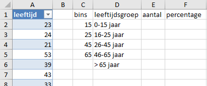
```

Selecteer cel E2 en voer hier in de formule `=INTERVAL(leeftijden;C2:C5)`. Dit is een dynamische matixformule en de resultaten verschijnen in het *overloopgebied* E2:E6.

Voor de berekening van de percentages moet er een verwijzing naar het overloopgebied gemaakt, dat doe je door het hash symbool *#* achter het adres van de eerste cel te plaatsen. Typ nu in cel F2 de formule `=E2#/SOM(E2#)`.

> *In plaats van het intypen van het adres van het overloopgebied kun je bij het invoeren van de formule ook het overloopgebied selecteren. Excel plaatst dan automatisch het juiste adres.*

```{r rokers-frequenties, fig.cap="Absolute en relatieve frequenties, berekend met de formule INTERVAL.", out.width="50%"}
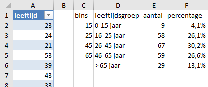
```

Maak nu een cirkeldiagram en een kolomdiagram voor een visualisatie van de frequentieverdeling. In figuur \@ref(fig:rokers-diagrammen) zie je een voorbeeld.

```{r rokers-diagrammen, fig.cap="Cirkeldiagram en kolomdiagram", out.width="50%"}
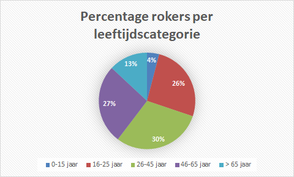
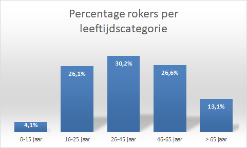
```

:::

### Twee categoriale variabelen

Bij twee categoriale variabelen gaat het om de verdeling van de ene variabele over de niveaus van de andere variabele.

**Oplossingen**

+ *Kruistabellen* - Deze bevatten de frequenties voor elke combinatie van waarden over twee categorische variabelen.
+ *Gegroepeerde staafdiagrammen* - Een van de twee categorische variabelen wordt als groep behandeld. Binnen elke groep worden staven voor de andere categorische variabele gemaakt.

::: {.workedexample}
van een groep van 90 mannen en vrouwen is de haarkleur genoteerd. De verzamelde gegevens staan in het bestand [haarkleur.xlsx](data/haarkleur.xlsx). Een onderzoeksvraag is of de verdeling van de kleuren sterk verschilt tussen mannen en vrouwen.

Je moet dan voor elke kleur tellen hoe vaak deze bij mannen en bij vrouwen voorkomt. Hiervoor moet je een kruistabel maken en voor een visualisatie van de verdeling leent zich een gegroepeerd kolomdiagram het beste. In Excel kun je daarvoor een draaigrafiek met draaitabel gebruiken.

Download het bestand, zet de kolom met gegevens om naar een Excel tabel en geef deze een zinvolle tabelnaam, bijvoorbeeld `Haarkleuren`. Selecteer een cel in de tabel en kies *Invoegen > Draaigrafiek > Draaigrafiek en draaitabel*. Neem een nieuw werkblad als locatie voor de uitvoer. Sleep het veld `geslacht` naar de `Rijen`, het veld `haarkleur` naar de `Kolommen` en het veld `id` naar de `Waarden`. Wijzig de *Waardeveldinstellingen* in *Aantal* in plaats van Som. Omdat je de verdeling van de kleuren per geslacht wilt bestuderen wijzig je via *Waardeveldinstellingen* de weergave in *% van rijtotaal*.

Verder kun je het kolomdiagram nog wat aanpassen door weergave van titel en datalabels, aanpassing van de kleuren en het verbergen van alle veldknoppen. Ook is de weergave van de kolomtotalen in de draaitabel niet zinvol en kun beter niet weergeven. Het resultaat is in de figuur \@ref(fig:haarkleur-resultaat) te zien.

```{r haarkleur-resultaat, out.width="50%", fig.cap="Kruistabel en kolomdiagram voor verdeling haarkleur per geslacht."}
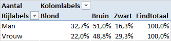
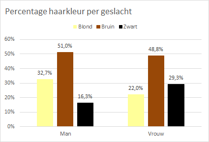
```

:::

### Eén numerieke variabele

**Oplossingen**

+ *Statistieken* - Zoals gemiddelde, mediaan, standaarddeviatie, interkwartielafstand, 5-getallensamenvatting, ... (zie hoofdstuk \@ref(beschrijvend)).
+ *Histogram* - Voor een visualisatie van de verdeling van de variabele en de vorm van de verdeling.
+ *Boxplot* - Voor een visualisatie van de 5-getallensamenvatting.

::: {.workedexample}
Bij een steekproef van 715 personen is o.a. het netto maandinkomen verzameld. Deze inkomens staan in het bestand [maandinkomen.xlsx](data/maandinkomen.xlsx). Je wilt een eerste indruk krijgen van de verdeling van de inkomens.

Download het bestand, zet de kolom met gegevens om naar een Excel tabel en geef deze een zinvolle tabelnaam, bijvoorbeeld `Maandinkomens`. Selecteer een cel in de tabel en kies *Gegevens > Gegevensanalyse > Beschrijvende statistiek*. Specificeer het invoerbereik en selecteer bij Uitvoeropties dat er een Samenvattingsinfo op een nieuw werkblad gemaakt moet worden.

De berekende getallen bevatten veel decimalen die hier en in dit stadium weinig betekenis hebben en zorgen alleen maar voor een chaotisch beeld. Maak Kurtosis en Scheefheid met 2 decimalen op en alle andere waarden als gehele getallen. Zie figuur \@ref(fig:maandinkomen-statistieken).

```{r maandinkomen-statistieken, fig.cap="Statistieken van de maandinkomens", out.width="30%"}
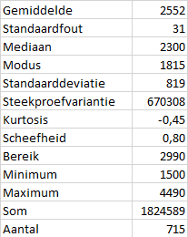
```

De kwartielen kun je zichtbaar maken met een boxplot. Selecteer een cel in de tabel en kies *Invoegen > Aanbevolen grafieken > Alle grafieken > Box-and-whisker*. Pas deze wat aan. Geef in ieder geval de gegevenslabels weer. In figuur \@ref(fig:maandinkomen-statistieken) is een voorbeeld te zien.

```{r maandinkomen-boxplot, fig.cap="Boxplot van de maandinkomens.", out.width="60%"}
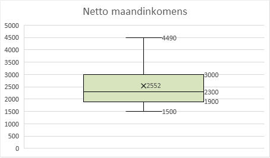
```

Voor een histogram selecteer je een cel in de tabel en kies *Invoegen > Aanbevolen grafieken > Alle grafieken > Histogram*. Het histogram is op zich in orde en geeft ook wel een goede indruk van de verdeling. Echter de automatisch gegenereerde bins hebben weinig zinvolle grenzen. Experimenteer daarom eens met een Bin-breedte van 250 en 500. Dat kan als volgt: *Selecteer horizontale as > As opmaken > Opties voor as > Bin-breedte*. Voor de resultaten zie figuur \@ref(fig:maandinkomen-histogram).

```{r maandinkomen-histogram, out.width="50%", fig.cap="Histogrammen, links met een breedte van 250 en rechts 500."}
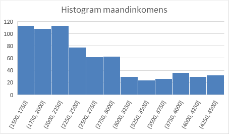
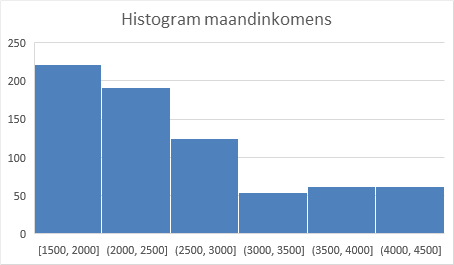
```

Uit de statistieken, boxplot en histogrammen krijg je een behoorlijke indruk van de verdeling.

:::

### Numerieke en categoriale variabele

**Oplossingen**

+ *Boxplot (gegroepeerd)* - Voor het vergelijken van een variabele tusssen verschillende groepen.

::: {.workedexample}
Bij een vergelijkend onderzoek van een lamptype van twee verschillende merken is ook de levensduur van de lamp getest. In het bestand [lampen.xlsx](data/lampen.xlsx) zijn de waarnemingen verzameld. De onderzoeksvraag is of er een substantieel verschil in levensduur is tussen de twee merken.

Download het bestand, zet de kolom met gegevens om naar een Excel tabel en geef deze een zinvolle tabelnaam, bijvoorbeeld `Lampen`. Selecteer een cel in de tabel en kies *Invoegen > Aanbevolen grafieken > Alle grafieken > Box-and-whisker*. Pas deze wat aan. Geef in ieder geval de gegevenslabels weer. In figuur \@ref(fig:lampen-boxplot) is een voorbeeld te zien.

```{r lampen-boxplot, fig.cap="Boxplot voor vergelijking levensduur lamptype van 2 merken."}
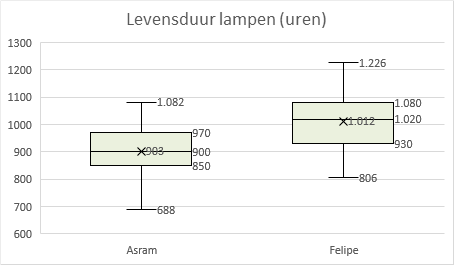
```

:::

### Twee numerieke variabelen

Bij het vergelijken van twee numerieke variabelen is er meestal eerst al naar elke variabele afzonderlijk gekeken. Bij de onderlinge vergelijking gaat het om te onderzoeken of er een mogelijk verband tussen de twee variabelen bestaat.

Bij het onderzoek naar de relatie tussen twee numerieke variabelen worden de variabelen in een grafiek tegen elkaar uitgezet. Hierna kan eventueel een vervolgonderzoek komen naar de aard van de relatie. In hoofdstuk \@ref(linregressie) wordt op dit laatste verder ingegaan.

**Oplossingen**

+ *Spreidingsdiagram* - Voor het onderzoeken van een verband tussen twee numerieke variabelen.
+ *Lijndiagram* - Gebruik je voornamelijk wanneer een van de numerieke variabelen een tijd weergeeft.

::: {.workedexample}
Een ijsverkoper heeft gedurende 14 opeenvolgende dagen de dagtemperatuur en de dagelijkse verkoop aan ijs bijgehouden. De gegevens zijn te zien in figuur \@ref(fig:ijsverkoop-data) en te downloaden met het bestand [ijsverkoop.xlsx](data/ijsverkoop.xlsx).

```{r ijsverkoop-data, fig.cap="Temperatuur (gemeten om 13:00 uur) en ijsverkoop gedurende 14 dagen", out.width="30%"}
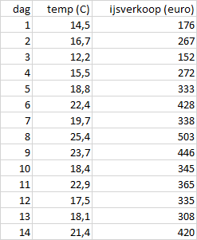
```

De vragen zijn: Hoe ziet het temperatuurverloop eruit en is er een verband tussen de ijsverkoop en de dagtemperatuur?

Voor het bekijken van het temperatuurverloop maak je een lijndiagram met de variabele `dag` op de X-as en de variabele `temperatuur` op de Y-as. Voor het beoordelen van een mogelijk verband tussen verkoop en temperatuur maak je een spreidingsdiagram met de variabele `temperatuur` als onafhankelijke variabele op de X-as en de variabele `ijsverkoop` op de Y-as. Voor de resultaten zie figuur \@ref(fig:ijsverkoop-diagrammen)

```{r ijsverkoop-diagrammen, fig.cap="Lijndiagram (links) en spreidingsdiagram (rechts).", out.width="50%"}
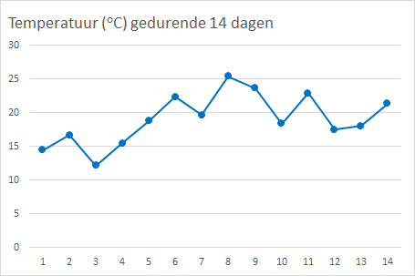
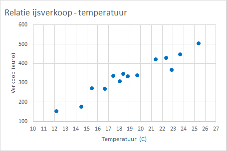
```

In het spreidingsdiagram is een duidelijk positief verband te zien. Voldoende reden voor een vervolgvraag of dit een lineair verband en zoja hoe een regressiemodel eruit zou kunnen zien.

:::

##  Analyse Old Faithful geiser

```{r ff-geiserfoto, fig.cap="Old Faithful geiser (bron: Detroit Free Press)", out.width="50%"}
knitr::include_graphics("images/eda/ff-geiserfoto.jpg")
```

<!-- Foto: https://www.gannett-cdn.com/presto/2019/09/16/USAT/26c3dfd5-ac5c-4cd9-9d22-f63dc3668aed-XXX_ras_017.JPG?crop=3023,1701,x0,y153&width=3200&height=1680&fit=bounds -->

<!-- Inspiratiebron: https://www.tudelft.nl/ewi/studeren/online-onderwijs/wiskunde-uitgelegd/statistiek#c144704 -->

De Old Faithful geiser in Yellowstone National Park (Wyoming, VS) heeft meerdere erupties per dag. De dataset [faithful.csv](data/faithful.csv) bevat 272 waarnemingen van twee variabelen: `eruptietijd` (tijdsduur van de uitbarsting in sec.) en `wachttijd` (wachttijd tussen twee erupties in min.).

:::{.guidedpractice}
Laad de data via Power Query in Excel. Kies hiervoor *Gegevens > Van het web > URL intypen > Laden*.
:::

De variabelen `eruptietijd` en `wachttijd` worden eerst afzonderlijk bekeken, daarna gecombineerd.

### Eruptietijd

:::{.guidedpractice}
Maak eerst via *Gegevens > Gegevensanalyse > Beschrijvende statistiek* samenvattingen voor de variabele `eruptietijd`. Laat de uitvoer in een nieuw werkblad plaatsen.

```{r ff-et-statistieken, fig.cap="Samenvattende statistieken variabele `eruptietijd`.", out.width="30%"}
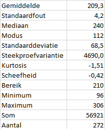
```

Maak nu een boxplot voor deze variabele via *Invoegen > Aanbevolen grafieken > Alle grafieken > Box-and-whisker*.
:::

```{r ff-et-boxplot, fig.cap="Boxplot variabele `eruptietijd`.", out.width="70%"}
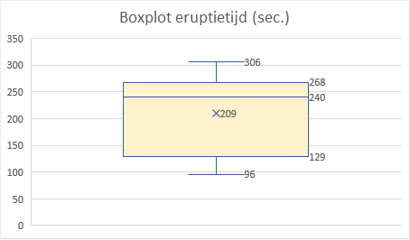
```

In de boxplot kun je goed zien dat de data asymmetrisch is. De mediaan (240) ligt niet in het midden van de box, maar is groter dan het gemiddelde (209). Ook licht ook veel dichter bij de maximumwaarde (306) dan bij de minimumwaarde (96). De verdeling is links scheef.

Geologische experts geloven dat er twee soorten uitbarstingen voorkomen: met een kortere en met een langere tijdsduur, die beiden een standaardlengte hebben. Rond deze waarden zou je een hogere concentratie van waargenomen lengtes verwachten. Voor het bekijken van de verdeling van de waarden van variabele `eruptietijd` maak je een histogram met een geschikte *Bin-breedte*. Om met de Bin-breedte te kunnen experimenteren moet je in Excel een histogram maken via het invoegen van het grafiektype.

:::{.guidedpractice}
Maak een histogram van de eruptietijden via *Invoegen > Aanbevolen grafieken > Alle grafieken > Histogram*.

Experimenteer met Bin-breedtes van 2 sec., 5 sec., 10 sec., 15 sec., 30 sec. en 50 sec. Hiervoor selecteer je eerst de X-as en kies daarna *As opmaken > Bin-breedte > breedte invullen*. Het venster met opties moet je meestal wat breder maken om de bin-breedte in te kunnen vullen!
:::

```{r ff-et-histogram, fig.cap="Histogram variabele `eruptietijd`. Links het standaarddiagram met een binbreedte van 37. Het histogram rechts heeft een bin-breedte van 15`.", out.width="50%"}
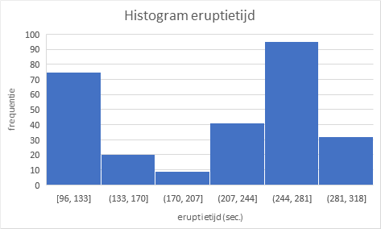
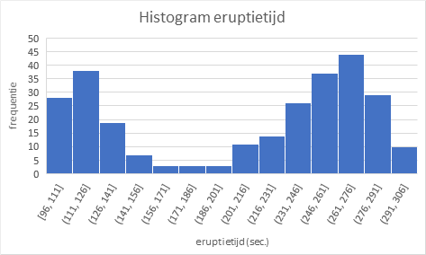
```

Bij wijziging van de Bin-breedte zie je de vorm van het histogram veranderen en ook de hoeveelheid informatie die je hieruit af kunt lezen. De zeer kleine bin-breedtes geven een wat rommeliger figuur en je ziet teveel details. Bij de grootste bin-breedte is alle informatie uit het histogram verdwenen en kun je de twee pieken niet meer waarnemen. Het is een kwestie van proberen en ervaring om een goede breedte te vinden.

Een bin-breedte van 15 lijkt hier redelijk geschikt. Het is niet goed mogelijk om de twee piekmomenten precies af te lezen. Wel kun je zien dat de eerste piek in het interval [111, 126] ligt en de tweede piek in het interval [261, 276].

::: {.tip}
Bij theoretische verdelingen zoals de normale verdeling, kun je *kansdichtheidsdiagrammen* maken waardoor je veel meer details in de verdeling kunt zien. Helaas lijkt de verdeling van de eruptietijden niet op een van de bekende verdelingsfuncties. Voor dergelijke situaties kun je als een goed alternatief een zogenaamde *Kernel dichtheidschattingsdiagram* maken, maar helaas wordt dit grafiektype niet door Excel aangeboden. Veel statistische add-ins ondersteunen dit grafiektype wel.

```{r ff-et-kde, fig.cap="Kernel dichtheidschatting, gemaakt met de addin van Real Statistics. De twee pieken komen hier duidelijker naar voren.", out.width="60%"}
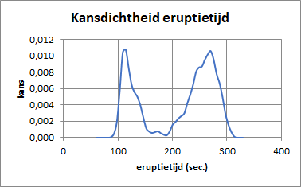
```

:::

Een redelijk alternatief is een diagram met een cumulatieve empirische verdeling. Excel biedt deze mogelijkheid aan via de histogramopties van Gegevensanalyse. Normaliter moet je hiervoor eerst zelf een kolommetje bins maken met de intervalgrenzen, maar wanneer je dat niet doet en dus de bins niet specificeert, dan worden er bins gemaakt die waarschijnlijk wat minder optimaal zijn. Voor een eerste verkenning is dat geen probleem.

:::{.guidedpractice}
Maak nu opnieuw een histogram, maar nu via *Gegevens -> Gegevensanalyse -> Histogram*. Specificeer voor het invoerbereik de kolom met gegevens. Laat het Verzamelbereik leeg. Wanneer de eerste rij in het invoerbereik zit moet je ook *Labels* aanvinken. Selecteer bij de uitvoeropties *Cumulatief percentage* en *Grafiek maken*.
:::

```{r ff-ecdf, fig.cap="Histogram met cumulatief percentages.", out.width="60%"}
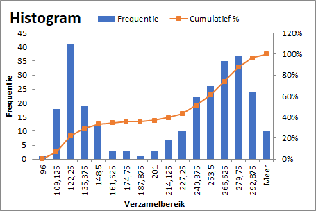
```

De procedure heeft hier een bin-breedte van 13,5 genomen, deze geeft net wat meer details dan bij de bin-breedte van 15. In de lijn voor de cumulatieve percentages zie je steilere hellingen aan de linkerkant van de piekmomenten die zo rond 120 sec. en 270 sec. liggen

### Wachttijd

Voer gelijke opdrachten uit voor de variabele `wachttijd`. De statistieken en boxplot zijn in figuur \@ref(fig:ff-wt-statistieken)

```{r ff-wt-statistieken, fig.cap="Samenvattende statistieken variabele `wachttijd`.", out.width="30%"}
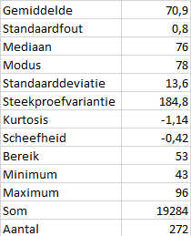
```

```{r ff-wt-boxplot, fig.cap="oxplot variabele `wachttijd`.", out.width="70%"}
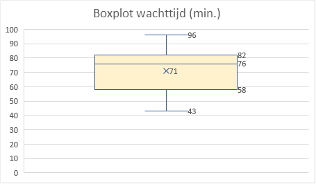
```

Voor een geschikte bin-breedte van het histogram moet je ook wat experimenteren. het waardenbereik loopt van 43-96 (minimum-maximum), een breedte van 53.

```{r ff-wt-histogram, fig.cap="Histogram variabele `wachttijd` met een bin-breedte van 4.", out.width="70%"}
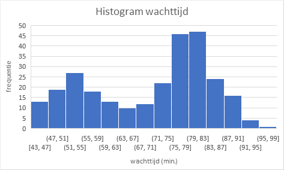
```

Het overall beeld is gelijk aan dat van de eruptietijden: een links scheve verdeling. Ook hier twee pieken die in de buurt van 55 min. en 80 min. liggen.

### Eruptietijd - Wachttijd

Voor het bekijken van een verband tussen de twee variabelen maak je een spereidingsdiagram.

```{r ff-spreidingsdiagram, fig.cap="Spreidingsdiagram eruptietijd - wachttijd", out.width="70%"}
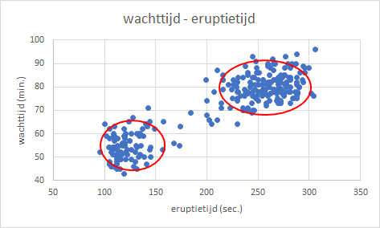
```

Je zie hier twee ellipsvormige clusters van punten die overeenkomen met waarnemingen in de buurt waar de twee laagste waarden van de pieken en de twee hoogste waarden van de pieken (270,80) samenkomen. Op het oog is een scheidingsgrens tussen deze twee clusters een eruptietijd van 180 sec. (3 minuten).

Om hier betekenis aan toe te kennen en/of vervolgvragen te formuleren is, zoals meestal, meer deskundigheid nodig over de context van het onderzoek.
