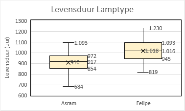
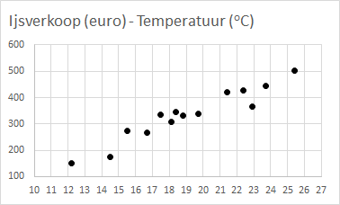

# Exploratieve Data Analyse (EDA)

:::{.chapterintro}
Exploratieve Data Analyse (EDA) is vaak de eerste stap naar het visualiseren en transformeren van de gegevens. Je leert de gegevens kennen, vaak resulterend in een eerste aanzet tot modelvorming.
:::

## Introductie

Van EDA wordt wel eens gezegd dat het een zich herhalende cyclus is van

1. het genereren van vragen over de data.
2. het zoeken naar antwoorden door de gegevens te visualiseren, transformeren en modelleren.
3. uit het geleerde de vragen te verfijnen of nieuwe vragen te genereren.

Het doorlopen van deze cyclus is geen formeel proces met strakke regels. Zie het meer als een creatief proces om elk opkomend idee te onderzoeken. Sommige ideeën zullen op een dood spoor eindigen, andere zullen tot een vervolg leiden.

Bij EDA gaat het om

+ Het verkrijgen van zoveel mogelijk inzicht in de dataset.
+ Het herkennen van de belangrijkste variabelen.
+ Het herkennen van eventuele uitschieters, onregelmatigheden en fouten.
+ Het herkennen van patronen in de data, zoals trends, seizoensinvloeden, groeperingen (clusters) en afwijkingen hierop.
+ Het onderzoeken naar een mogelijk verband tussen variabelen.
+ Het testen van aannames die zijn gedaan over het voorspellende en/of verklarende vermogen van de data.
+ Het spaarzaam ontwikkelen van modellen en het testen van onderliggende aannames hierbij.

Een eerste stap is meestal de beschrijvende statistiek, waarbij je de belangrijkste statistische kenmerken van de variabelen vastlegt. Daarna stap je al snel over op visualisaties en grafieken. Deze zijn meestal gemakkelijker te interpreteren en vereisen geen geavanceerde statistische kennis. Door de gegevens te visualiseren worden verwachte of juist onverwachte eigenschappen intuïtief zichtbaar.

Tijdens de verkenningen ga je snel diverse grafieken maken om jouw ideeën te onderzoeken. In deze beginfase zijn deze grafieken (nog) niet voor publicatie bedoeld, waardoor je aan de opmaak nauwelijks aandacht hoeft te besteden. Het gaat er in eerste instantie om dat je de data leert begrijpen. Wanneer een grafiek in een latere rapportage wordt opgenomen is de opmaak natuurlijk wel van belang, dan moeten anderen jouw grafiek kunnen interpreteren.

## Anscombe dataset

Dat je voor het inzicht krijgen in een gegevensverzameling niet alleen maar af kunt gaan op een aantal statistische parameters, maar ook altijd een grafiek moet bekijken, wordt fraai gedemonstreerd met de dataset van Anscombe. Deze klassieke dataset bestaat uit vier eenvoudige gekunstelde verzamelingen van 11 paren x- en y-waarden. Hierbij zijn de gemiddelden en de variantie van respectievelijk de vier x en y variabelen gelijk en zijn ook de onderlinge correlaties voor de vier paren x en y variabelen gelijk zijn. In figuur \@ref(fig:anscombe) is te zien dat de spreidingsdiagrammen voor de vier verschillende paren x en y variabelen compleet verschillend zijn.

```{r anscombe, fig.cap="Spreidingsdiagrammen voor de vier datasets van Anscombe."}
knitr::include_graphics("images/anscombe.png", dpi = NA)
```

Conclusies uit de spreidingsdiagrammen:

-   Anscombe-1 is duidelijk lineair met enige spreiding.
-   Anscombe-2 is duidelijk kwadratisch, heeft iets van een bergparabool.
-   Anscombe-3 heeft een duidelijke uitschieter.
-   Anscombe-4 heeft één enkel punt ver verwijderd van de rest van de data die dicht bij elkaar ligt.

Wanneer je zelf hiermee wilt experimenteren dan kun je de dataset met de bijbehorende grafieken [hier](data/anscombe.xlsx) downloaden.

## Werkwijze

De beste manier om de dataset te leren begrijpen is door vragen op te stellen. Door het formuleren van een vraag wordt jouw aandacht gevestigd op een specifiek gedeelte van de dataset. Dit helpt je om te beslissen welke grafieken of samenvattingen je moet maken en of daarvoor bewerkingen van de dataset nodig zijn.

In het begin van het onderzoek is het lastig om kwalitatief goede vragen op te stellen, je kent immers de dataset nog niet. Stel daarom veel vragen op. Je hebt dan de meeste kans dat je wat interessants vindt, wat tot nieuwere of scherper geformuleerde vragen leidt.

Een aantal handige vragen die je bijna altijd kunt gebruiken zijn:

1. Welke variabelen heeft de dataset? Zijn ze numeriek (discreet / continu) of categoriaal? wat is de schaling? Welke waarden kunnen deze variabelen aannemen?
1. Welke variatie komt er voor in de variabelen? Dus hoe gedragen zich de waarden van een variabele.
1. Welke covariatie komt er voor tussen variabelen? Dus hoe gedragen zich de waarden tussen variabelen.
1. Is er een verband te ontdekken tussen variabelen?

## Keuze hulpmiddelen

Op welke manier je data kunt samenvatten en welke grafiek het meest geschikt is voor visualisatie hangt vooral van de soort variabele(n) en de vraag af. Het volgende schema kan je hierbij een handje helpen.

```{r diagramselectie, fig.cap="Schema voor selectie samenvatting en visualisatie"}
grViz("
    digraph desc {
      # graph opdracht
      graph [rankdir = LR, bgcolor=transparent]

      # node opdrachten
      node[fontname = Sans, shape = cds, style = filled, fillcolor = Khaki, width = 1.5]
      T [label = 'Type variabele']
      node[fontname = Sans, shape = ellipse, style = filled, fillcolor = Beige, width = 2.0]
      C1 [label = '1 categorie\n variabele']
      C2 [label = '2 categorie\nvariabelen']
      N1 [label = '1 numerieke\nvariabele']
      N2 [label = '2 numerieke\nvariabelen']
      CN [label = '1 cat & 1 num\nvariabele']
      node[fontname = Sans, shape = box, style = filled, fillcolor = Azure, width = 2.7]
      C1R [label = 'Frequentietabel\nCirkeldiagram\nStaafdiagram']
      C2R [label = 'Kruistabel\nStaafdiagram (gegroepeerd)']
      N1R [label = 'Statistieken\nHistogram\nBoxplot']
      N2R [label = 'Spreidingsdiagram\nLijndiagram']
      CNR [label = 'Boxplot (gegroepeerd)']
      # edge opdrachten
      T -> {C1, N1,C2,CN,N2}
      C1 -> C1R
      C2 -> C2R
      N1 -> N1R
      N2 -> N2R
      CN -> CNR
    }
")
```

Deze worden hierna kort uitgewerkt.

### Eén categorie variabele samenvatten / visualiseren

**Oplossingen**

- *Frequentietabellen* - Je kunt absolute of relatieve frequenties gebruiken. Deze laatste wordt iets meer gebruikt omdat je hiermee kunt vergelijken hoe vaak waarden voorkomen in verhouding tot het totale aantal.
- *Cirkeldiagrammen* - Deze vertegenwoordigen relatieve frequenties doordat ze aangeven welk deel van de gehele cirkel bij een categorie hoort. Een cirkeldiagram wordt moeilijk leesbaar wanneer je veel categorieën hebt.
- *Staafdiagrammen* - Hiermee kun je zowel absolute als relatieve frequenties weergeven, ook voor veel categorieén.

**Voorbeeld**

Vraag: Wat is de verdeling van het percentage rokers in een aantal leeftijdscategorieën?

```{r eda-c1, out.width="33.3%", fig.cap="Frequentietabel, cirkeldiagram en staafdiagram voor percentage rokers per leeftijdscategorie."}
knitr::include_graphics("images/eda-c1-freq.png")


```

### Eén numerieke variabele samenvatten / visualiseren

**Oplossingen**

+ *Statistieken* - Zoals gemiddelde, mediaan, standaarddeviatie, interkwartielafstand, 5-getallensamenvatting, ... Zie hiervoor verder het hoofdstuk beschrijvende statistiek.
+ *Histogram* - Voor een visualisatie van de verdeling van de variabele en de vorm van de verdeling.
+ *Boxplot* - Voor een visualisatie van een aantal statistieken.

**Voorbeeld**

Vraag: Hoe ziet de verdeling van de netto maandkomens eruit bij een steekproef van 30 personen?

```{r eda-n1, out.width="33.3%", fig.cap="Statistieken, histogram en boxplot voor het netto maandinkomen bij een steekproef van 30 personen."}
knitr::include_graphics("images/eda-n1-statistieken.png")
knitr::include_graphics("images/eda-n1-histogram.png")
knitr::include_graphics("images/eda-n1-boxplot.png")
```

:::{.tip}
In Excel kun je eenvoudig een histogram en boxplot maken via Invoegen > Grafieken. De getoonde statistieken krijg je snel met Gegevens > Gegevensanalyse > Beschrijvende statistiek > Samenvattingsinfo.
:::

### Combinatie van twee categoriale variabelen

Je wilt dan de verdeling van een categorische variabele (haarkleur) weten over de niveaus van een andere categorische variabele (geslacht).

**Oplossingen**

+ *Kruistabellen* - Deze bevatten de frequenties voor elke combinatie van waarden over twee categorische variabelen.
+ *Gegroepeerde staafdiagrammen* - Een van de twee categorische variabelen wordt als groep behandeld. Binnen elke groep worden staven voor de andere categorische variabele gemaakt.

**Voorbeeld**

Vraag: Is de verdeling van de haarkleuren bij mannen anders dan bij vrouwen?

```{r eda-c2, out.width="33.3%", fig.cap="Kruistabel en staafdiagram voor verdeling haarkleur per geslacht."}

knitr::include_graphics("images/eda-c2-staaf.png")
```

:::{.tip}
In Excel kun je een kruistabel en een bijbehorend gegroepeerd staafdiagram het eenvoudigst maken via een draaigrafiek.
:::

### Combinatie van numerieke en categoriale variabele

**Oplossingen**

+ *Boxplot (gegroepeerd)* - Voor het vergelijken van een variabele tusssen verschillende groepen.

**Voorbeeld**

Vraag: Is de levensduur van een bepaald type lamp afhankelijk van het merk

```{r eda-cn, fig.cap="Boxplot voor vergelijking levensduur lamptype van 2 merken."}

```

### Combinatie van twee numerieke variabelen

**Oplossingen**

+ *Spreidingsdiagram* - Voor het onderzoeken van een verband tussen twee numerieke variabelen.
+ *Lijndiagram* - Gebruik je voornamelijk wanneer een van de numerieke variabelen een tijd weergeeft.

**Voorbeeld**

Vraag: Hoe ziet het gemiddelde temperatuurverloop over de laatste 2 weken eruit?

Vraag: Is er een verband tussen de ijsverkoop en de gemiddelde temperatuur?

```{r eda-cn2, out.width="50%", fig.cap="Lijndiagram (links) en spreidingsdiagram (rechts)."}
knitr::include_graphics("images/eda-n2-lijn.png")

```

##  Voorbeeld: Old Faithful geiser

<!-- Inspiratiebron: https://www.tudelft.nl/ewi/studeren/online-onderwijs/wiskunde-uitgelegd/statistiek#c144704 -->

De Old Faithful geiser in Yellowstone National Park (Wyoming, VS) heeft meerdere erupties per dag. De dataset [faithful.csv](data/faithful.csv) bevat 272 waarnemingen van twee variabelen: `eruptie` (tijdsduur van de uitbarsting in sec.) en `wachttijd` (wachttijd tussen twee erupties in min.).

:::{.guidedpractice}
1. Laad de data via Power Query in Excel.
2. Voer een beschrijvend onderzoek uit naar de variabele `eruptie`. Bepaal in ieder geval minimum- en maximumwaarde, mediaan en gemiddelde. Teken ook een boxplot. Welke conclusies kun je hieruit trekken over de verdeling van de waarden?[^faithful-02]

:::

Geologische experts geloven dat er twee soorten uitbarstingen voorkomen: met een kortere en met een langere tijdsduur, die beiden een standaardlengte hebben. Rond deze waarden zou je een hogere concentratie van waargenomen lengtes verwachten. Voor het bekijken van de verdeling van de waarden is een histogram erg geschikt. Je moet dan wel een geschikte *Bin-breedte* kiezen.

:::{.guidedpractice}
3. Maak een histogram van de eruptietijden. Doe dit via de methode Invoegen -> Grafieken -> Histogram, want alleen via deze methode heb je de mogelijkheid om interactief met de Bin-breedte te experimenteren. Doe dit met Bin-breedtes van 2 sec., 5 sec., 10 sec. 30 sec. en 50 sec. Wat kun je zeggen over de vorm van de histogrammen en de hoeveelheid af te lezen informatie hieruit bij die wisselende Bin-breedtes?[^faithful-03]
4. Kies de Bin-breedte die de meeste informatie oplevert. Kun je de twee piekmomenten precies aflezen?[^faithful-04]

:::

Met kansdichtheidsdiagrammen die bij de theoretische verdelingen horen kun je veel meer details in de verdeling zien. Helaas behoort de verdeling hier niet tot een van de bekende verdelingsfuncties. Een zeer goed alternatief is een zogenaamd *Kernel dichtheidschattingsdiagram* maar dit grafiektype wordt niet door Excel aangeboden. Het voert te ver om hierop in te gaan. De meeste statistische add-ins ondersteunen dit wel.

In de volgende afbeelding zie je hoe deze eruit zou kunnen zien.

```{r faithful-kde, fig.cap="Kernel dichtheidschatting m.b.v. de add-in van Real Statistics."}

```

Hierin zie je de twee pieken erg goed: rond 120 en rond 270. En ook dat de dataset in feite uit twee groepen bestaat.

Een goed alternatief is een disgram met een cumulatieve empirische verdeling die bij de histogramopties van gegevensanalyse zit.

:::{.guidedpractice}
5. Maak nu opnieuw een histogram, maar nu via de methode Gegevens -> Gegevensanalyse -> Histogram. Selecteer in het dialoogvenster zowel *Cumulatief percentage* als *Grafiek maken*.

:::

```{r faithful-ecdf, fig.cap="Histogram met cumulatief percentages."}
knitr::include_graphics("images/faithful-ECDF.png")
```

Hier zie je steile hellingen aan weerszijden van 120 en van 270, de twee piekwaarden.

[^faithful-02]: Je kunt hier goed zien dat de data willekeurig is. De mediaan (240) ligt veel dichter bij de maximumwaarde (306) dan bij de minimumwaarde en ligt ook rechts van het gemiddelde (209). De verdeling is asymmetrisch, scheef, skew rechts.

[^faithful-03]: De vorm van het histogram verandert, een rommelige figuur bij de zeer kleine Bin-breedte bij de grootste Bin-breedte is alle informatie uit het histogram verdwenen. Wanneer de breedte te groot wordt kun je de twee pieken niet meer waarnemen. Het is een kwestie van proberen en ervaring om een goede breedte te vinden.

[^faithful-04]: Precies aflezen is niet goed mogelijk. Bij een Bin-breedte van 15 kun je wel zie dat de eerste piek in het interval [116, 126] ligt en de tweede piek in het interval [261, 276].
