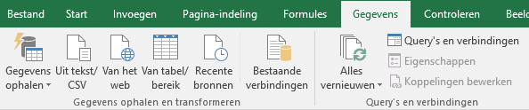
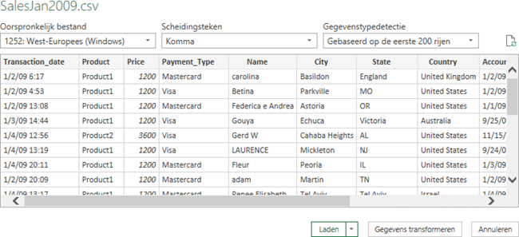
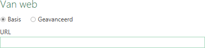
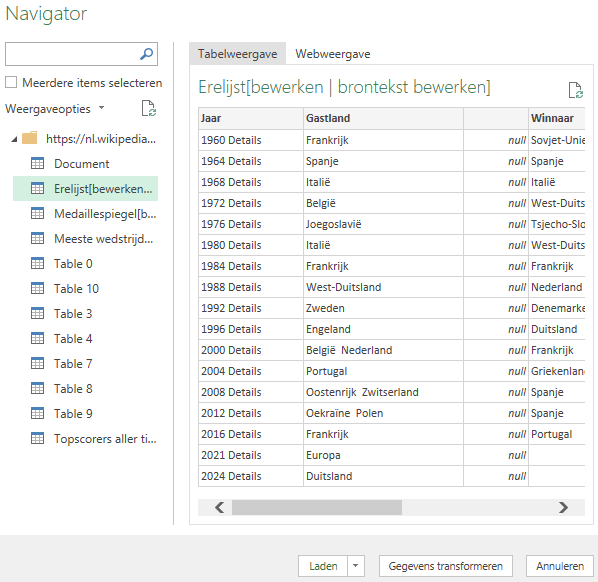
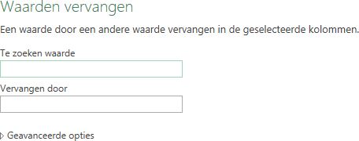
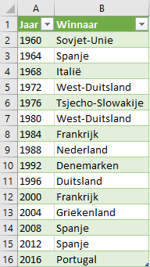

# Importeren van data {#importdata}

:::{.chapterintro}
Bij de analyse van data probeer je antwoorden te vinden op vragen door statistische methodes toe te passen op waarnemingen. Deze waarnemingen - verzameld uit rapportages, enquêtes en experimenten - vormen de ruggegraat van een statistisch onderzoek en worden **data** genoemd. In de praktijk komen veel gegevens uit externe bronnen: txt/csv, web, excel bestanden, databases, ... Om deze gegevens in Excel te analyseren, moeten ze eerst geïmporteerd worden en soms worden getransformeerd en opgeschoond. Dat gebeurt met Power Query.
:::

In Excel is Power Query beschikbaar onder de groep *Gegevens ophalen en transformeren* in het lint *Gegevens*. Hiermee kun je verbindingen maken met meerdere gegevensbronnen en daarna die gegevens structureren (bijvoorbeeld een kolom verwijderen, een gegevenstype wijzigen) of de gegevens omzetten (transformeren) naar wat anders. Uiteindelijk komen de gegevens dan in een Excel werkblad beschikbaar. Alle stappen die je met de Power Query Editor uitvoert worden in een script vastgelegd.

Deze aanbevolen werkwijze heeft de volgende voordelen:

+ De oorspronkelijke gegevens blijven onveranderd.
+ Omdat de uitgevoerde acties in een script zijn vastgelegd heb je tevens een vorm van documentatie van wat je met de gegevens gedaan hebt.
+ In het script kun je eenvoudig een stap wijzigen, ongedaan maken of een nieuwe stap toevoegen.
+ Wanneer er wijzigingen of aanvullingen in de brondata komen hoef je de query alleen maar opnieuw uit te voeren waarna de gewijzigde gegevens in het werkblad verschijnen.

## Gegevens ophalen en transformeren

Om Gegevens ophalen en transformeren in Excel te gebruiken, maak je eigenlijk een query in de werkmap. Met een query kun je een verbinding maken met een breed scala aan beschikbare gegevensbronnen, een voorbeeld van de gegevens bekijken en de gegevens transformeren.

De eerste stap is het maken van een verbinding met een gegevensbron. Wanneer de verbinding is gemaakt, krijg je een voorbeeld van de gegevens te zien. Daarna kun je stappen toevoegen om de gegevens te structureren en te transformeren. Hiervoor wordt een Query Editor gestart om een aantal instructies te maken die de acties uitvoeren. De laatste stap is het laden van de gegevens als een tabel in een werkblad.

::: {.tip}
+ Je hebt ook de mogelijkheid om de gegevens te laden in het ingebouwde gegevensmodel.
+ Je kunt de query later ook wijzigen en/of de gegevens vernieuwen.
:::

Voor het maken van een query gebruik je de *tab Gegevens* in het lint, waarna je een van de mogelijke acties in de *Gegevens ophalen en transformeren* groep kiest.

```{r ribbon-queries, fig.cap="Lint gegevens."}

```

Er zijn knoppen voor het ophalen van gegevens uit tekst/csv, web en een Excel tabel/bereik. Deze gegevensbronnen en nog veel meer zijn beschikbaar via de knop *Gegevens ophalen*.

De groep *Query's en verbindingen* heeft een knop voor het vernieuwen van query's en een knop om bestaande query's en verbindingen te bekijken en te beheren.

## Importeren van een tekst/csv bestand

Veel gegevens in externe bronnen zijn beschikbaar als tekst (bestandstype `.txt`) of via komma (of karakter) gescheiden waarden (bestandstype `.csv`).

1. Download eerst het hulpbestand [SalesJan2009.csv](data/SalesJan2009.csv) en open daarna een nieuwe lege werkmap.

2. Kies *tab Gegevens > Uit tekst/CSV (groep Gegevens ophalen en transformeren)*.

3. Blader naar het hulpbestand en klik *Importeren*.
Een voorbeeld van de gegevens wordt getoond.

```{r salesjan2009-preview, fig.cap="Voorbeeld van SalesJan2009 gegevens."}

```

4. Klik op *Gegevens transformeren*.
De Query Editor wordt gestart in een nieuw venster. In de rechterzijbalk *Queryinstellingen* zie je onder *Toegepaste Stappen* de stappen die reeds zijn uitgevoerd.

5. Selecteer de kolommen `Account_Aangemaakt` en `Laatste_Login` door op de kolomkop te klikken met ingedrukte CTRL toets. Kies dan *Kolommen verwijderen (groep Kolommen beheren) > Kolommen verwijderen*. De kolommen worden verwijderd en de stap is toegevoegd aan *Toegepaste Stappen*.

::: {.tip}
Als alternatief kun je de rechtermuisknop gebruiken en dan de gewenste actie uit het snelmenu kiezen.
:::

In elke kolomkop zit aan de linkerkant een knopje welke het toegepaste gegevenstype weergeeft. Wanneer je een kolom selecteert zie je het gegevenstype ook op het lint. En dit is tevens de plek waar je het gegevenstype kunt wijzigen.

Als bij het importeren het automatisch ontdekken van het gegevenstype goed gegaan is heeft kolom `Prijs` het gegevenstype `Geheel getal` (zie figuur \@ref(fig:datatype-prijs)), kolom `Transactie_Datum` het gegevenstype `Datum/Tijd` en de andere kolommen het gegevenstype `Tekst`.

```{r datatype-prijs, fig.cap="Gegevenstype.", out.width="40%", fig.align='left'}
knitr::include_graphics("images/importdata/ribbon_datatype_wholenumber.png")
```

::: {.important}
Controleer dat kolom `Transactie_Datum` het juiste gegevenstype heeft. Zo niet, wijzig deze dan via *Gegevenstype (groep Transformeren) > Datum/Tijd*. Wanneer er een dialoogscherm komt met de vraag of de bestaande conversie vervangen moet worden, kies dan voor vervangen van de huidige conversie.
:::

6. In kolom `Naam` beginnen de meeste namen met een hoofdletter, maar niet allemaal. Dat dient gecorrigeerd te worden. Selecteer kolom `Naam`, rechtermuisklik en kies *Transformeren > Elk Woord Met Een Hoofdletter*.

7. Kies *Sluiten en laden(groep Sluiten) > Sluiten en laden*.
De gegevens worden in een Excel tabel in een nieuw werkblad opgeslagen. Je kunt nu met de gegevens werken en de Excel map voor later gebruik opslaan.

::: {.tip}
Het is altijd mogelijk om de query achteraf te wijzigen. Selecteer hiervoor een cel in de tabel en kies *tab Query > Bewerken (groep Bewerken)*. De Query Editor wordt weer opgestart. Van hieruit kun je tevens de gegevens vernieuwen, alle stappen worden dan herhaald.
:::

## Importeren van een webtabel

In webpagina's tref je vaak tabellen. Bekijk maar eens de pagina [Europees kampioenschap voetbal mannen](https://nl.wikipedia.org/wiki/Europees_kampioenschap_voetbal_mannen). Power Query in Excel kan deze tabellen herkennen en importeren. In deze taak ga je uit de tabel *Erelijst* de kolommen *Jaar* en *Winnaar* importeren voor de jaren waarvoor ook een winnaar bekend is.

1. Open een nieuwe lege werkmap.

2. Kies *tab Gegevens > Van het web (groep Gegevens ophalen en transformeren)*. Er wordt een dialoogvenster weergegeven waarin de URL van de webpagina moet worden ingevoerd.

```{r weburl-textbox, fig.cap="Dialoogvenster voor invoer URL.", out.width="70%"}

```

3. Voer voor de URL in `https://nl.wikipedia.org/wiki/Europees_kampioenschap_voetbal_mannen` en klik *OK*.

Er wordt een verbinding met de webpagina gemaakt.
Wanneer de verbinding gerealiseerd is wordt een *Navigator* venster getoond waarin een lijst met alle tabellen in de webpagina te zien is. Door op een tabel te klikken verschijnt aan de rechterkant van het venster een voorbeeld van de gegevens.

```{r ek-voetbal-navigator, fig.cap="Venster Navigator voor UEFA pagina op Wikipedia.", out.width="70%"}

```

4. Selecteer tabel `Erelijst[bewerken]` en klik dan op de knop *Gegevens transformeren*.
De Query Editor wordt gestart in een nieuw venster. Aan de rechterkant onder *Queryinstellingen* en onder *Toegepaste Stappen* zie je de stappen die reeds zijn toegepast.

Vervolgens kun je de gegevens naar behoefte structureren, wijzigen en opschonen.

5. Selecteer de kolommen `Jaar` en `Winnaar` door op deze kolomkoppen te klikken met ingedrukte CTRL toets. Kies dan *Kolommen verwijderen (groep Kolommen beheren) > Andere kolommen verwijderen*.

6. Selecteer kolom `Jaar` en kies *Waarden vervangen (groep Transformeren)*. Het dialoogvenster *Waarden vervangen* wordt weergegeven.

```{r replace-values-dialogbox, fig.cap="Dialoogvenster Waarden vervangen.", out.width="70%"}

```

Type `Details` in het tekstvak *Te zoeken waarde*, laat het tekstvak *Vervangen door* leeg. Klik daarna op *OK*.

7. Selecteer kolom `Winnaar` en klik op de filter keuzepijl in de kolomkop. Deselecteer de optie `leeg` en klik *OK*.

8. Kies *Sluiten en laden(groep Sluiten) > Sluiten en laden*.
De gegevens worden in een Excel tabel in een nieuw werkblad opgeslagen. Je kunt nu met de gegevens werken en de Excel map voor later gebruik opslaan.

```{r ek-voetbal-resultaat, fig.cap="Tabel met winnaars van het EK voetbal voor mannen.", out.width="30%"}

```

## Opgaven {#opg-importdata}

::: {.sectionexercise}
1. **Eenvoudig csv bestand importeren**

    Download het hulpbestand [verkopen.csv](data/verkopen.csv) en open het eerst met een kale tekstverwerker (Kladblok, Notepad) om te onderzoeken hoe het bestand er uit ziet. Het is belangrijk om te weten is of er veldnamen in staan en welk scheidingssymbool gebruikt is. Meestal herkent Power Query dit zelf, maar het is toch wel nuttig om dit zelf eerst na te gaan.

    Importeer de gegevens via *Gegevens ophalen en transformeren*. Let hierbij op de volgende punten:
    
    + De veldnamen staan in de eerste rij. Om deze te veranderen in de kolomkoppen kies je *Start > De eerste rij als veldnamen gebruiken (groep Transformeren)> De eerste rij als veldnamen gebruiken*.
    + Door de transformatie naar veldnamen wordt ook het gegevenstype aangepast. Controleer of de kolommen naar het juiste gegevenstype zijn omgezet. Zo niet, wijzig dan het gevenstype.
:::
