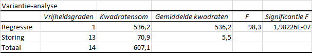
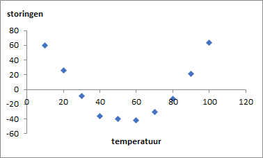
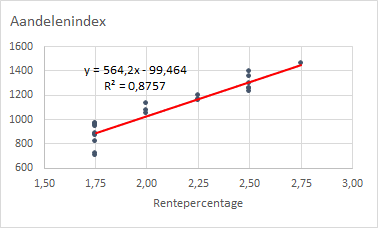
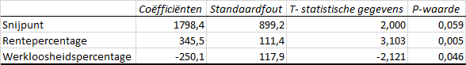

# Samenhang en lineaire regressie {#linregressie}

:::{.chapterintro}
Voor het nemen van beslissingen is het van belang om te weten of er samenhang tussen variabelen bestaat. Ook kan het zijn dat je de waarde van een variabele wilt schatten op basis van de waarde van andere variabelen. Onderzoek naar een mogelijk verband tussen variabelen is dan nodig. Is er een verband dan kan een model voor het verband worden opgesteld.
:::

De variabele waarvan je de waarde wilt schatten en die afhangt van de waarde van een andere variabele wordt heeft benamingen als *afhankelijke variabele*, *verklaarde variabele* of *respons variabele*. En de variabelen waarvan deze afhangt worden de *onafhankelijke variabelen*, of *verklarende variabelen* genoemd. De techniek naar mogelijke verbanden wordt ook wel *regressie-analyse* genoemd.

$Onafhankelijke (verklarende) variabele \rightarrow Afhankelijke (verklaarde) variabele$

## Samenhang {#samenhang}

De waarden van een variabele kunnen samenhangen met de waarden van een andere variabele. Zo zal meestal de benzineprijs stijgen wanneer de prijs van een vat ruwe olie stijgt. De variabelen benzineprijs en olieprijs vertonen dan  een positieve samenhang. Het omgekeerde kan ook, wanneer bijvoorbeeld de werkloosheid stijgt dan dalen de consumentenuitgaven. De variabelen werkloosheidspercentage en consumentenuitgaven vertonen een negatieve samenhang. 

Of er een mogelijk verband tussen numerieke variabelen is kun je onderzoeken

+ door ze in een spreidingsdiagram tegen elkaar uit te zetten en dan te kijken of er een patroon zichtbaar is.
+ door de covariantie of correlatiecoëfficiënt te berekenen.

Wanneer er een verband tussen twee variabelen is, dan zal ook de variantie van de variabelen samenhang vertonen. Er is dan sprake van *covariantie* (gedeelde variantie). vandaar dat variabelen die aan elkaar gerelateerd zijn en dus een deel van hun variantie delen, ook wel *covariaten* genoemd worden. Een maatstaf om de samenhang tussen twee variabelen in uit te drukken is de *covariantie*, welke aangeeft of en hoeveel de waarden van de ene variabele toe- dan wel afnemen bij toenemende waarden van de andere variabele.

<!-- De covariatie is het gemiddelde van de produkten van de deviaties (afwijkingen van het gemiddelde) voor ieder gegevenspaar. -->

::: {.important}
Het lastige is echter dat variantie afhangt van de meetschaal. Stap je bijvoorbeeld bij het meten van de lengte over van meters naar centimeters, dan worden de meetwaarden zelf 100 keer zo groot, maar de variantie wordt 10.000 keer zo groot. De variantie is dus gevoelig voor veranderingen in de schaal. Daarom kun je door simpelweg naar de covariantie te kijken niet zeggen of de variabelen veel of weinig van hun variantie delen. De covariantie is hierdoor een minder bruikbaar getal en zal dan ook verder bij de analyses niet bekeken worden.
:::

Een betere maat voor de samenhang is de **Pearson correlatiecoëfficiënt** welke berekend wordt door de covariantie te delen door het produkt van de standaarddeviaties van beide variabelen. Deze is onafhankelijk van de meetschaal. Deze correlatiecoëfficiënt wordt meestal weergegeven met $r$ en de waarde loopt van -1 tot +1:

+ $-1$ bij een volledig negatieve samenhang.
+ $0$ bij geen samenhang
+ $+1$ bij een volledig positieve samenhang

Met de correlatiecoëfficiënt kun je dus zowel de sterkte van de correlatie aangeven als de richting (positief of negatief).

Voor alleen de sterkte van de correlatie wordt meestal gewerkt met het kwadraat van de correlatiecoëfficiënt, aangeduid met $R^2$. De benaming hiervoor is **R-kwadraat** of ook wel *determinatiecoefficient*. De waarde ervan loopt van 0 tot 1. Hoe dichter bij 1, hoe sterker het verband.

Deze R-kwadraat geeft tevens aan welk deel (of percentage bij vermenigvuldiging met 100) van de variantie de variabelen met elkaar delen. Of met andere woorden, welk deel van de variantie in de ene variabele verklaard wordt door de variantie in de andere variabele. Dit wordt de **verklaarde variantie** genoemd.

**Excel formules**

+ Covariantie populatie: `COVARIANTIE.P()`
+ Covariantie steekproef: `COVARIANTIE.S()`
+ Pearson correlatiecoëfficiënt: `PEARSON()`
+ R-kwadraat: `R-KWADRAAT()`

## Lineair verband

Wiskundig gezien is een verband tussen twee numerieke variabelen lineair wanneer je dat verband grafisch weer kunt geven met een rechte lijn. Bij een niet-lineair verband heb je een gebogen lijn.

Heb je te maken met maar één verklarende variabele dan wordt dat *enkelvoudige lineaire regressie* genoemd. Zijn er meerdere verklarende variabelen dan heet dat *meervoudige lineaire regressie*.

Hoewel regressie en correlatie vaak samen gebruikt worden, zijn het twee verschillende begrippen.

+ *Regressie* heeft als doel om de soort relatie tussen $y$ en $x$ te bepalen. Bijvoorbeeld $y$ neemt lineair toe als $x$ toeneemt.
+ *Correlatie* meet de sterkte van die relatie. Is die sterk of juist zwak.

:::{important}
Regressie en correlatie verklaren de wijzigingen in de afhankelijke variabele, maar niet de oorzaak van deze wijzigingen. Er hoeft dus geen oorzakelijk verband te zijn.
:::

## Enkelvoudige lineaire regressie  {#linreg-enkelvoudig}

Het lineaire regressiemodel bevat één verklarende variabele en kun je weergeven met de vergelijking

$y = \beta_0 + \beta_1 * x + \epsilon$, met

+ $y$ : afhankelijke (respons) variabele
+ $x$ : onafhankelijke (verklarende) variabele
+ $\beta_0$ : intercept, snijpunt met y-as, de waarde van $y$ voor $x=0$
+ $\beta_1$ : richtingscoëfficient, de verandering van de waarde van $y$ wanneer de waarde van $x$ met 1 toeneemt.
+ $\epsilon$ : foutterm, verschil tussen de echte waarde van $y$ en de geschatte waarde van $y$. Dit is het deel van de afhankelijke variabele dat niet verklaard kan worden door de onafhankelijke variabele. Wordt ook wel ruis of storing genoemd.

Bij lineaire regressie probeer je de beste waarden voor $\beta_0$ en $\beta_1$ te vinden zodat de totale fout van het model zo klein mogelijk wordt.

Als voorbeeld wordt een gesimuleerde dataset met 15 waarnemingen voor $x$ en $y$ gebruikt om een aantal achtergronden uit te leggen.

```{r sim1-data, echo=FALSE}
sim1.data <- read_csv2("data/sim1.csv")
sim1.data %>% 
	t() %>% 
	kbl(digits = 1, format.args = list(decimal.mark = ","), caption = "Dataset met 15 waarnemingen x en y.") %>% 
	kable_styling(full_width = FALSE, font_size = 14)
```

In figuur \@ref(fig:sim1-basis) kun je zien hoe ze aan elkaar gerelateerd zijn.

```{r sim1-basis, fig.cap="Spreidingsdiagram voor de 15 waarnemingen."}
ggplot(data = sim1.data, aes(x, y)) +
	geom_point(colour = "black")
```

De gegevens laten een sterk lineair patroon zien en lenen zich ervoor om het patroon in een lineair model vast te leggen. Wanneer je de waarden voor $\beta_0$ en $\beta_1$ hebt, kun je via de vergelijking van de regressielijn voor elke waarde van $x$ een bijbehorende waarde van $y$ berekenen. Deze voorspelde y-waarden worden ook wel de geschatte waarden genoemd.

De kunst is nu om zodanige waarden voor $\beta_0$ en $\beta_1$ te vinden, zodat de regressielijn zo dicht mogelijk bij de gegevens ligt, dan ligt de voorspelde waarde zo dicht mogelijk bij de echte waarde.

In figuur \@ref(fig:sim1-regressie) is een regressielijn (rood) getekend met daarnaast vertikale afstanden (blauwe lijnstukjes) tussen de echte y-waarde (de zwarte punt) en de voorspelde y-waarde (het punt op de rode lijn.

```{r sim1-regressie, fig.cap="Spreidingsdiagram nu met regressielijn en afstandslijntjes."}
sim1.data %>% 
	mutate(prog = 4.71 + 2.05*x) %>% 
	ggplot(aes(x, y)) + 
	geom_abline(intercept = 4.71, slope = 2.05, colour = "red") +
 	geom_point(colour = "black") + 
 	geom_linerange(aes(ymin = y, ymax = prog), colour = "blue")
```

Voor elk punt is afstand = $y - y_{voorspeld}$. Dit verschil wordt ook wel **residu** genoemd. En de beste lijn is de lijn waarvoor de som van de kwadratische afstanden zo klein mogelijk is. Deze methode heet ook wel de **kleinste kwadraten methode**. Hoe je dit precies berekend is in dit kader niet van belang. Excel gebruikt deze methode ook.

Je kunt in Excel op een aantal manieren een (lineaire) regressie uitvoeren.

+ Via werkbladformules.
+ Via een spreidingsdiagram met regressielijn.
+ Via Gegevensanalyse, de enige methode om echte analyses uit te voeren.

### Via Formules

De regressiecoëfficienten kun je met de volgende formules bepalen:

+ $\beta_0$ - met formule `SNIJPUNT(y-bekend ; x-bekend)`
+ $\beta_1$ - met formule `RICHTING(y-bekend ; x-bekend)`

::: {.workedexample}
Download het bestand [sim1.csv](data/sim1.csv). Maak een nieuw Excel werkmap en importeer de gegevens hierin. Geef de geïmporteerde tabel een zinvolle naam, bijv. `TabelSim1`. Het voordeel van dit laatste is dat Excel de tabel- en kolomnamen in de formules gebruikt, waardoor deze beter leesbaar worden.

Bepaal nu met de formules `SNIJPUNT()` en `RICHTING()` de waarden voor $\beta_0$ en $\beta_1$.

Het resultaat wordt: `SNIJPUNT=4,7096` en `RICHTING= 2,0549`.

De regressielijn wordt dan $y = 4,7096 + 2,0549 * x$.

Voor verdere analyses, zoals het berekenen van de residuen, zul je zelf formules moeten maken. Met de methode via *Gegevensanalyse* kan Excel dit automatisch voor je doen.

Bewaar het bestand onder de naam `sim1.xlsx`, je hebt het nog nodig voor opdrachten hierna.
:::

### Via Spreidingsdiagram

Bij het maken van een spreidingsdiagram kun je bij de opmaak aangeven dat de vergelijking van de lijn in de grafiek moet worden weergegeven. Je krijgt dan de gevonden waarden voor $\beta_0$ en $\beta_1$ te zien. Voor visualisatie is dit wel nuttig, maar verder kun je hier niets mee doen. Ook kun je de waarde van $R^2$ laten weergeven.

::: {.workedexample}
Open het hiervoor gemaakte bestand `sim1.xlsx`. Selecteer een cel in de gegevenstabel en voeg een spreidingsdiagram in. Selecteer de gegevenspunten, *rechter muisklik > Trendlijn toevoegen*. Standaard wordt een lineaire trendlijn toegevoegd.  In het eigenschappenvenster voor de trendlijn (aan de rechterkant) kun je bij *Opties voor trendlijn* aangeven dat de vergelijking en R-kwadraat in de grafiek moeten worden weergegeven.

```{r sim1-spreiding, fig.cap="Spreidingsdiagram met vergelijking regressielijn en R-kwadraat.", out.width="70%"}

```

Uiteraard heb je nog meer opmaakmogelijkheden. Zo is in figuur \@ref(fig:sim1-spreiding) de grafiektitel verwijderd en zijn astitels toegevoegd. Ook de trendlijn kun je verder opmaken (kleur, soort lijn, lijndikte)

Bewaar het bestand voor de oefeningen hierna.
:::

### Via Gegevensanalyse

Met deze methode kun je een uitvoerige analyse maken. Met *tab Gegevens > Gegevensanalyse > Regressie* krijg je het volgende dialoogscherm:

```{r toolpak-regressie, fig.cap="Dialoogscherm regressie bij Gegevensanalyse.", out.width="70%"}

```

+ *Invoerbereik y* - Specificeer het gebied voor de y-waarden, inclusief eventuele koptekst.
+ *Invoerbereik x* - Specificeer het gebied voor de x-waarden, inclusief eventuele koptekst.
+ *Labels* - Selecteer deze wanneer de invoerbereiken kopteksten bevatten, hierdoor wordt de uitvoer beter leesbaar.
+ *Door oorsprong* - Door deze te selecteren forceer je dat de constante term nul is. Normaliter moet je dit **niet** selecteren!
+ *Betrouwbaarheidsniveau* - Via deze optie kun je betrouwbaarheidsintervallen (standaard 95%) voor de coëfficiënten laten bepalen.
+ *Uitvoeropties* - Hiermee kun je aangeven waar de uitvoer moet komen.
+ *Storingen* - Storingen zijn de residuen. Voor elke waarneming wordt de storing bepaald.
+ *Standaardstoringen* - De standaardwaarde van elke storing.
+ *Grafiek voor storingen* - Spreidingsdiagram van storing en $x$.
+ *Grafiek voor lijnen* - Spreidingsdiagram waarin zowel $y$ als $y_{voorspeld}$ is uitgezet tegen $x$.
+ *Grafiek met kanswaarden* - Hier kun meestal niet veel mee, zeker in het begin niet.

De uitvoer bestaat uit een aantal onderdelen. Wat je hiervan nodig hebt hangt vooral van de onderzoeksvraag af. Via een oefening zullen de belangrijkste opties besproken worden.

::: {.workedexample}
Open het hiervoor gemaakte bestand `sim1.xlsx`. Kies *tab Gegevens > Gegevensanalyse > Regressie*. Specificeer de invoerbereiken voor y en x. Selecteer verder Labels, Betrouwbaarheidsniveau, Nieuw werkblad, Storingen en de twee grafieken. Klik *OK*.

De uitvoer verschijnt in een nieuw werkblad. Voor een betere leesbaarheid kun je vaak beter het aantal decimalen beperken.
:::

#### Samenvatting regressie {.unnumbered}

```{r sim1-samenvatting, fig.cap="Samenvatting regressie.", out.width="50%"}
knitr::include_graphics("images/linregressie/sim1-samenvatting.png")
```

+ *R-kwadraat* - Een belangrijke waarde welke aangeeft hoeveel van de variantie in de afhankelijke variabele verklaard wordt door de variantie in de onafhankelijke variabele(n). Dus in feite hoe goed de regressielijn bij de werkelijke data past. De waarde ligt tussen 0 1n 1. De waarde bij dit model van 0,88 geeft aan dat ca. 88% van de variantie in $y$ door het model verklaard wordt, wat een redelijk goede waarde is.
+ *Aangepaste kleinste kwadraat* - Wat conservatiever dan R-kwadraat. Deze waarde is alleen maar interessant bij modellen met meerdere onafhankelijke variabelen.

#### Variantie-analyse (ANOVA) {.unnumbered}

```{r sim1-anova, fig.cap="Variantie-analyse regressie."}

```

Bij eenvoudige lineaire regressie is dit niet zo van belang. De waarde van *Significantie F* die hier nagenoeg 0 is, moet wel groter dan 0,05 zijn. Wanneer dat niet het geval is kun je onderzoeken of er een andere onafhankelijke variabele is die mogelijk geschikter is.

#### Regressie-coëfficiënten {.unnumbered}

```{r sim1-coefficienten, fig.cap="Coéfficiënten regressielijn."}
knitr::include_graphics("images/linregressie/sim1-coefficienten.png")
```

Dit is wel het belangrijkste deel in de uitvoer. Je ziet de reeds eerder genoemde waarden van de coëfficiënten van de regressievergelijking: $y = 4,7096 + 2,0549 * x$.

#### Storingen (Residuen) {.unnumbered}

*Storingen* is de term die Excel gebruikt voor *Residuen*. De residuen zijn het verschil tussen de werkelijke waarde van $y$ en de voorspelde waarde (die met de regressievergelijking is berekend).

```{r sim1-residuen, fig.cap="Residuen (storingen).", out.width="50%", }
knitr::include_graphics("images/linregressie/sim1-residuen.png")
```

**Grafiek voor storingen**

```{r sim1-residuplot, fig.cap="Residuen van y uitgezet tegen de waarde van x.", out.width="50%"}
knitr::include_graphics("images/linregressie/sim1-residuplot.png")
```

In figuur \@ref(fig:sim1-residuplot) zijn de residuen uitgezet tegen de bijbehorende x-waarde. De residuen vormen  de variatie in de data die niet door het regressiemodel verklaard worden. Bij een positief residu wordt de waarde *onderschat* door het model en bij een negatief residu wordt de waarde *overschat*.

:::{ .important}
**Residuen** zijn belangrijk bij het evalueren hoe goed een model bij de dataset past. Het diagram met residuen moet altijd goed bestudeerd worden.
Bij een goed model moet het gemiddelde en de som van de residuen dicht bij 0 liggen. En in de grafiek moeten de residuen een willekeurig patroon laten zien. Is dat niet het geval en is er nog een patroon zichtbaar, dan moet het model aangepast worden. In voorbeeld \@ref(sim2) is dat het geval.
:::

:::{.guidedpractice}
In de praktijk van data-analyses kom je vaak grafieken tegen waarin de residuen zijn uitgezet tegen de voorspelde waarden. Mogelijke problemen zie je hierin wat sneller. Helaas maakt Excel deze niet automatisch. Met behulp van de tabelgegevens in figuur \@ref(fig:sim1-residuen) kun je eenvoudig zelf deze grafiek maken. Selecteer de twee kolommen en maak een spreidingsdiagram, zie figuur \@ref(fig:sim1-residu-voorspeld).

```{r sim1-residu-voorspeld, fig.cap="Residuen uitgezet tegen de voorspelde waarden.", out.width="50%"}

```

:::

#### Grafiek voor lijnen {.unnumbered}

Hierin zijn zowel de werkelijke waarden als de voorspelde waarden van $y$ uitgezet tegeb $x$. Hierdoor is het mogelijk om te kijken hoe goed of hoe slecht deze waarden samenvallen. In de praktijk wordt veel meer naar de residuen gekeken en wordt deze grafiek minder gebruikt.

```{r sim1-lijnen, fig.cap="Spreidingsdiagram waarin de werkelijke y-waarden en de berekende y-waarden zijn uitgezet ten x.", out.width="50%"}
knitr::include_graphics("images/linregressie/sim1-lijnen.png")
```

### Voorbeeld Druk-Temperatuur {#sim2}

Bij een bepaald natuurkundig experiment wil men onderzoeken of de druk lineair afhankelijk is van de temperatuur. Daartoe zijn 10 waarnemingen verzameld die te vinden zijn in het bestand `sim2.csv`.

::: {.workedexample}
Download het bestand [sim2.csv](data/sim2.csv). Maak een nieuw Excel werkmap en importeer de gegevens hierin. Geef de geïmporteerde tabel een zinvolle naam, bijv. `TabelSim2`.

Maak een spreidingsdiagram waarin je de druk uitzet tegen de temperatuur. Voeg een lineaire trendlijn toe en laat ook de vergelijking ervan en R-kwadraat weergeven. Zie figuur  \@ref(fig:sim2-lineair).

```{r sim2-lineair, fig.cap="Spreidingsdiagram met vergelijking regressielijn en R-kwadraat", out.width="70%"}

```

Bewaar het bestand onder de naam `sim2.xlsx`.
:::

Er is een duidelijk positief verband te zien dat een beetje bij een rechte lijn in de buurt komt. In het midden is echter wel een vorm van een kromming waar te nemen.

::: {.guidedpractice}
Ga verder met het bestand `sim2.xlsx` en kies *tab Gegevens > Gegevensanalyse > Regressie*. Specificeer de invoerbereiken voor y en x. Selecteer verder Labels, Nieuw werkblad, Storingen en de twee grafieken. Klik *OK*.

:::

**Samenvatting regressie**

```{r sim2-samenvatting, fig.cap="Samenvatting regressie.", out.width="50%"}

```

Zowel de correlatiecoëfficiënt als R-kwadraat liggen dicht bij 1 en dat is goed.

**Regressie-coëfficiënten**

```{r sim2-coefficienten, fig.cap="Coëfficiënten regressielijn."}

```

Voor beide coëfficiënten is de p-waarde kleiner dan 0,05 en dus zijn de coëfficiënten significant.

```{r sim2-residu, fig.cap="Residu Analyse.", out.width="40%",}
knitr::include_graphics("images/linregressie/sim2-residuen.png")

```

In het diagram van de residuen is te zien dat de waarden niet willekeurig verdeeld zijn en een patroon laten zien dat op een parabool lijkt. Dat betekent dat er misschien een verborgen patroon is dat niet door het lineaire model wordt meegenomen. Vanwege het paraboolkarakter van de residuen ligt het voor de hand om te onderzoeken of het toevoegen van een kwadratische term een beter een resultaat oplevert. Het model zou dan de volgende vorm kunnen hebben:

$druk = \beta_0 + \beta_1 * temperatuur + \beta2 * temperatuur^2 + \epsilon$

Het valt buiten het karakter van dit hoofdstuk om deze analyse uit te voeren. Wel kun je in het spreidingsdiagram voor een andere trendlijn dan lineair kiezen. Zo levert de keuze voor een polynoom van de graad 2 het volgende op.

```{r sim2-polynoom2, fig.cap="Spreidingsdiagram met een polynoom van de graad 2 als trendlijn.", out.width="70%"}
knitr::include_graphics("images/linregressie/sim2-polynoom2.png")
```

De R-kwadraat is nu bijna 1.

## Meervoudige lineaire regressie {#linreg-meervoudig}

Bij een meervoudig lineair regressiemodel zijn er meerdere verklarende variabelen. De algemene vergelijking is

$y = \beta_0 + \beta_1 * x_1 + \beta_2 * x_2 + \beta_3 * x_3 + \cdots  + \epsilon$, met

+ $y$ : afhankelijke (respons) variabele
+ $x_1, x_2, x_3, \cdots$ : onafhankelijke (verklarende) variabelen

Om het overzichtelijk en niet te ingewikkeld te maken, een voorbeeld met een gefingeerde verzameling economische gegevens.

::: {.guidedpractice}
Download het bestand [economiedata.xlsx](data/economiedata.xlsx) en open het.

```{r ecdata, fig.cap="Dataset economische gegevens.", out.width="70%"}

```

:::

Onderzocht gaat worden of `Aandelenindex` lineair afhankelijk is van zowel `Rentepercentage` als `Werkloosheidspercentage`. De variabelen zijn dus:

+ Afhankelijke variabele: `Aandelenindex`
+ Onafhankelijke variabelen: `Rentepercentage` en `Werkloosheidspercentage`

Allereerst wordt gekeken of er een relatie is tussen de afhankelijke variabele en elk van de onafhankelijke variabelen afzonderlijk.

::: {.guidedpractice}
Maak twee spreidingsdiagrammen: *Aandelenindex - Rentepercentage* en *Aandelenindex - Werkloosheidspercentage*.

```{r ecdata-relaties, fig.cap="Relaties tussen Aandelenindex en respectievelijk Rentepercentage en Werkloosheidspercentage.", out.width="50%"}


```

:::

**Conclusies**

1. *Aandelenindex - Rentepercentage* - Er is een positief lineair verband te zien. Als het `Rentepercentage` omhoog gaat, gaat ook de `Aandelenindex` omhoog. En een voldoend hoge R-kwadraat van 0,8757.

2. *Aandelenindex - Werkloosheidspercentage* - Er is een negatief lineair verband te zien. Als het `Werkloosheidspercentage` omhoog gaat, gaat de `Aandelenindex` omlaag. Ook hier een voldoend hoge R-kwadraat van 0,8507.

Er wordt nu een meervoudig lineair model opgesteld met de formule

$Aandelenindex = \beta_0 + \beta_1 * Renteperc + \beta_2 * Werkloosheidsperc  + \epsilon$

::: {.guidedpractice}
Kies *Gegevens > Gegevensanalyse > Regressie*. Let er op dat je in het invoerbereik voor X beide onafhankelijke variabelen opneemt, zie figuur \@ref(fig:ecdata-regressie).

```{r ecdata-regressie, fig.cap="Dialoogscherm regressie voor economiedata.", out.width="70%"}
knitr::include_graphics("images/linregressie/ecdata-regressie.png")
```

:::

**Samenvatting regressie**

```{r ecdata-samenvatting, fig.cap="Samenvatting regressie meervoudige lineaire regressie.", out.width="50%"}

```

Zowel de correlatiecoëfficient als R-kwadraat zijn in dit meervoudige model hoger dan voor de afzonderlijke relaties. Een model met beide onafhankelijke variabelen lijkt dus beter dan afzonderlijke modellen.

**Regressie coëfficiënten**

```{r ecdata-coefficienten, fig.cap="Coéfficiënten regressievergelijking."}

```

De regressievergelijking wordt

Aandelenindex = 1798,4 + 345,5 * Rentepercentage - 250,1 * Werkloosheidspercentage  + &#949;

Alleen de p-waarde voor `Rentepercentage` is flink beneden 0,05. Voor het snijpunt en werkloosheidspercentage is deze respectievelijk iets er boven en iets eronder. Het model kan dus waarschijnlijk nog wel verbeterd worden.

**Analyse residuen**

```{r ecdata-residu, out.width="50%", fig.cap="Diagrammen van de residuen."}


```

Bij beide diagrammen lijken de residuen willekeurig verdeeld en is er geen patroon waar te nemen.

Samenvattend is het meervoudige lineaire model een redelijk model. Onderzocht zou moeten worden of er nog verbetering vatbaar is, bijvoorbeeld door een mogelijke interactie tussen de twee onafhankelijke variabelen in het model mee te nemen. Zo'n model zou er dan als volgt uitzien:

$y = \beta_0 + \beta_1 * x_1 + \beta_2 * x_2 + \beta_3 * x_1 * x_2 + \epsilon$

Naast dat dit in Excel extra handwerk met zich meebrengt, is dit ook geen lineair model meer en valt een uitwerking hiervan buiten het bestek van dit hoofdstuk.

## Voorspellen

Wanneer je eenmaal een betrouwbaar regressiemodel gemaakt hebt, dan kun je hiermee de waarde van de afhankelijke variabele schatten, door de waarden voor de onafhankelijke variabelen in de regressievergelijking in te vullen.

Hierbij is wel een kanttekening te maken. Modellen hebben echte beperkingen. Het lineaire regressiemodel is opgesteld voor een bepaald bereik van de onafhankelijke variabelen. Je weet niet hoe de gegevens zich buiten dat bereik gaan gedragen. Het toepassen van een model voor een schatting op waarden buiten het het bereik van de oorspronkelijke gegevens wordt **extrapolatie** genoemd. Over het algemeen is een lineair model slechts een benadering van de werkelijke relatie tussen twee variabelen. En als je dan gaat extrapoleren, dan maak je een onbetrouwbare gok dat deze relatie ook geldig is op plaatsen waar deze niet is geanalyseerd.

Ter toelichting een voorbeeld. De gevonden vergelijking bij de meervoudige lineaire regresie, zie \@ref(linreg-meervoudig), luidt

Aandelenindex = 1798,4 + 345,5 * Rentepercentage - 250,1 * Werkloosheidspercentage

Bij een werkloosheidspercentage van 6,0 en een negatieve rente (niet ondenkbaar) van -0,5 is de aandelenindex 125. En bij een negatieve rente van -1,0 zou de aandelenindex zelfs -48 zijn!! Dat kan natuurlijk niet.

## Opgaven {#opg-linreg}

::: {.sectionexercise}
1. In het bestand [salaris_data.csv](data/salaris_data.csv) is van 30 personen het salaris en het aantal jaren ervaring verzameld. Stel hiervoor een lineair regressiemodel op.

2. In de grafiek in figuur \@ref(fig:toetsresultaat) is voor een bepaalde toets bij 20 leerlingen het toetsresultaat uitgezet tegen het aantal uren studietijd voor deze toets.
   a.  Is er een correlatie tussen het cijfer en de studietijd? Wat verwacht je voor de waarden van R-kwadraat? <!-- dichtbij 0 -->
   b.  Bedenk een reden voor deze opvallende cijferreeks. <!-- zeer gemakkelijke toets -->

```{r toetsresultaat, fig.cap="Toetsresultaat en studietijd", out.width="60%"}
toets <- data.frame(studietijd = c(6,8,4,1,9,11,10,3,6,12,9,5,2,4,2,9,2,3,10,9),
				   cijfer = c(10,9.4,9.7,9.7,9.8,9.3,9.2,9.7,9.2,9.4,9.4,8.8,8.9,9.1,9.2,9.3,9.9,9.5,9.8,10))
plot(x = toets$studietijd, y = toets$cijfer,
	 xlim = c(0, max(toets$studietijd)),
	 ylim = c(6, 10),
	 xlab = "Studietijd (uur)", ylab = "Cijfer", main = "Toetsresultaat - Studietijd",
	 type = "p", pch=19, col="blue")
```

3. Aan een willekeurige groep van 36 werknemers is gevraagd naar hun bruto maandinkomen en hun wekelijkse uitgaven aan eten. De resultaten staan in het bestand [eetkosten.xlsx](data/eetkosten.xlsx). Onderzoek of er een lineair verband is tussen het inkomen en eetuitgaven. 

4. het bestand [reclamekosten.xlsx](data/reclamekosten.xlsx) bevat van 84 bedrijven hun verkoop en de reclamekosten van een bepaald jaar. Beide soort gegevens in duizend euro. Onderzoek of er een verband is tussen deze twee variabelen. Probeer een verklaring te geven voor de waarde van R-kwadraat.

5. Een fabrikant van energierepen wil de dalende omzet van het topprodukt "GreenBull" weer een impuls geven. Om een plan hiervoor te ontwikkelen zijn via een steekproef in 34 winkels een aantal gegevens verzameld, welke te vinden zijn in het bestand [energiereep.xlsx](data/energiereep.xlsx). Stel hiervoor een meervoudig lineair regressiemodel op. De verzamelde gegevens zijn:

    - `winkelnr`
    - `omzet` - aantal verkochte repen per maand in de winkel
    - `prijs` - verkoopprijs reep (centen)
    - `promotiekosten` - maandelijkse kosten voor promotie van het produkt in de winkel (euros)

:::
