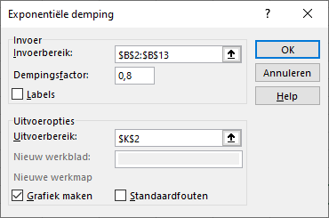

# Prognoses {#prognoses}

:::{.chapterintro}
Voor het schatten van toekomstige waarden zijn verschillende (statistische) technieken beschikbaar. Naast de zeer eenvoudige naïeve prognose komt de meer geavanceerdere exponentïele vereffening (smoothing) aan bod. Ook wordt gekeken naar maatstaven om de nauwkeurigheid van de voorspelde waarden te beoordelen.
:::

## Nauwkeurigheid prognoses {#prognoses-nauwkeurigheid}

Hoe nauwkeurig zijn de voorspellingen die zijn verkregen met een bepaalde prognosetechniek? Om deze vraag te beantwoorden worden een aantal verschillende kentallen voor de voorspelling van de nauwkeurigheid geïntroduceerd.

Alles begint bij het bepalen van de *prognosefout*. 

$$\text{(prognose)fout} = \text{werkelijke waarde} - \text{voorspelde waarde}$$

Je wilt uiteraard dat de prognosefouten zo klein mogelijk zijn. Omdat de fouten zowel positief als negatief kunnen zijn, heb je niet veel aan het gemiddelde van deze fouten. Vandaar dat altijd de absolute waarde van de fouten genomen wordt.

Er zijn verschillende kentallen ontwikkeld om de nauwkeurigheid te beoordelen. Deze worden meestal met hun Engelstalige afkorting gebruikt. Een paar veel voorkomende kentallen staan in tabel \@ref(tab:kentallen) genoemd.

```{r kentallen}
tribble(
  ~Kental, ~Engelstalig, ~Nederlandstalig,
  "MAE", "Mean Absolute Error", "Gemiddelde absolute fout",
  "MAPE", "Mean Absolute Percentage Error", "Gemiddelde absolute procentuele fout",
  "MSE", "Mean Squared Error", "Gemiddelde kwadratische afwijking",
  "RMSE", "Root Mean Squared Error", "Wortel kwadratische afwijking"
) %>% 
  kbl(caption = "Enkele maatstaven voor de naukeurigheis van prognoses.") %>%
  kable_styling()
```

Je kunt niet zomaar een van deze kentallen als het beste kental beschouwen. In het algemeen geldt voor elk kental: hoe kleiner de waarde, des te beter.

## Naïeve prognose {#prognoses-naief}

Een van de meest eenvoudige prognosemethodes is de *naïeve prognose*. Hierbij is de prognose op een bepaald tijdstip gelijk aan de waarde op het voorgaande tijdstip. Voor het bepalen hiervan heb je geen ingewikkelde formules nodig. Ondanks dat deze methode erg simpel is, zijn de resultaten vaak verrassend goed. Het is aan te raden om altijd hiermee te starten en daarna andere methodes hiermee te vergelijken.

In tabel \@ref(tab:benzineverkoop-data) zie je de wekelijkse verkoop van liters (x 1000) benzine van een brandstofhandelaar.

```{r benzineverkoop-data}
liters <- c(69, 79, 74, 64, 57, 76, 83, 66, 84, 63, 66, 74)
mydata <- tibble(week = seq(1:12), liters)
t(mydata) %>% kbl(caption = "Wekelijkse verkoop van benzine in duizend liters.")
```

In de lijngrafiek in figuur \@ref(fig:benzineverkoop-grafiek) zie je dat dit een horizontaal patroon met willekeurige fluctuaties rond het gemiddelde van $71,25$ is.

```{r benzineverkoop-grafiek, fig.cap="Aantal verkochte liters benzine (x 1000) per week.", out.width="50%"}
knitr::include_graphics("images/prognoses/benzinegrafiek.png")
```

Voor deze gegevens wordt een naïeve prognose van de wekelijkse verkoop gemaakt, zie kolom 3 in figuur \@ref(fig:benzineverkoop-naief).

```{r benzineverkoop-naief, fig.cap="Naïeve prognose van de wekelijkse verkopen en berekening van een aantal kenmerken voor de nauwkeurigheid.", out.width="50%"}
knitr::include_graphics("images/prognoses/benzinetabel-naief.png")
```

In de kolommen 4 t/m 6 zijn berekeningen voor de nauwkeurigheid uitgevoerd.

+ *abs. fout*:  `=ABS(werkelijke waarde - prognosewaarde)`
+ *abs. proc. fout*: `=ABS(fout) / werkelijke waarde`
+ *kwadr. fout* `= fout^2`
+ *MAE*, *MAPE* en *MSE* zijn berekend met de formule `=GEMIDDELDE(...)`
+ *RMSE*: `=WORTEL(MSE)`

:::{.guidedpractice}
Wat is de verkoopprognose voor de weken 13 t/m 14?[^prognoses-01]

:::

[^prognoses-01]: Voor de weken 13 t/m 15 is de prognose 74, de waarde van week 12. Wanneer de werkelijke verkoop voor week 13/14 beschikbaar is kan een nieuwe prognose voor week 14/15 gemaakt worden.

## Naïeve Seizoen prognose {#prognoses-naiefseizoen}

Voor een tijdreeks met een seizoenscomponent verloopt de naïeve prognose iets anders. In dat geval is de prognose op een bepaald tijdstip gelijk aan de waarde in hetzelfde seizoen in de voorgaande periode.

Als voorbeeld de kwartaalverkoop van paraplu's over een periode van vijf jaar, zie de lijngrafiek figuur \@ref(fig:parapluverkoop-grafiek).

```{r parapluverkoop-grafiek, fig.cap="Kwartaalverkoop paraplu's gedurende vijf jaar.", out.width="70%"}
knitr::include_graphics("images/prognoses/paraplugrafiek.png")
```

Deze grafiek lijkt op het eerste gezicht ook op een horizontaal patroon met willekeurige fluctuaties. Maar wanneer je goed kijkt zie je toch een systematisch patroon binnen elk jaar. Steeds is binnen elk jaar de verkoop in het tweede kwartaal het hoogst en in het vierde kwartaal het laagst. En de kwartalen 1 en 3 scoren redelijk gemiddeld.

Om te laten zien dat een naïeve seizoenprognose in een dergelijke tijdreeks beter is dan een gewone naïeve prognose worden beide prognoses bepaald. De resultaten, alsmede de kentallen voor de nauwkeurigheid zijn te zien in figuur \@ref(fig:parapluverkoop-prognose). Voor de eerste vier kwartalen kunnen de naïeve seizoenprognoses niet bepaald worden, omdat er geen waarde in de voorgaande periode beschikbaar is.

```{r parapluverkoop-prognose, fig.cap="Naïeve en naïeve seizoenprognoses voor de Kwartaalverkoop van paraplu's.", out.width="70%"}
knitr::include_graphics("images/prognoses/paraplutabel.png")
```

De naïeve seizoensprognose toont voor alle kentallen de beste waarde.

:::{.guidedpractice}
Wat is de verkoopprognose voor de vier kwartalen van jaar 6?[^prognoses-02]

:::

[^prognoses-02]: Voor jaar 6 is de naïef-seizoenprognose voor de kwartalen 1 t/m achtereenvolgens 65, 83, 64 en 48

## Voortschrijdend gemiddelde {#prognoses-ma}

Via de methode van het voortschrijdend gemiddelde kun je ook prognoses maken. Als voorbeeld wordt de wekelijkse benzineverkoop genomen waarvoor eerder (figuur \@ref(fig:benzineverkoop-naief)) een naïeve prognose gemaakt is. Er wordt een 3-weeks voortschrijdend gemiddelde gekozen. De resultaten zijn te zien in figuur \@ref(fig:benzineverkoop-ma)

```{r benzineverkoop-ma, fig.cap="Voortschrijdend 3-weeks gemiddelde van de wekelijkse benzineverkopen.", out.width="50%"}
knitr::include_graphics("images/prognoses/benzinetabel-ma.png")
```

Bij een 3-weeks voortschrijdend gemiddelde kun je de eerste waarde pas berekenen voor week 4. En deze waarde is bepaald met de formule `=GEMIDDELDE(...)` met als argument de werkelijke waarden voor de 3 weken daarvoor.

Gelet op de kentallen voor de nauwkeurigheid zie je dat het voortschrijdend gemiddelde iets beter presteert dan de naïeve prognose, maar ook niet echt heel veel beter. En de prognose voor week 13 wordt $67,67$.


## Exponentiële demping {#prognoses-expsmooth}

Exponentiële demping (effening, smoothing) is een analysemethode voor tijdreeksen waarbij gewichten aan de waarnemingen worden toegekend. Het exponentiële smoothing model heeft de volgende vorm

$F_{t+1} = \alpha Y_t + (1-\alpha)F_t$ , met

+ $F_{t+1}$: de prognose (Engels: Forecast) op tijdstip $t+1$
+ $Y_t$: de werkelijke waarde op tijdstip $t$
+ $F_t$: de prognose op tijdstip $t$
+ $\alpha$: dempingscoëfficient (dempingsconstante) met $0 \le \alpha \le 1$

De prognose op tijdstip $t+1$ is dus een gewogen gemiddelde van de werkelijke waarde op tijdstip $t$  en de prognose voor tijdstip $t$, met als wegingsfactoren respectievelijk $\alpha$ en $1 - \alpha$. Bij een grote waarde van $\alpha$ tellen de meest recente waarnemingen zwaarder mee dan de oudere waarnemingen. De prognoses kunnen daardoor sneller reageren op veranderende omstandigheden.

Voor het tijdstip $t = 1$ (het eerste tijdstip) kun je geen prognose berekenen. Voor tijdstip $t = 2$ (het tweede tijdstip) wordt de prognose gelijk aan de werkelijke waarde op tijdstip $t = 1$. Voor alle volgende tijdstippen wordt de prognose berekend met de formule.

Als voorbeeld weer de wekelijkse benzineverkoop zodat de prognoses via exponentiële demping vergeleken kunnen worden met de naïeve prognose en die via het voortschrijdend gemiddelde.

```{r benzineverkoop-ets, fig.cap="Prognose van de wekelijkse benzineverkopen via exponentiële demping met α=0,2.", out.width="50%"}
knitr::include_graphics("images/prognoses/benzinetabel-ets.png")
```

Gelet op de nauwkeurigheidswaarden zijn dit tot nu toe de beste voorspellingen. de prognose voor week 13 wordt $71,0$.

:::{.tip}
**Keuze $\alpha$**

Als de tijdreeks een substantiële willekeurige variabiliteit heeft kun je het beste een kleine waarde voor $\alpha$ nemen. En bij een tijdreeks met weinig variabiliteit heeft een grotere waarde de voorkeur. De meest wenselijke waarde voor $\alpha$ is die waarde die de minste fouten oplevert, dus die zorgt voor de laagste gemiddelde kwardratische fout (MSE). In de praktijk ga je meestal proberen of een andere waarde voor $\alpha$ een nauwkeuriger voorspelling oplevert.
:::

**Via gegevensanalyse**

In plaats van zelf de formules te bedenken en in te voeren kun je ook gebruik maken van *Gegevens > Gegevensanalyse > Exponentiële demping*. In het dialoogscherm (zie figuur \@ref(fig:dialoog-exp-demping)) vul je voor het invoerbereik het gebied met de werkelijke waarden in.

:::{.important}
**Dempingsfactor**

Voor de dempingsfactor moet je de waarde voor $1 - \alpha$ invullen. Om dezelfde resultaten te krijgen dus 0,8.
:::

```{r dialoog-exp-demping, fig.cap="Dialoogscherm voor exponentiële demping", out.width="50%"}

```

Je krijgt dan dezelfde resultaten. Desgewenst kun je ook een grafiek produceren.

```{r enzinegrafiek-ets, fig.cap="Lijndiagram van de benzineverkoop en de voorspelling via exponentiële demping met α=0,2.", out.width="50%"}
knitr::include_graphics("images/prognoses/benzinegrafiek-ets.png")
```

De eenvoud van deze methode heeft ook wel zijn prijs. Wil je experimenteren met een andere waarde voor $\alpha$ dan moet je de procedure weer opnieuw uitvoeren.

## Voorspellingenblad {#prognoses-voorspellingenblad}

De exponentiële effenings methoden zijn op dit moment de beste en meest gebruikte methodes. Het grootste voordeel van de ETS (Exponential Tripple Smoothing) methode is dat deze de mogelijkheid heeft om automatisch seizoenpatronen te ontdekken in de gegevensreeks en daarnaast ook nog een betrouwbaarheidsinterval voor de voorspellingen kan leveren.

:::{.tip}
Je kunt het beste deze methode gebruiken wanneer de tijdreeks zowel een trend als een seizoenspatroon laat zien.
:::

In de nieuwere versies van Excel ( Excel 365, Excel 2016, Excel 2019, ...) zijn de volgende werkbladfuncties voor het uitvoeren van de ETS methode beschikbaar:

  - `VOORSPELLEN.ETS`
  - `VOORSPELLEN.ETS.SEASONALITY`
  - `VOORSPELLEN.ETS.CONFINT`
  - `VOORSPELLEN.ETS.STAT`

Eenvoudiger is het gebruik van het *Voorspellingblad* of *prognosewerkblad* dat in die nieuwere Excel versies aanwezig is. Onder de motorkop worden de `VOORSPELLEN.ETS` functies gebruikt.

Via het Voorspellingenblad wordt een nieuw werkblad gemaakt met daarin een tabel met de oorspronkelijke gegevens en de voorspelde waarden. Deze toekomstige waarden worden berekend op basis van het Holt-Winters ETS algoritme. Ook wordt een grafiek gemaakt met de oorspronkelijke en voorspelde waarden en een aantal schattingen van meetwaarden voor de nauwkeurigheid. Hiermee wordt het maken van geavanceerde prognoses een stuk eenvoudiger.

:::{.workedexample}
1. Open het bestand `verkopen.xlsx` dat je eerder in in \@ref(opg-importdata) hebt aangemaakt.

2. Selecteer een willekeurige cel in het gegevensgebied.

3. Kies *tab Gegevens > Voorspellingblad (groep Voorspelling)*. Het dialoogvenster Prognosewerkblad maken verschijnt.

```{r prognosewerkblad, fig.cap="Prognosewerkblad maken"}
knitr::include_graphics("images/prognoses/sales_fcast_sheet.png")
```

In dit venster kun je een aantal keuzes maken. Zie bijlage \@ref(app-voorspellingenblad) voor een toelichting.

4. Stel `Einde van prognose` in op 1 december 2013.
5. Klik op *Opties*.

```{r sales-fcast-options, fig.cap="Opties prognosewerkblad."}
knitr::include_graphics("images/prognoses/sales_fcast_options.png")
```

6. Klik op *Maken*. Er wordt een nieuw werkblad gemaakt met daarin de historische gegevens, de voorspelde waarden, betrouwbaarheidsgrenzen (standaard 95%) en een grafiek.

De resultaten van de voorspellingen staan in tabel \@ref(tab:voorspelling) weergegeven

```{r voorspelling}
result <- tribble(
  ~Datum, ~Voorspellen, ~Laag, ~Hoog,
  "01-10-2013", 4264177, 3869915, 4658439,
  "01-11-2013", 4033806, 3639542, 4428070,
  "01-12-2013", 4033625, 3639358, 4427892
)
result %>%
  kbl(col.names = c("Datum", "Voorspellen", 
                    "Laagste betrouwbaarheidsgrens", "Hoogste betrouwbaarheidsgrens"), 
      caption = "Voorspelde waarden en betrouwbaarheidsgrenzen") %>%
  kable_paper(bootstrap_options = "condensed", font_size=14)
```

:::

## Opgaven {#opg-prognoses}

::: {.sectionexercise}
1. **Autoverkopen**

    In het bestand [autoverkoop.xlsx](data/autoverkoop.xlsx) staan de de autoverkopen per kwartaal van 4 jaren, zie ook \@ref(ts-ma-calc). Maak met behulp van het Voorspellingenblad een prognose van de verkopen voor de vier kwartalen van jaar 5.

2. **Omzetvoorspelling**

    In het bestand [bedrijfsomzet.xlsx](data/bedrijfsomzet.xlsx) staan de omzetten van een bedrijf over de jaren 2007-2015.
    
    a. Maak een grafiek van de omzet tegen het jaar.
    a. Voeg achtereenvolgens de volgende trendlijnen toe; lineair, logaritmisch en exponentieel.Verzamel voor elk van deze trendlijnen de waarde van R-kwadraat. Maak op basis hiervan een keuze voor het meest geschikte model.
    a. Maak via de opties voor de trendlijn een voorspelling van de omzet voor 2016 en lees de waarde in de grafiek af.
    a. Experimenteer met de opties voor de trendlijn om uit te zoeken wanneer een omzet van €25.000.000 te verwachten is.
    a. Bereken een voorspelling van de omzet voor 2016 met een werkbladformule. Welke formule je hiervoor kunt gebruiken hangt af van het gekozen model. Zie hiervoor onderdeel.
    a. Maak m.b.v. het Voorspellingenblad een prognose voor de omzet van 2016, alsmede een 95% betrouwbaarheidsinterval hiervoor.
    a. Vergelijk de drie voorspelde waarden met elkaar.

3. **Televisieverkoop**

   In het bestand [televisies.xlsx](data/televisies.xlsx) staan de verkochte aantallen televisies per kwartaal gedurende vier jaar.
   
   a.  Maak een grafiek van de tijdreeks.
   b.  Is er een trend of een seizoenspatroon in de tijdreeks te ontdekken.
   c.  Maak een voorspelling van de verkoop voor de kwartalen van het volgende daar. Denk eerst na over welke prognosemethode je wilt gebruiken.
:::
