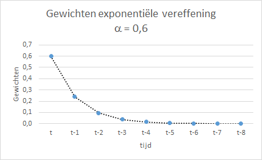

# Tijdreeksen {#tijdreeksen}

:::{.chapterintro}
Veel bedrijfskritische beslissingen zijn afhankelijk van goede prognoses voor de toekomst. Het maken van een prognose is gebaseerd op historische gegevens en dat zijn meestal *tijdreeksen*, een reeks waarnemingen van een variabele gemeten op opeenvolgende tijdstippen of over opeenvolgende periodes.
:::

## Intro

De historische gegevens omvatten vaak trends, seizoenpatronen en externe factoren. Een tweetal veel voorkomende scenario's zijn:

+ Financiële prognoses voor het voorspellen van omzet, kosten en winst alsmede van indicatoren hiervoor zoals aantal nieuwe klanten of verkoopprijs.
+ Vraagvoorspellingen voor producten vormen een kritische stap in de supply-chain management van een organisatie. Hierop is de inkoop van grondstoffen en inzetten van mensen en machines weer gebaseerd. Vraagvoorspelling is vaak uniek voor een bedrijfstak. Zo zal een electriciteitsbedrijf een schatting willen maken van de te leveren energie in de toekomst. En een ziekenhuis zal het aantal benodigde bedden willen plannen.

Voor een gedegen begrip van tijdreeksen en de verschillende prognosetechnieken is behoorlijke statistische kennis vereist. In dit studieboek worden de statistische achtergronden niet behandeld. Ook de hoeveelheid formules wordt zoveel mogelijk beperkt. De doelstellingen van dit hoofdstuk zijn:

1. Introductie in de analyse van tijdreeksen
1. Introductie van prognosetechnieken in het algemeen en de mogelijkheden met Excel
1. Het opdoen van praktische vaardigheden via taken en oefeningen

## Wat is een tijdreeks?

Een tijdreeks is een reeks waarnemingen van een variabele gemeten op opeenvolgende tijdstippen of over opeenvolgende periodes. Wanneer de gegevens een bepaald patroon in de tijd vormen, dan kan dit patroon gebruikt worden om een prognose voor een toekomstige waarde te maken.

::: {.tip}
Het kan ook zijn dat de waarde van een variabele afhangt van andere variabelen dan de tijd. Zo zou er een verband kunnen zijn tussen de hoogte van de bloeddruk en de leeftijd. Je hebt dan een onafhankelijke variabele (leeftijd) en een afhankelijke variabele (bloeddruk). Dergelijke verbanden tussen variabelen worden onderzocht met *regressie-analyse*. Wanneer je de tijd als een onafhankelijke variabele beschouwt, dan kan regressie-analyse ook bij tijdreeksen worden gebruikt.
:::

De meetgegevens van de variabele bestaan uit herhaalde metingen op vaste tijdstippen zoals elk uur, dag, week, maand, kwartaal, jaar of elke regelmatige periode. De gegevens zijn dus geordend in de tijd en de tijd tussen elke waarneming is constant.

Voorbeelden van tijdreeksen:

+ ziekteverzuim per maand of jaar
+ omzet per maand
+ verkopen per kwartaal
+ verkeersdoden per jaar
+ ...

Veel tijdreeksen vertonen een trend (toename of afname) en/of zijn seizoensgebonden, dat wil zeggen variaties die specifiek voor een bepaald tijdsbestek zijn. Zo zal bijvoorbeeld de verkoop van ijs in de zomer hoger zijn dan in de winter.

## Componenten tijdreeks

Een tijdreeksanalyse is de analyse van gegevens die in de loop van een bepaalde periode verzameld zijn. Het is dus een onderzoek naar de samenhang tussen twee variabelen, waarvan de onafhankelijke variabele de tijd is.

Een tijdreeksanalyse begint altijd met het weergeven van de tijdreeks in een grafiek. Op de horizontale as staat altijd de tijd en op de verticale as de te onderzoeken variabele. De grafiek geeft vaak al een eerste beeld van de kenmerken van de tijdreeks.


::: {.workedexample}

```{r airpassengers, fig.cap="Tijdreeks van het aantal internationale vliegtuigpassagiers per maand (1949-1960)"}
forecast::autoplot(AirPassengers) + 
  labs(title = "Aantal internationale vliegtuigpassagiers per maand (1949-1960)",
       x = "Tijd",
       y = "Aantal passagiers")
```

Je ziet hierin onmiddellijk een paar zaken:

1. Het aantal passagiers neemt in de loop van de tijd toe.
2. Er vinden jaarlijks terugkerende patronen plaats: periodiek gedrag.
3. De variantie lijkt in de tijd toe te nemen: de uitzwaaiers worden groter.

:::

Zaken waar je op moet letten zijn:

+ Is er een *trend*? Dit houdt in dat de variabele de neiging heeft toe te nemen (continu stijgend) of af te nemen (continu dalend).
+ Is er *seizoensgebondenheid*? Dit houdt in dat er een regelmatig terugkerend patroon van pieken en dalen te zien is, gerelateerd aan bepaalde tijdsdelen zoals seizoenen, kwartalen, maanden, weekdagen, enz.
+ Zijn er *uitschieters*? Dit zijn waarden die ver verwijderd zijn van de andere waarden.
+ Is er een *lange termijn cyclus*? Deze is niet gerelateerd aan de seizoensfactoren.
+ Is er een *constante variantie* van de variabele over de tijd of wordt deze groter of kleiner?
+ Zijn er *plotselinge wijzigingen* in de grootte of de variantie?

Bij een nauwkeuriger analyse van een tijdreeks is het nuttig wanneer je dergelijke zaken apart zou kunnen bekijken. Daarvoor moet je een tijdreeks in de verschillende componenten kunnen splitsen. Bij de meest gebruikte systematiek gaat men er van uit dat een tijdreeks uit de volgende componenten bestaat:

```{r ts-componenten, echo=FALSE, fig.cap="Componenten van een tijdreeks."}
grViz("
  digraph stat1 {
    graph[rankdir = TB, bgcolor=transparent]
    node[shape = box, fontname = Arial]
    TS [label = 'Tijdreeks']

    node[shape = box, width = 0.8, fontsize = 10]
    T [label = 'Trend (T)\ncomponent']
    S [label = 'Seizoen (S)\ncomponent']
    C [label = 'Cyclische (C)\ncomponent']
    R [label = 'Random (R)\ncomponent']

    TS -> {T, S, C, R}
  }
")
```

### Component Trend

De neiging om over langere tijd te stijgen (positieve trend) of te dalen (negatieve trend). Deze hoeft niet lineair te zijn. Soms wordt alleen naar een trend verwezen als de richting (stijgend of dalen) waarin de veranderingen plaatsvinden.

:::{.workedexample}
```{r ap-trend,  fig.cap="Trendcomponent aantal internationale vliegtuigpassagiers.", out.width="70%"}
ap.components <- decompose(AirPassengers,type='multiplicative')
autoplot(ap.components$trend) + 
  labs(title = "",
       x = "Tijd",
       y = "")
```

De trend is nagenoeg lineair.
:::

### Component Seizoen

Dit zijn regelmatige schommelingen (fluctuaties) per dag/maand/kwartaal (meestal binnen een jaar). Zo zullen ijsverkopen in de zomer hoger zijn dan in de winter. Seizoensgebondenheid betreft altijd een vaste, bekende periode.

:::{.workedexample}
```{r ap-season,  fig.cap="Seizoencomponent aantal internationale vliegtuigpassagiers.", out.width="70%"}
ap.components <- decompose(AirPassengers,type='multiplicative')
autoplot(ap.components$seasonal) + 
  labs(title = "",
       x = "Tijd",
       y = "")
```

De seizoenscomponent lijkt elk jaar laag te beginnen, halverwege te stijgen (zomer?) en dan weer te dalen.
:::

### Component Random

Dit zijn onregelmatige schommelingen die niet uit een van de eerder genoemde onderdelen verklaard kunnen worden. Ze worden ook wel toevallige invloeden genoemd.

:::{.workedexample}
```{r ap-random,  fig.cap="Randomcomponent aantal internationale vliegtuigpassagiers.", out.width="70%"}
ap.components <- decompose(AirPassengers,type='multiplicative')
autoplot(ap.components$random) + 
  labs(title = "",
       x = "Tijd",
       y = "")
```

Het lijkt er op dat deze component niet volledig willekeurig is, omdat er in het midden een stukje zit dat minder variatie heeft dan de rest. Wanneer dat zo is en er dus nog een patroon in deze component zit, dan is de decompositie niet volledig geslaagd.
:::

### Component Cyclisch

Dit zijn schommelingen (golfbewegingen) over een langere periode, vaak vele jaren, door schommelingen in de conjunctuur. Kenmerkend is ook dat deze periodes geen vaste lengte hebben. In veel gevallen wordt de cyclische component weggelaten of gecombineerd met de trend tot één trendcyclus.

:::{.tip}
De conjunctuur is een samenspel van verschillende factoren of indicatoren. Zie eventueel:

+ [Dossier Conjunctuur, CBS](https://www.cbs.nl/nl-nl/dossier/dossier-conjunctuur)
+ [Conjunctuurklok, CBS](https://www.cbs.nl/nl-nl/visualisaties/conjunctuurklok)
:::

### Modellen

Er worden twee wiskundige modellen voor tijdreeksen gehanteerd: Additief en Multiplicatief. En het ontleden van de tijdreeks in de afzonderlijke componenten heet *decompositie* van de tijdreeks.

**Additief model**

Je kiest hiervoor wanneer de seizoenseffecten in grootte nagenoeg constant blijven.

$Y_t = T_t + S_t + R_t$

+ $Y_t$ - de waargenomen waarde in de tijdreeks op tijdstip $t$
+ $T_t$ - waarde trend component op tijdstip $t$
+ $S_t$ - waarde seizoen component op tijdstip $t$
+ $R_t$ - waarde random component op tijdstip $t$

Je telt dus gewoon de waarden van de drie componenten op om de waarde in de tijdreeks te krijgen.

**Multiplicatief model**

Je kiest hiervoor wanneer de seizoenseffecten in grootte toenemen of afnemen.

$Y_t = T_t \times S_t \times R_t$

+ $Y_t$ - de waargenomen waarde in de tijdreeks op tijdstip $t$
+ $T_t$ - waarde trend component op tijdstip $t$
+ $S_t$ - seizoenindex op tijdstip $t$
+ $R_t$ - randomindex op tijdstip $t$

De trend wordt gemeten in eenheden van de variabele in de tijdreeks. De seizoenscomponenten en onregelmatige componenten worden echter relatief gemeten, waarbij waarden boven de 1,00 duiden op effecten boven de trend en waarden onder 1,00 op effecten onder de trend. Om de tijdreekswaarde te krijgen worden deze drie componenten met elkaar vermenigvuldigd. Veel zakelijke en economische tijdreeksen volgen dit patroon. 

In figuur \@ref(fig:airpassengers) zie je de seizoenseffecten steeds groter worden, hier past dus een multiplicatief model bij.

:::{.tip}
Een multiplicatieve tijdreeks kan via de logaritme functie omgezet worden in een additieve tijdreeks:

$log(T*S*C*R) = log(T) + log(S) + log(C) + log(R)$
:::

Er zijn verschillende methodes voor het bepalen van de afzonderlijke componenten. Het gewogen gemiddelde wordt meestal gebruikt om te corrigeren voor de seizoensinvloed. Hierna wordt de trend bepaald voor de seizoengecorrigeerde reeks. Wat er dan nog overblijft is de randomcomponent. Het uitvoeren van een decompositie valt buiten het bestek van dit studieboek.

### Oefening: Australische bierproductie

Als voorbeeld van een tijdreeks wordt de bierproductie (in megaliters) in Australie voor de jaren 1956-1973 bekeken en geanalyseerd.

1. Download het hulpbestand [ausbeer56-73.xlsx](data/ausbeer56-73.xlsx) en open het daarna.

2. Selecteer een cel in de tabel en kies dan *tab Invoegen > Draaigrafiek (groep Grafieken) > Draaigrafiek > OK*. Op een nieuw werkblad wordt een lege draaitabel aangemaakt.

3. Voeg het veld `Volume` toe aan het gebied *Waarden* en het veld `Datum` aan het gebied *As (categorieën)*. Naast het veld `Datum` worden ook de velden `Jaren` en `Kwartalen` aangemaakt.

4. Wijzig het grafiektype in *Lijn met markeringen*.

5. Selecteer in de draaitabel een willekeurig jaar. Daarna Rechter muisknop en kies uit het snelmenu *Uit- en samenvouwen > Gehele veld uitbreiden*. Zowel in de draaitabel als draaigrafiek worden de jaren uitgesplitst in kwartalen. In principe is de tijdreeks nu zichtbaar. Echter de layout kan nog verbeterd worden.

6. Breng de volgende wijzigingen in de lay-out aan:

   + Verwijder het veld Datum uit het gebied As in de lijst met Draaitabelvelden.
   + Wijzig in de draaitabel in de cel rechtsboven de tekst "Som van Volume" in "Bierproductie". Hierdoor wijzigt ook de tekst linksboven in de draaigrafiek.
   + Schaal de Y-as van 200 tot 600 met stappen van 50.
   + Voeg een titel aan de Y-as toe.
   + Verwijder de legenda en grafiektitel.
   + Maak de lijn iets dunner en geef de markeringspunten een andere kleur dan de lijn.
   + Pas eventueel de afmetingen aan.

Het resultaat zie je in figuur \@ref(fig:ts-beer1)

```{r ts-beer1, fig.cap="Australische bierproductie (megaliters) per kwartaal."}
knitr::include_graphics("images/timeseries/ts_beer1.png")
```

In de grafiek zie je de volgende kenmerken:

+ Er is een opwaartse trend, mogelijk geen rechte lijn maar iets gebogen.
+ Er is een sterke seizoensgebondenheid te zien door de regelmatige pieken en dalen gerelateerd aan de verschillende kwartalen. De top ligt steeds bij kwartaal 4, de dalen bij de kwartalen 2 en 3 en de waarden voor kwartaal 1 liggen tussen piek en dal.
+ Er zijn geen uitschieters.
+ Er is geen lange termijn cyclus.
+ De variantie in de waarden lijkt iets toe te nemen in de tijd.

Om een beter beeld te krijgen van de seizoensgebondenheid wordt de grafiek gewijzigd zodat de gegevens voor elk jaar worden uitgezet tegen de afzonderlijke kwartalen.

7. Verplaats in de lijst met draaitabelvelden het veld `Jaren` van het gebied *As* naar het gebied *Legenda*.

8. In de draaigrafiek:

   + Voeg een legenda toe aan de bovenkant.
   + Rechter muisklik op de legenda en kies dan uit het snelmenu legenda opmakenDeselecteer: De legenda weergeven zonder dat deze de grafiek overlapt.
   + Rechterhuisklik op de legendaknop en kies Legendaveldknopppen verbergen in de grafiek

In de nu ontstane grafiek \@ref(fig:ts-beer2) is de seizoensgebondenheid duidelijk waar te nemen.

```{r ts-beer2, fig.cap="Jaarlijkse Australische bierproductie (megaliters) per kwartaal."}

```

Om het gedrag per kwartaal te bestuderen worden de gegevens voor elk kwartaal uitgezet tegen de jaren.

9. Verwissel de velden `Jaren` en `Kwartalen` in de lijst met draaitabelvelden, dan staat `Jaren` in het gebied *As* en `Kwartalen` in het gebied *Legenda*.

```{r ts-beer3, fig.cap="Jaarlijkse Australische bierproductie (megaliters) per kwartaal."}
knitr::include_graphics("images/timeseries/ts_beer3.png")
```

Nu kun je goed zien dat de eerder waargenomen stijgende trend voor elk kwartaal geldt.

## Voortschrijdend gemiddelde

Het voortschrijdend gemiddelde (Moving Average, MA) is een gemiddelde van een vast aantal opeenvolgende waarnemingen. De verzameling waarnemingen waarover het gemiddelde berekend wordt, schuift mee in de tijd.
Het aantal van deze waarnemingen wordt ook wel de *breedte* genoemd van een venster dat als het ware over de waarnemingen wordt gelegd. Door het venster steeds één periode op te schuiven ontstaat een reeks van gemiddelden. Deze reeks van gemiddelden geeft een gladder (smooth) verloop van de tijdreeks weer, doordat seizoensinvloeden en ruis (random component) vereffent worden, waardoor het verloop op de langere termijn (de trend) getoond wordt.
Het doel van deze vereffeningsmethode is dan ook om seizoensinvloeden en ruis te verwijderen. Daarom is de vensterbreedte meestal ook gelijk aan de lengte van het seizoen.
Het voortschrijdend gemiddelde is gevoelig voor de breedte van het venster. Bij een smaller venster wordt er sneller gereageerd op veranderingen in de trend.

Er zijn twee methodes om het voortschrijdend gemiddelde te berekenen.

**Gecentreerd (Middeling rond $t_n$)**

Het gemiddelde wordt hier berekend voor een tijdstip $t_n$ dat in het midden van het venster ligt. Er wordt dus het gemiddelde berekend van waarden rondom dat tijdstip.
Voor een 5-punts voortschrijdend gemiddelde op tijdstip $t_n$ bereken je dan het gemiddelde van de waarden op de tijdstippen $t_{n-2}$, $t_{n-1}$, $t_n$, $t_{n+1}$, $t_{n+2}$. Het tijdstip $t_n$ ligt dus in het midden van het venster. Je kunt dan geen voortschrijdend gemiddelde berekenen voor de eerste twee en de laatste twee tijdstippen in de tijdreeks.

De middeling wordt dan altijd gebaseerd op een oneven aantal meetwaarden, zodat het interval symmetrisch rond $t_n$ ligt.

Omdat bij deze methode ook altijd waarden na tijdstip $t_n$ bekend moeten zijn, kun je deze methode niet gebruiken worden voor het maken van prognoses. De methode is wel zeer geschikt om tijdreeksen te visualiseren en seizoensinvloeden en ruis te onderdrukken.

**Achterlopend (Middeling over voorgaande periode)**

Hier is het tijdstip $t_n$ waarvoor het voortschrijdend gemiddelde bepaald wordt de laatste periode in het venster. Het gemiddelde wordt dus berekend uit waarden op tijdstip $t_n$ en daarvoor.
Voor een voortschrijdend gemiddelde van drie maanden wordt de waarde voor de maand maart het gemiddelde van de waarden voor januari,februari en maart. Het volgende voortschrijdend gemiddelde is dat voor de maand april, dat het gemiddelde van februari, maart en april is. Dat gaat zo door tot je bij de laatste waarde uit de reeks bent. Voor de eerste twee maanden kun je geen voortschrijdend gemiddelde berekenen.
Zou je een halfjaars voortschrijdend gemiddelde gebruiken, dan kan dat pas voor het eerst voor de maand juni, dat dan het gemiddelde wordt van de maanden januari t/m juni)

Omdat je met deze methode ook voor het laatste tijdstip het voortschrijdend gemiddelde kunt berekenen kan deze methode ook gebruikt worden bij het maken van prognoses. Voor visualisatie van de tijdreeks is deze methode watminder geschikt omdat het voortschrijdend gemiddelde achter loopt en de trend minder zichtbaar wordt.

In de financiële wereld, vooral bij de analyse van aandelenkoersen, wordt voornamelijk met deze methode gewerkt.

:::{.tip}
Er zijn ook varianten met weegfactoren zodat je een **gewogen voortschrijdend gemiddelde** krijgt.
:::

**Voorbeeld**

Een eenvoudig voorbeeld van beide soorten zie je in de volgende figuur.


<!-- In repository tijdreeksen staan nog meer voorbeelden o.a. voor AirPassengers. -->

### Berekening

In Excel kun je op drie manieren het voortschrijdend gemiddelde berekenen.

1. Met de werkblad functie `=GEMIDDELDE()`. Je kunt dan zelf kiezen welke van de hiervoor genoemde twee methodes je wilt gebruiken.

2. Via een trendlijn aan een bestaande grafiek toevoegen. Deze gebruikt de achterlopende methode (middeling over voorgaande periode). Je kunt de breedte van het venster instellen. Er wordt een lijn in de grafiek geplaatst die de voortschrijdende gemiddeldes volgt. De waarden van de gemiddeldes zelf worden niet getoond. Voor de werkwijze en een voorbeeld zie bijlage \@ref(app-excel-trendlijnen).

3. Via *Gegevens > Gegevensanalyse > Zwevend Gemiddelde*. Ook hier wordt de achterlopende methode (middeling over voorgaande periode) gebruikt. De gemiddeldes worden in het werkblad geplaatst en je kunt in het dialoogscherm, zie figuur \@ref(fig:dialog-ma), aangeven dat je een grafiek en eventueel ook de standaardfouten wilt zien. De breedte van het venster specificeer je in het vak voor interval.

:::{.workedexample}
**Autoverkopen**

In het bestand [autoverkoop.xlsx](data/autoverkoop.xlsx) staan de autoverkopen per kwartaal over vier jaar. De verkopen worden beïnvloed door het kwartaal. Om de trend te bestuderen wordt daarom een voortschrijdend gemiddelde gemaakt met een vensterbreedte van 4.

Download het bestand, open het en kies *Gegevens > Gegevensanalyse > Zwevend Gemiddelde*

```{r dialog-ma, fig.cap="Dialoogscherm Zwevend Gemiddelde", out.width="50%"}
knitr::include_graphics("images/timeseries/zwevend-gemiddelde.png")
```

Specificeer het volgende.

+ *Invoerbereik*: C2:C17
+ *Interval*: 4
+ *Uitvoerbereik*: D2
+ *Grafiek maken*: aanvinken

In het werkblad verschijnen de berekende gemiddeldes:

```{r autoverkoop-ma-data, fig.cap="Berekende voortschrijdend gemiddeldes.", out.width="40%"}
knitr::include_graphics("images/timeseries/autoverkoop-ma-data.png")
```

En een lijngrafiek met de data en een voortschrijdend gemiddelde:

```{r autoverkoop-ma-origineel, fig.cap="Standaardgrafiek voortschrijdend gemiddeldes.", out.width="70%"}
knitr::include_graphics("images/timeseries/autoverkoop-ma-origineel.png")
```

De seizoensafhankelijkheid is duidelijk zichtbaar. Het voortschrijdend gemiddelde verwijdert deze afhankelijkheid en de ruis. De overblijvende trend is nagenoeg lineair en licht stijgend.

Voor een eerste indruk is de kwaliteit van deze grafiek voldoende. Voor publicatiedoeleinden moet je wel wat verbeteringen aanbrengen. Corrigeer de teksten in de grafiektitel en de titel langs de Y-as. Breng lichte horizontale rasterlijnen aan. Wijzig de labels langs de X-as en de legendatekst als volgt.

Selecteer de gegevensreeks in de grafiek. dan *Rechter muisklik > Gegevens selecteren*. Kies *Horizontale aslabels > Bewerken* en geef als *Aslabelbereik* op `A2:B17` en *OK*. Kies *Legendagegevens Voorspelling > Bewerken* en wijzig de reeksnaam in 'Voortschrijdend gemiddelde'. Het resultaat is in figuur \@ref(fig:autoverkoop-ma-aangepast) te zien.

```{r autoverkoop-ma-aangepast, fig.cap="Aangepaste grafiek voortschrijdend gemiddeldes.", out.width="70%"}

```

:::

## Voorspellen in Excel

Voorspellen is het extrapoleren van tijdreeksen naar de toekomst. Hiervoor worden verschillende statistische technieken gebruikt. Om een goede voorspelling te kunnen maken is het belangrijk om een patroon in de historische gegevens te ontdekken. Dat gebeurt door analyse van de tijdreeks.

Excel heeft diverse mogelijkheden om voorspellingen te maken.

+ Via de vergelijking van de trendlijn. De coefficienten van de vergelijking kunnen via werkbladfuncties bepaald worden.
+ Via speciale werkbladfuncties:
  - Lineair model: `VOORSPELLEN.LINEAIR` en `TREND`
  - Exponentieel model: `GROEI`
+ Via afvlakkende (smoothing) functies welke gebruik maken van Exponential Triple Smoothing (ETS):
  - `VOORSPELLEN.ETS`
  - `VOORSPELLEN.ETS.SEASONALITY`
  - `VOORSPELLEN.LINEAIR`
  - `VOORSPELLEN.ETS.CONFINT`
  - `VOORSPELLEN.ETS.STAT`

:::{.caution}
Deze `ETS` functies zijn alleen beschikbaar in de nieuwere versies van Excel: Excel 365, Excel 2016, Excel 2019, ...
:::

+ Via de addin Gegevensanalyse. Deze biedt aan Exponentiele demping (Exponential Smoothing) en Zwevend gemiddelde (Moving Average). Verder kun je hiermee ook correlatie en regressieberekeningen uitvoeren.

## Nauwkeurigheid voorspellingen

Het verschil tussen de werkelijke waarde en de voorspelde waarde wordt prognosefout genoemd. Bij het ontwikkelen van prognosemodellen wordt getracht om deze prognosefouten zo klein mogelijk te maken. Er zijn verschillende kentallen ontwikkeld om de nauwkeurigheid te beoordelen. Je kunt niet zomaar een van deze kentallen als het beste kental beschouwen. In het algemeen geldt hoe kleiner de waarde, des te beter.

De kentallen die standaard in Excel beschikbaar zijn:
 
+ **RMSE** - Root Mean Square Error
+ **MASE** - Mean Absolute Scaled Error
+ **SMAPE** - Symmetric Mean Absolute Percentage Error
+ **MAE** - Mean Absolute Percentage Error

## Exponentiële effening

Exponentiële effening is een analysemethode voor tijdreeksen waarbij gewichten aan de waarnemingen worden toegekend. Hierbij wordt er vanuitgegaan dat de meest recente waarnemingen belangrijker zijn voor het maken van voorspellingen dan de oudere waarnemingen. Aan de meest recente waarnemingen worden daarom zwaardere gewichten toegekend dan aan oudere waarnemingen.

In onderstaande formule is $F_{t+1}$ de prognosewaarde voor de eerstvolgende periode $t+1$. De $Y$-waarden zijn de waarden voor de huidige periode $t$ en de voorgaande perioden $t-1, t-2, ...$. Deze $Y$-waarden worden met coëfficiënten vermenigvuldigd waarin een factor $\alpha$ voorkomt. Deze $\alpha$ heet de dempingscoëfficiënt of dempingsconstante en heeft een waarde tussen 0 en 1.

$F_{t+1} = \alpha Y_t + \alpha(1-\alpha)Y_{t-1} + \alpha(1-\alpha)^2Y_{t-2} + \alpha(1-\alpha)^3Y_{t-3} + ...$

Voor bijvoorbeeld $\alpha = 0,6$ 0,6 ziet de formule er als volgt uit:

$F_{t+1} = 0,6Y_t + 0,24Y_{t-1} + 0,096Y_{t-2} + 0,038Y_{t-3} + ...$

In de volgende figuur staan de gewichten uitgezet tegen de tijd in aflopende volgorde. Duidelijk is te zien dat de gewichten exponentieel in de tijd afnemen.



De exponentiële effenings methoden zijn op dit moment de beste en meest gebruikte methodes. In de nieuwere versies van Excel is de ETS (Exponential Smoothing) methode beschikbaar. Het grootste voordeel van de ETS methode is dat deze de mogelijkheid heeft om automatisch seizoenpatronen te ontdekken in de gegevensreeks en daarnaast ook nog een betrouwbaarheidsinterval voor de voorspellingen kan leveren.

## Taak: Voorspellingenblad in Excel

Wanneer je in Excel een prognose maakt, dan wordt hiervoor een nieuw werkblad gemaakt met daarin een tabel met de oorspronkelijke gegevens en de voorspelde waarden. Deze toekomstige waarden worden berekend op basis van de AAA versie van het ETS algoritme. Ook wordt een grafiek gemaakt met de oorspronkelijke en voorspelde waarden. Dit nieuwe werkblad wordt ook wel *Voorspellingblad* of *prognosewerkblad* genoemd.

:::{.workedexample}
1. Importeer het hulpbestand [verkopen.csv](data//verkopen.csv) via *Gegevens ophalen en transformeren*. Voor hulp hierbij zie hoofdstuk Importeren gegevens.

2. Selecteer een willekeurige cel in het gegevensgebied.

3. Kies *tab GegevensVoorspellingblad (groep Voorspelling)*. Het dialoogvenster Prognosewerkblad maken verschijnt.

```{r prognosewerkblad, fig.cap="Prognosewerkblad maken"}
knitr::include_graphics("images/timeseries/sales_fcast_sheet.png")
```

:::

In dit venster kun je een aantal keuzes maken.

+ Grafiektype (rechtsboven): lijndiagram of kolomdiagram
+ Einde van prognose (linksonder): de einddatum voor de prognose, dus het aantal prognoses.
+ Opties (linksonder): een aantal geavanceerde instellingen

:::{.workedexample}
4. Stel `Einde van prognose` in op 1 december 2013. Klik dan op *Maken*. Er wordt een nieuw werkblad gemaakt met daarin de historische gegevens, de voorspelde waarden, betrouwbaarheidsgrenzen (standaard 95%) en een grafiek.

De resultaten staan in tabel \@ref(tab:voorspelling) weergegeven

```{r voorspelling}
result <- tribble(
  ~Datum, ~Voorspellen, ~Laag, ~Hoog,
  "01-10-2013", 4264177, 3869915, 4658439,
  "01-11-2013", 4033806, 3639542, 4428070,
  "01-12-2013", 4033625, 3639358, 4427892
)
result %>%
  kbl(col.names = c("Datum", "Voorspellen", 
                    "Laagste betrouwbaarheidsgrens", "Hoogste betrouwbaarheidsgrens"), 
      caption = "Voorspelde waarden en betrouwbaarheidsgrenzen") %>%
  kable_paper(bootstrap_options = "condensed", font_size=14)
```

:::

:::{.tip}
+ De voorspelde waarden worden berekend met de functie `VOORSPELLEN.ETS`.
+ De betrouwbaarheidsgrenzen worden berekend met de functie `VOORSPELLEN.ETS.CONFINT`.
:::

<!-- Bron: https://support.office.com/nl-nl/article/Een-prognose-maken-in-Excel-2016-voor-Windows-22c500da-6da7-45e5-bfdc-60a7062329fd?ui=nl-NL&rs=nl-NL&ad=NL&fromAR=1  -->

## Opgaven {#opg-timeseries}

::: {.sectionexercise}
1. **Inkomsten uit advertenties**

    In het hulpbestand [advertenties.xlsx](data/advertenties.xlsx) staan de inkomsten uit advertenties van een tweewekelijks verschijnend huis-aan-huisblad.
    
    a. Maak een grafiek waarin de inkomsten tegen het weeknummer zijn uitgezet.
    b. Voeg een polynoom trendlijn toe. Experimenteer met een polynoom van de 2e, 3e en 4e graad. Verzamel voor elk van deze trendlijnen de R-kwadraat waarde. Maak een keuze voor de meest geschikte trendlijn.

2. **Omzetvoorspelling**

    In het hulpbestand [bedrijfsomzet.xlsx](data/bedrijfsomzet.xlsx) staan de omzetten van een bedrijf over de jaren 2007-2015.
    
    a. Maak een grafiek van de omzet tegen het jaar.
    a. Voeg achtereenvolgens de volgende trendlijnen toe; lineair, logaritmisch en exponentieel.Verzamel voor elk van deze trendlijnen de waarde van R-kwadraat. Maak op basis hiervan een keuze voor het meest geschikte model.
    a. Maak via de opties voor de trendlijn een voorspelling van de omzet voor 2016 en lees de waarde in de grafiek af.
    a. Experimenteer met de opties voor de trendlijn om uit te zoeken wanneer een omzet van €25.000.000 te verwachten is.
    a. Bereken een voorspelling van de omzet voor 2016 met een werkbladformule. Welke formule je hiervoor kunt gebruiken hangt af van het gekozen model. Zie hiervoor onderdeel.
    a. Maak m.b.v. het Voorspellingenblad een prognose voor de omzet van 2016, alsmede een 95% betrouwbaarheidsinterval hiervoor.
    a. Vergelijk de drie voorspelde waarden met elkaar.

:::
